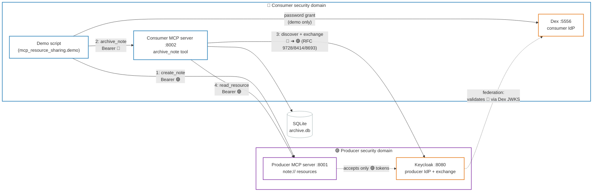

# Cross-IdP resource pipeline

A minimal but spec-faithful MCP example that answers one architectural question:

> **How does a user's identity travel safely across two MCP servers in different
> security domains so that a resource is only ever readable by its creator —
> even when the read is brokered by another server acting on the user's behalf?**

The answer: five OAuth standards chained into a pipeline running in Docker
Compose with **Dex** (consumer IdP) and **Keycloak** (producer IdP). It follows
the MCP authorization spec, revision **2025-11-25**.

---

## System overview



| Component | Service | Role |
|-----------|---------|------|
| Dex | `dex:5556` | Consumer IdP — issues 🔵 user tokens |
| Keycloak | `keycloak:8080` | Producer IdP — federation, token exchange, issues 🟣 tokens |
| `mcp_resource_sharing.producer.server` | `producer:8001` | Resource server: `note://` resources, owner-locked |
| `mcp_resource_sharing.consumer.server` | `consumer:8002` | Archiver: discovers producer IdP at runtime, exchanges tokens |
| `mcp_resource_sharing.demo.run_demo` | `demo` | End-to-end script (Alice archives, Bob denied) |

---

## Token legend

Every diagram and prose sentence uses these icons to show where a token came
from — a 🔵 is always a consumer-IdP token, a 🟣 is always a producer-IdP
token:

| Icon | Token | Issued by | `aud` claim | Accepted by |
|------|-------|-----------|-------------|-------------|
| 🔵 | user login token | **Dex** | `alice-desktop-app` (Dex client id) | consumer server only |
| 🟣 | exchanged delegation token (`sub`=user, `act`=service) | **Keycloak** | `http://producer:8001/mcp` | producer server only |

Audience binding (RFC 8707) ensures neither 🔵 nor 🟣 works anywhere it wasn't
minted for. Dex does not support RFC 8707 resource indicators, so the consumer
overrides audience verification via `RP_CONSUMER_AUDIENCE` — see
[08 — IdP stack](docs/08-compose.md).

---

## Quick start

```bash
cd mcp_resource_sharing/

# Install dependencies (local development)
uv sync

# Build and start the full stack (Keycloak first startup: ~2–3 min)
docker compose -f compose/docker-compose.yml up --build

# Watch the demo in a second terminal
docker compose -f compose/docker-compose.yml logs -f demo
```

Expected output:

```
[dex] alice token  sub='...'  preferred_username='alice'
[keycloak] alice producer token  sub='<uuid>'  aud=['http://producer:8001/mcp', ...]
[alice] created note://...  (owner_sub='<uuid>')
[alice] archived: {'producer': 'http://producer:8001/mcp', ...}
[bob] denied as expected: ...access denied: user '<bob-uuid>' is not the owner ...
✓ Demo completed successfully
```

---

## Documentation — reading order

Read these in sequence to understand the full architecture:

| # | Document | What you learn |
|---|----------|----------------|
| [01](docs/01-problem.md) | Problem and scenario | Why the naive approach fails; what token exchange preserves |
| [02](docs/02-protocols.md) | Protocol stack | The five RFCs and where each appears in the code |
| [10](docs/10-standards-context.md) | Standards context | What's spec-defined vs vendor/demo-specific; where this pattern is used |
| [03](docs/03-trust.md) | Trust and architecture | Which trust edges are configured vs. discovered; registration rules; DCR |
| [04](docs/04-flow.md) | End-to-end flow | Alice's full sequence; the discovery ladder step by step |
| [05](docs/05-exchange.md) | Exchange and denial | The four checks Keycloak runs; Bob's denial path |
| [06](docs/06-security.md) | Security model | Threat → control mapping; what the demo does not protect |
| [07](docs/07-running.md) | Running the demo | Code layout, config reference, Docker Compose |
| [08](docs/08-compose.md) | IdP stack | Keycloak + Dex architecture and realm configuration |
| [09](docs/09-lessons-learned-compose.md) | Lessons learned | Failure modes, fixes, and diagnostics from standing up the stack |
