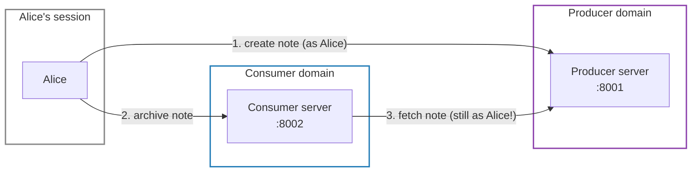
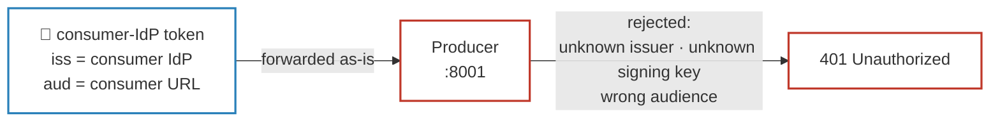
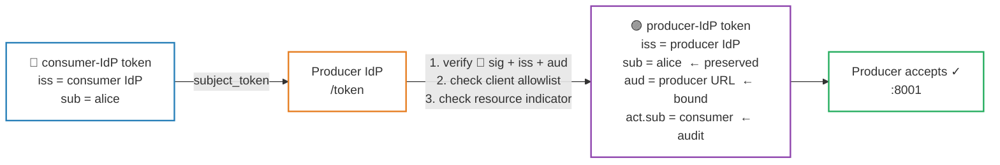

# 01 — The Problem and the Scenario

> **Previous**: [README](../README.md) — system overview and quick start
> **Next**: [02 — Protocol stack](02-protocols.md)

---

## What are we actually solving?

A **producer** MCP server (think: another team's or another company's service)
lets users create private notes and exposes them as MCP resources
(`note://{id}`). It is secured by *its own* IdP.

A **consumer** MCP server (your domain) offers an `archive_note` tool: give it
a producer URL and a resource URI, and it fetches the resource *as the calling
user* and stores it in SQLite. It is secured by *your* IdP.

The challenge in four bullets:

- **Alice** creates a note at the producer, then asks the consumer to archive
  it. That must succeed.
- **Bob** asks the consumer to archive *Alice's* note. That must fail — at the
  producer, on a verified identity, not on anything the client claims.
- The consumer holds a 🔵 token from *its* IdP, which the producer will not
  accept.
- Identity must cross the domain boundary **without breaking the chain of
  verification**.

Step 3 is the hard part: the consumer must prove to the producer that it is
acting *on behalf of Alice* — not on its own authority, and not by blindly
forwarding Alice's token.

---

## Why you cannot just forward the token

The naive design: the consumer attaches the user's 🔵 bearer token to its call
to the producer. This is the **token passthrough** anti-pattern, explicitly
forbidden by the MCP security guidelines.

### ✗ Token passthrough (forbidden)

The producer's `JWTVerifier` will reject the 🔵 token on three independent
grounds — any one of them is sufficient:

| Failure | Why |
|---------|-----|
| Unknown issuer | The token's `iss` names the consumer IdP, which the producer has never heard of |
| Unknown signing key | The consumer IdP's public key is not in the producer IdP's JWKS |
| Wrong audience | The token's `aud` is the consumer server's MCP URL, not the producer's |

### ✓ Token exchange (RFC 8693)

The correct path converts the 🔵 consumer-IdP token into a 🟣 producer-IdP
token without losing the user's identity:

### Why is passthrough wrong even with shared keys?

Even if the producer *could* validate the 🔵 consumer-IdP token (shared keys,
sloppy audience check), accepting it would break the OAuth security boundary:
any service that ever receives a 🔵 user token could replay it against any other.

**Audience binding (RFC 8707)** makes this structurally impossible — each
🔵/🟣 token's `aud` is the canonical MCP URL of exactly **one** server. A 🔵
token minted for the consumer URL simply cannot be used at the producer.

### What token exchange preserves

Token exchange converts 🔵 → 🟣 without losing the user:

| Claim | 🔵 consumer-IdP token (Dex) | 🟣 exchanged producer-IdP token (Keycloak) |
|-------|-----------------------------|-----------------------------------------------|
| `iss` | `http://dex:5556` | `http://keycloak:8080/realms/producer` |
| `sub` | Dex opaque id | Keycloak federated UUID — **the user, preserved** |
| `aud` | `alice-desktop-app` (Dex client id) | `http://producer:8001/mcp` (producer) |
| `act` | — | `{"sub": "resource-consumer-service"}` — **who acted on her behalf** |
| signed by | Dex key | Keycloak key |

The `act` (actor) claim is the audit trail of delegation: the producer can
always distinguish "Alice herself" from "the consumer service acting for Alice".

---

> **Next**: [02 — Protocol stack](02-protocols.md) — the five RFCs and where
> each one appears in this codebase.
