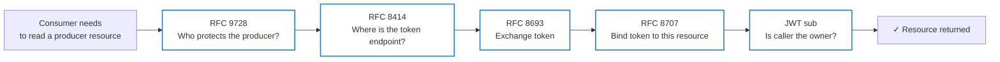

# 02 — The Protocol Stack

> **Previous**: [01 — Problem and scenario](01-problem.md)
> **Next**: [03 — Trust and architecture](03-trust.md)

---

Five standards combine to solve the cross-domain identity problem. Each one
answers exactly one question — and together they leave no gap.

| # | Question | Standard | Where in this repo |
|---|----------|----------|--------------------|
| 1 | "Who protects this MCP server, and where is its IdP?" | **RFC 9728** Protected Resource Metadata | served by both MCP servers via FastMCP `RemoteAuthProvider`; consumed in `common/token_exchange.py` |
| 2 | "Where is that IdP's token endpoint?" | **RFC 8414** AS Metadata, falling back to OIDC discovery | served by Keycloak; consumed in `common/token_exchange.py` |
| 3 | "Swap a foreign user token for one this domain accepts" | **RFC 8693** Token Exchange | Keycloak `/protocol/openid-connect/token` endpoint |
| 4 | "Make the token unusable anywhere but its target" | **RFC 8707** Resource Indicators (audience binding) | `resource` parameter sent by clients, validated and mapped to `aud` by the producer IdP, verified by both servers |
| 5 | "Whose request is this, really?" | Verified JWT `sub` claim | `common/identity.py` — `current_subject()` |

---

## RFC 9728 — Protected Resource Metadata

Every MCP server MUST advertise which authorization server protects it. It does
this by serving a JSON document at:

```
GET /.well-known/oauth-protected-resource/mcp
→ { "authorization_servers": ["http://keycloak:8080/realms/producer"] }
```

FastMCP's `RemoteAuthProvider` serves this automatically when `base_url` and
`authorization_servers` are configured. The MCP 2025-11-25 revision also
requires servers to include `resource_metadata` in their `WWW-Authenticate`
headers (though clients must fall back to the well-known URI when it's absent).

Both `producer/server.py` and `consumer/server.py` use `RemoteAuthProvider` so
each advertises its own IdP — even the consumer, which is never exchanged
against in this demo. That advertisement is a protocol requirement, not just a
convenience.

## RFC 8414 — Authorization Server Metadata

Once a client knows the issuer URL, it needs the token endpoint. RFC 8414 says:

```
GET {issuer}/.well-known/oauth-authorization-server
→ { "token_endpoint": "http://keycloak:8080/realms/producer/protocol/openid-connect/token", … }
```

Keycloak serves this document via OIDC discovery. If the RFC 8414 path returns a
404, `common/token_exchange.py` falls back to the OIDC well-known path
(`/.well-known/openid-configuration`) — both are valid per MCP 2025-11-25.

## RFC 8693 — Token Exchange

The actual swap. The client POSTs to the token endpoint with:

```
grant_type   = urn:ietf:params:oauth:grant-type:token-exchange
subject_token      = <the user's consumer-IdP token 🔵>
subject_token_type = urn:ietf:params:oauth:token-type:access_token
requested_token_type = urn:ietf:params:oauth:token-type:access_token
resource     = http://producer:8001/mcp   ← RFC 8707
audience     = resource-producer          ← Keycloak legacy exchange (client id)
subject_issuer = dex                      ← Keycloak legacy exchange (IdP alias)
client_id    = resource-consumer-service
```

The IdP verifies the 🔵 subject token (signature, issuer, audience), checks the
client registry, checks the resource indicator, then mints a new 🟣 token with:
- `sub` copied from the verified 🔵 subject token (the user's identity)
- `aud` set to the resource URL named by `resource`
- `act.sub` set to the `client_id` (the acting service)

## RFC 8707 — Resource Indicators

Audience binding. The `resource` parameter explicitly names the target:

```
resource = http://producer:8001/mcp
```

The IdP maps this URL to the 🟣 token's `aud` claim. The producer server then
verifies `aud == its own canonical URL` on every incoming 🟣 request, rejecting
any token minted for a different resource — even one signed by the same IdP key.

This is what prevents a 🔵 token issued for the consumer from being replayed
against the producer, and vice versa.

## JWT `sub` — verified identity

None of the above matters if authorization is done on the wrong claim. The MCP
security spec is explicit: identity comes from the **verified** `sub` claim of
the token the server itself validates — never from `_meta`, request headers, or
tool arguments.

`common/identity.py` exposes a single helper:

```python
def current_subject() -> str:
    """Return the verified sub claim of the current request's access token."""
    token = get_access_token()
    return token.claims["sub"]
```

The producer sets `note.owner = current_subject()` at creation time and checks
`current_subject() == note.owner` at read time. That's the entire authorization
model — two lines, verifiable at a glance.

---

## How the five standards chain together



Discovery (RFC 9728 → RFC 8414) happens entirely without tokens — it is safe
to probe unauthenticated. Only after the token endpoint is found does the
client engage credentials.

For background on how standard this overall pattern is — and which parts are
Keycloak/Dex/demo-specific — see [10 — Standards context](10-standards-context.md).

---

> **Next**: [03 — Trust and architecture](03-trust.md) — which trust
> relationships must be configured explicitly and which are discovered at
> runtime.
> **Also**: [10 — Standards context](10-standards-context.md) — is token
> exchange a normal pattern?
