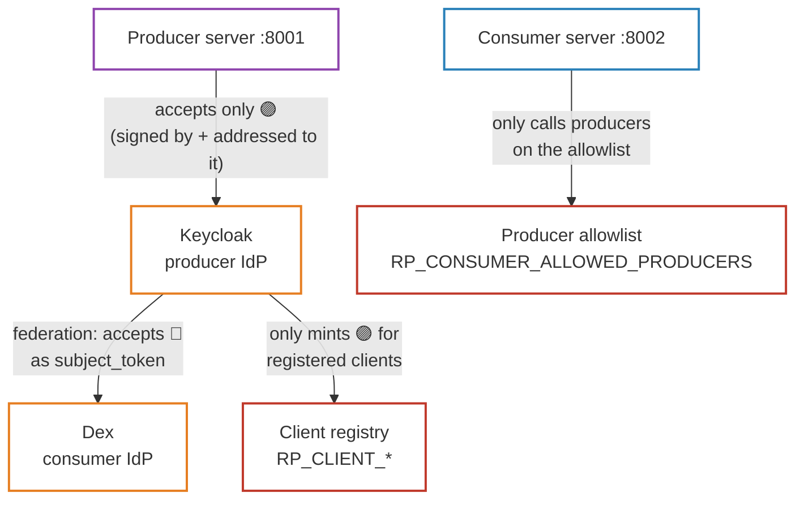
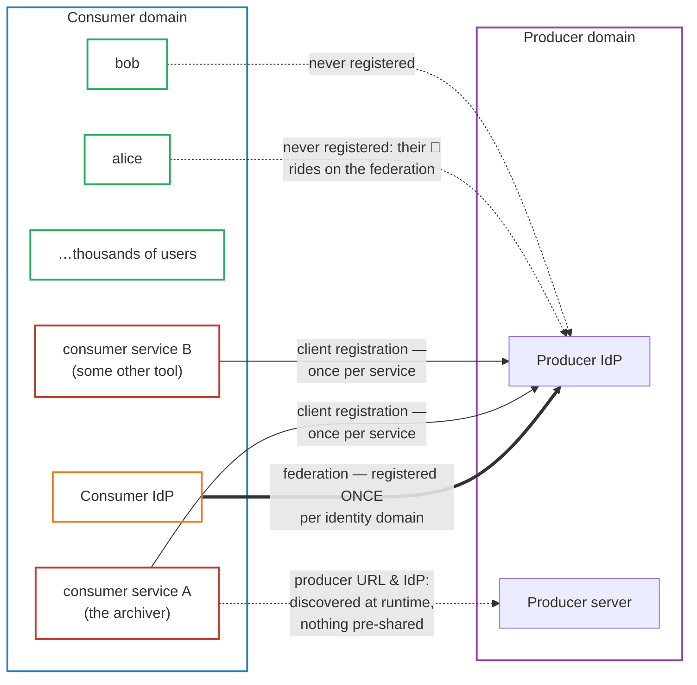
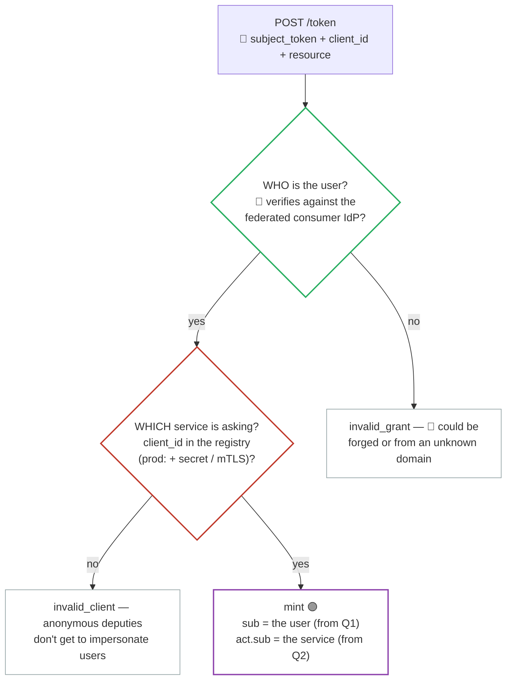
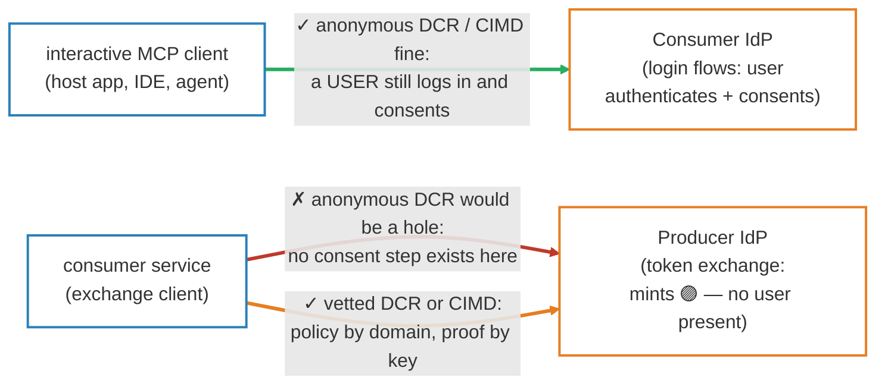

# 03 — Trust and Architecture

> **Previous**: [02 — Protocol stack](02-protocols.md) · **See also**:
> [10 — Standards context](10-standards-context.md)
> **Next**: [04 — End-to-end flow](04-flow.md)

---

## The four trust edges

Discovery tells you *where* to ask. These explicitly configured relationships
decide *whether* the answer is yes. None are discovered — each is a deliberate
operator decision:

1. **Federation** — the producer IdP verifies 🔵 `subject_token`s with the
   consumer IdP's public key. Without this edge, no exchange is possible.
2. **Client registry** (`compose/keycloak/producer-realm.json` + FGAP policies) — the producer IdP refuses to
   mint 🟣 tokens for unknown `client_id`s. A stranger can't manufacture 🟣
   producer tokens even with a valid 🔵 user token.
3. **Audience pinning** — the producer only accepts 🟣 tokens whose `aud` is
   its own canonical URL. 🔵 sibling-service tokens are useless against it.
4. **Producer allowlist** — the consumer is a confused-deputy / SSRF target:
   it fetches a caller-supplied URL **and attaches a 🟣 credential**. The
   allowlist bounds which producers it will ever call. This is an
   operator-config trust boundary, not knowledge of any specific resource.

---

## Must every consumer be registered at the producer?

The precise answer: **every consumer *service* that performs token exchange must
be registered as an OAuth client at the producer IdP — but consumer *users*
are never registered, and the producer learns nothing about the consumer's
servers or URLs.**

Three different things scale three different ways:

- 🟢 **Users: zero registrations.** Alice, Bob and every future user cross the
  boundary on the strength of the *federation* edge alone — the producer IdP
  verifies their tokens against the consumer IdP's key and copies the verified
  `sub`. Onboarding a new user touches nothing in the producer domain.
- 🟠 **Identity domains: one registration, ever.** Federation is established
  once per consumer *IdP*, regardless of how many services and users live
  behind it.
- 🔴 **Exchanging services: one registration each.** Each confidential client
  that wants to *act on users' behalf* needs its own `client_id` in the
  producer IdP's registry.

### Why is the per-service registration non-negotiable?

The exchange endpoint answers **two independent questions**:

If the green check stood alone — federation without client registration — then
*any* process that ever got hold of a user's 🔵 consumer-IdP token (a leaked
log, a compromised browser extension, a malicious MCP server) could walk up to
the producer IdP and convert it into a 🟣 producer token. Client registration
supplies the second statement, making `act` trustworthy: the producer can
audit, rate-limit, or revoke a single misbehaving deputy without touching the
federation or any user.

---

## Would Dynamic Client Registration help?

FastMCP ships DCR: its `OAuthProvider` exposes an RFC 7591 `/register`
endpoint, its `OAuthProxy` presents DCR to MCP clients while bridging to a
fixed upstream client, and 3.4 adds beta support for **Client ID Metadata
Documents** (CIMD), where the `client_id` *is* an HTTPS URL serving the
client's metadata.

Whether DCR helps depends on **which registration edge** you point it at.
The critical asymmetry is that consumer-side login issues 🔵 tokens with a user
consent step, while the producer-side exchange issues 🟣 tokens with no user
present:

- 🟢 **Interactive clients → their AS: yes, freely.** This is the leg
  MCP 2025-11-25 designed DCR/CIMD for. Anonymous self-registration is safe
  there because a real user still authenticates and consents before any 🔵
  token is issued.
- 🔴 **Exchange clients → producer IdP: not anonymously.** The 🔵→🟣
  token-exchange endpoint has **no user-consent step** — registration
  effectively *is* the authorization.
- 🟠 **The useful middle ground: vetted automation.** RFC 7591 supports gated
  registration (initial access tokens, software statements), and CIMD is
  particularly attractive: the `client_id` is a URL the client provably
  controls (the document carries a JWKS, so the client authenticates with its
  private key). The producer IdP can then express trust as *policy at domain
  granularity* — "any client whose CIMD URL lives under
  `https://consumer.example/`" — instead of hand-maintaining one registry row
  per service.

So: DCR doesn't remove the trust decision at the exchange endpoint — nothing
can — but vetted DCR or CIMD can turn "register every consumer service by hand"
into "approve the consumer *domain* once, let its services onboard themselves
with cryptographic proof".

---

> **Next**: [04 — End-to-end flow](04-flow.md) — step by step through Alice's
> archive operation, including the discovery ladder and token exchange.
