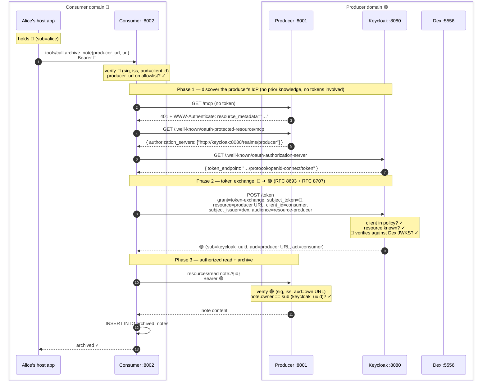
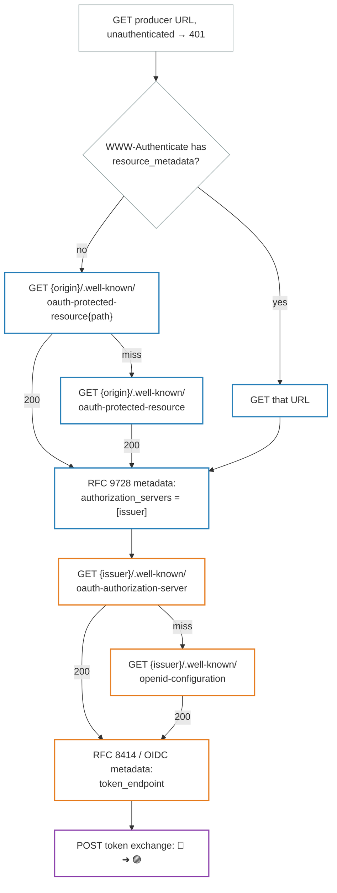

# 04 — End-to-End Flow

> **Previous**: [03 — Trust and architecture](03-trust.md)
> **Next**: [05 — Exchange and denial](05-exchange.md)

---

## Alice archives her note — full sequence



Note what the consumer needed in advance: **nothing producer-specific except
the allowlist entry**. The producer URL arrives as a tool argument; the IdP,
its token endpoint, and the 🟣 audience are all derived at runtime from that
URL alone — no 🟣 token details are pre-configured.

---

## Phase 1 in depth — the discovery ladder

The MCP 2025-11-25 revision made the `WWW-Authenticate` hint optional and
mandated client-side fallbacks. `common/token_exchange.py` implements the full
ladder:



The implementation in `common/token_exchange.py`:

```python
async def _discover_token_endpoint(http, producer_url):
    # Step 1: probe → 401, check for resource_metadata in WWW-Authenticate
    probe = await http.get(producer_url)
    challenge = probe.headers.get("WWW-Authenticate", "")
    match = _RESOURCE_METADATA_RE.search(challenge)
    if match:
        metadata_urls = [match.group(1)]
    else:
        metadata_urls = _well_known_prm_urls(producer_url)  # RFC 9728 fallbacks

    # Step 2: fetch protected-resource metadata → authorization_servers
    resource_metadata = await _fetch_first_json(http, metadata_urls)
    issuer = resource_metadata["authorization_servers"][0].rstrip("/")

    # Step 3: fetch AS metadata → token_endpoint (RFC 8414 then OIDC fallback)
    as_metadata = await _fetch_first_json(http, [
        f"{issuer}/.well-known/oauth-authorization-server",
        f"{issuer}/.well-known/openid-configuration",
    ])
    return as_metadata["token_endpoint"]
```

Two IdPs, two roles:

- **Keycloak (producer IdP)** is discoverable — its issuer is a reachable URL
  serving RFC 8414/OIDC metadata because remote clients must find it at runtime
  to exchange 🔵→🟣.
- **Dex (consumer IdP)** is configured out of band — the consumer verifies 🔵
  tokens against Dex JWKS; users obtain 🔵 tokens via Dex's token endpoint
  (password grant in the demo only).

---

## Phase 2 in depth — what the exchange request carries

```
POST /realms/producer/protocol/openid-connect/token
Content-Type: application/x-www-form-urlencoded

grant_type           = urn:ietf:params:oauth:grant-type:token-exchange
subject_token        = <alice's 🔵 Dex JWT>
subject_token_type   = urn:ietf:params:oauth:token-type:access_token
requested_token_type = urn:ietf:params:oauth:token-type:access_token
resource             = http://producer:8001/mcp    ← RFC 8707 indicator
audience             = resource-producer           ← Keycloak legacy exchange
subject_issuer       = dex                         ← Keycloak legacy exchange
client_id            = resource-consumer-service
```

Keycloak legacy exchange uses `audience` for the target OAuth **client id** and
`subject_issuer` for the federated IdP alias. The `resource` parameter still
names the MCP URL for RFC 8707; Keycloak's audience mapper stamps that URL into
the minted 🟣 token's `aud` claim.

---

> **Next**: [05 — Exchange checks and the denial path](05-exchange.md) — the
> four checks Keycloak runs, and what happens when Bob tries to archive Alice's
> note.
