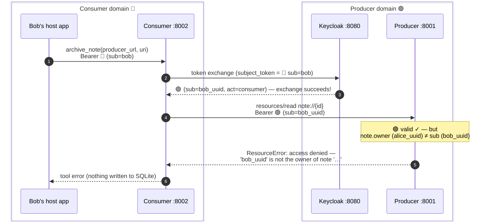

# 05 — Exchange Checks and the Denial Path

> **Previous**: [04 — End-to-end flow](04-flow.md)
> **Next**: [06 — Security model](06-security.md)

---

## What Keycloak verifies on exchange

Keycloak refuses an exchange unless **all** of these hold:

| # | Check | Failure response |
|---|-------|------------------|
| 1 | `grant_type` is the RFC 8693 token-exchange URN | `unsupported_grant_type` |
| 2 | `client_id` is permitted by FGAP token-exchange policy | `403` / `client not allowed to exchange` |
| 3 | `resource` / `audience` name a permitted target | `invalid_target` or audience policy denial |
| 4 | 🔵 `subject_token` verifies against Dex (signature, issuer, federation) | `invalid_grant` / `invalid_token` |

Only then does Keycloak mint a 🟣 producer token: `sub` from the federated user
(Keycloak UUID), `aud` set to the MCP URL via the audience protocol mapper,
`act.sub` set to the requesting client.

Check 3 is easy to skip in homegrown implementations and is exactly what stops
a registered-but-curious client from asking this AS for 🟣 tokens aimed at
arbitrary third-party services.

Configuration lives in `compose/keycloak/producer-realm.json` and
`compose/keycloak/configure-realm.sh` (FGAP v1 permissions on `realm-management`).

For how standard this exchange model is across the industry — and what is
Keycloak-specific vs RFC-defined — see [10 — Standards context](10-standards-context.md).

---

## The denial path: Bob

Authorization is enforced **where the data lives**, on a verified identity —
not at the consumer, and not on anything the client sends in `_meta`:



Key observations:

1. **The exchange succeeds for Bob.** He is a legitimate user with a valid
   🔵 Dex token. Keycloak mints a 🟣 producer token for him. This is correct —
   the IdP's job is identity, not authorization.

2. **The denial is at the resource, on verified identity.** The producer
   compares `note.owner` (set at creation time from a verified `sub` inside a
   🟣 token — Alice's Keycloak UUID) with `current_subject()` (the verified
   `sub` of the incoming 🟣 request). No client input is involved.

3. **The error message is deliberately sparse** — it does not reveal who the
   owner is:

   ```python
   # producer/server.py
   if requester != note["owner"]:
       raise ResourceError(
           f"access denied: user {requester!r} is not the owner of note {note_id!r}"
       )
   ```

4. **`ResourceError` (and `ToolError`) guarantees delivery.** FastMCP surfaces
   these as structured MCP error responses even when `mask_error_details` is
   enabled. They are the right channel for *intentional* denials — not generic
   Python exceptions, which would be masked.

---

## Why this layering matters

The separation between "can exchange a token" and "can read the resource" is
load-bearing:

```
Consumer allowlist check (consumer server)
    └── Only whitelisted producer URLs are even attempted
        └── Exchange (Keycloak)
                └── Is the client registered / in policy?
                    └── Is the resource / audience permitted?
                        └── Is the user's 🔵 token valid (federation)?
                            └── Ownership check (producer server)
                                    └── Is sub == note.owner?
```

Each layer has a distinct responsibility and can fail independently. A
registered exchange client that somehow obtains a valid user token still cannot
read another user's note. An unregistered client cannot manufacture producer
tokens at all. An allowlisted producer URL still requires a valid user identity.

---

> **Next**: [06 — Security model](06-security.md) — the full threat model and
> which control addresses each threat.
