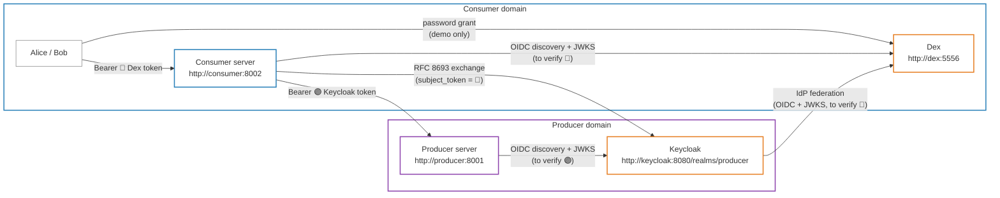
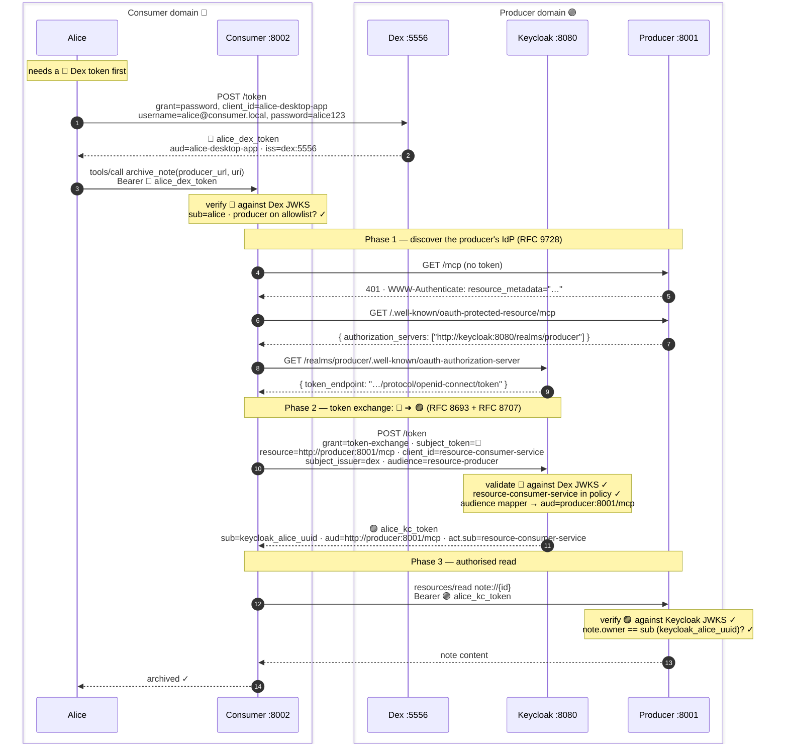

# 08 — IdP Stack (Keycloak + Dex)

> **Previous**: [07 — Running the demo](07-running.md)
> **Next**: [09 — Lessons learned](09-lessons-learned-compose.md)

---

The stack uses two production-grade, self-hostable identity providers alongside
the same MCP server code:

| Component | Provider | Role |
|-----------|----------|------|
| Consumer IdP | **[Dex](https://dexidp.io)** | Lightweight OIDC, static users, single YAML config |
| Producer IdP | **[Keycloak](https://www.keycloak.org)** 26 | Enterprise AS, realm import, token exchange + federation |

---

## Why Dex for the consumer and Keycloak for the producer?

**Dex** represents a *simple, consumer-side* IdP where the organisation
controls its users but doesn't need a full AS. A single YAML file is the
entire configuration.

**Keycloak** represents the *resource-owning* organisation that must:
1. **Trust** tokens from external organisations (Dex is registered as an IdP).
2. **Exchange** those tokens for narrowly-scoped, audience-bound producer tokens.
3. **Enforce** which clients are allowed to exchange (fine-grained policy).

---

## Architecture



---

## Token flow



> 🔵 Dex token — `iss=http://dex:5556`, `aud=alice-desktop-app`
> 🟣 Keycloak token — `iss=http://keycloak:8080/realms/producer`, `aud=http://producer:8001/mcp`

---

## How Keycloak token exchange is configured

`compose/keycloak/producer-realm.json` wires the declarative baseline; the
`keycloak-setup` service runs `configure-realm.sh` to attach FGAP v1 permissions
that realm JSON alone cannot express:

```
resource-producer client
  authorizationServicesEnabled: true
  │
  ├── resource: token-exchange  (type=urn:ietf:params:oauth:token-type:access_token)
  │
  ├── policy: consumer-clients-can-exchange
  │     type=client, grants: [resource-consumer-service, alice-desktop-app]
  │
  └── permission: token-exchange.permission.client.resource-producer
        resources=[token-exchange]  scopes=[token-exchange]
        policies=[consumer-clients-can-exchange]

  protocolMapper: producer-mcp-url-audience
    → stamps aud="http://producer:8001/mcp" on every exchanged access token

identityProvider: dex
  discoveryEndpoint=http://dex:5556/.well-known/openid-configuration
  → Keycloak validates Dex JWKS at exchange time
  → first exchange creates a federated Keycloak user for alice/bob
```

Keycloak requires `--features=token-exchange,admin-fine-grained-authz:v1` for
legacy external→internal exchange (Dex 🔵 in, Keycloak 🟣 out).

---

## Notable implementation details

| Topic | Detail |
|-------|--------|
| 🔵 consumer token `aud` | `alice-desktop-app` — Dex has no RFC 8707 resource indicators; set `RP_CONSUMER_AUDIENCE` |
| 🟣 producer token `aud` | Keycloak **Audience protocol mapper** stamps `http://producer:8001/mcp` |
| `sub` in 🟣 token | Keycloak federated **UUID**; `preferred_username` used for display |
| Exchange client auth | Keycloak **fine-grained authorization policy** on `realm-management` |
| IdP federation | Dex registered as OIDC IdP; Keycloak validates JWKS at runtime |
| Exchange parameters | Legacy V1 needs `subject_issuer=dex` and `audience=resource-producer` |

---

## Configuration gotchas

See **[09 — Lessons learned](09-lessons-learned-compose.md)** for the full
diagnostic tables. Short list:

| Topic | Detail |
|-------|--------|
| `start-dev` only | `--import-realm` works with `start-dev`. For production use `kc.sh import` or the Admin REST API. |
| Post-import setup | FGAP v1 token-exchange permissions require `keycloak-setup` / `configure-realm.sh` — realm JSON alone is insufficient. |
| Exchange parameters | Legacy V1 needs `subject_issuer=dex` and `audience=resource-producer` (see `compose/.env`). |
| Exchange client auth | Both exchange clients are **public** in this demo. In production make them confidential (`private_key_jwt`, mTLS). |
| Audience binding gap | Dex 🔵 tokens carry `aud=alice-desktop-app`, not the consumer MCP URL. Set via `RP_CONSUMER_AUDIENCE`. |
| Issuer trailing slash | Pydantic normalizes `http://dex:5556` → `http://dex:5556/`; consumer JWT verification strips it via `idp_issuer_value`. |

---

> **Next**: [09 — Lessons learned](09-lessons-learned-compose.md) — failure
> modes and diagnostics from standing up the stack.
