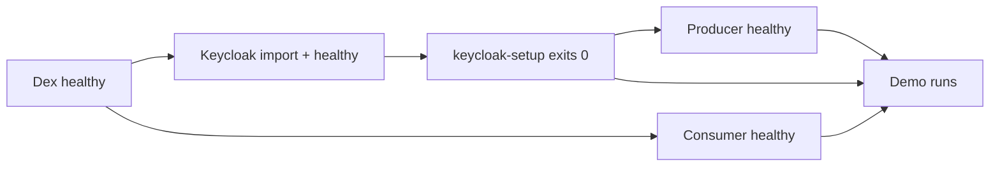

# Lessons learned — Docker Compose setup (Keycloak + Dex)

This document captures what we learned while making the Docker Compose stack
work. It complements [08 — IdP stack](08-compose.md) with the *failure modes*
we hit and the *fixes* that made the demo succeed.

If your stack starts but the demo fails, scan the tables below before diving
into logs.

---

## What “success” looks like

A healthy run ends like this:

```
[dex] alice token  sub='CgVhbGljZRIFbG9jYWw'  preferred_username='alice'
[keycloak] alice producer token  sub='800b03a1-…'  aud=['http://producer:8001/mcp', …]
[alice] created note://945ef437  (owner_sub='800b03a1-…')
[alice] archived: {… 'archived_by': 'CgVhbGljZRIFbG9jYWw' …}
[bob] denied as expected: … user '76696b2b-…' is not the owner …
✓ Demo completed successfully
```

Three different `sub` shapes appear — and that is **correct**:

| Phase | Token | `sub` meaning |
|-------|-------|---------------|
| Consumer auth | 🔵 Dex | Opaque Dex user id (`CgVhbGljZ…`) |
| Producer create/read | 🟣 Keycloak | Federated Keycloak UUID (`800b03a1-…`) — **note owner** |
| Archive metadata | 🔵 Dex again | Consumer records who asked (`archived_by`) |

Ownership on the producer is enforced against the 🟣 token's `sub` (Keycloak
UUID). The consumer never forwards the 🔵 token to the producer.

---

## Keycloak 26

### Hostname v1 is gone

| Symptom | Cause | Fix |
|---------|-------|-----|
| `Unknown option: '--hostname-port'` on startup | KC 26 removed hostname v1 flags | Use hostname v2: `--hostname=http://keycloak:8080` (port in the URL) |

### Realm import format changed

| Symptom | Cause | Fix |
|---------|-------|-----|
| `Unrecognized field "permissions"` during `--import-realm` | KC 26 `ResourceServerRepresentation` has no top-level `permissions` array | Put scope permissions in `policies[]` with `"type": "scope"` |

### Legacy token exchange needs FGAP v1 **and** a post-import script

Standard token exchange (V2, supported in KC 26.2+) covers **internal→internal**
only. External 🔵→🟣 exchange (Dex token in, Keycloak token out) still uses
**legacy V1**, which requires:

```yaml
--features=token-exchange,admin-fine-grained-authz:v1
```

Realm JSON alone is **not enough**. Permissions live on `realm-management` and
reference runtime UUIDs. The `keycloak-setup` service runs
`compose/keycloak/configure-realm.sh` after import to:

1. Point the Dex IdP at `jwksUrl` / `userInfoUrl` (token validation).
2. Enable management permissions on the Dex IdP and `resource-producer` client.
3. Wire client policies so `alice-desktop-app` and `resource-consumer-service`
   may exchange.

| Keycloak event reason | Meaning | Fixed by |
|-----------------------|---------|----------|
| `client not allowed to exchange subject_issuer` | Missing IdP token-exchange permission | `configure-realm.sh` → `idp.resource.dex-idp` |
| `client not allowed to exchange to audience` | Missing client token-exchange permission | `configure-realm.sh` → `client.resource.{uuid}` |
| `user info service disabled` | IdP missing JWKS/userinfo config | IdP `jwksUrl`, `userInfoUrl`, `disableUserInfo=false` |
| `No enum constant … IdentityProviderSyncMode.INHERIT` | Invalid IdP `syncMode` | Use `"syncMode": "IMPORT"` on the IdP (mappers keep `INHERIT`) |

### Exchange request parameters (legacy V1)

| Parameter | Value | Env var |
|-----------|-------|---------|
| `subject_issuer` | **`dex`** (Dex IdP alias) | `RP_TOKEN_EXCHANGE_SUBJECT_ISSUER` |
| `audience` | **`resource-producer`** (OAuth client id) | `RP_TOKEN_EXCHANGE_AUDIENCE` |
| `resource` | MCP URL (`http://producer:8001/mcp`) | _(derived from producer URL)_ |

Keycloak's audience mapper still stamps `aud=http://producer:8001/mcp` on the
minted 🟣 token; the exchange `audience` parameter names the **target client**,
not the JWT `aud` claim.

### Healthcheck without `curl`

The Keycloak image ships no HTTP client. Use bash `/dev/tcp` with HTTP/1.1 and
a `Host` header — HTTP/1.0 against `/realms/producer` returns 500.

---

## Dex

| Symptom | Cause | Fix |
|---------|-------|-----|
| Dex `/token` → `Invalid username or password` | Password grant authenticates by **email**, not short username | Use `alice@consumer.local` / `bob@consumer.local` in `demo/run_demo.py` |
| Consumer 401, log shows `got 'http://dex:5556', expected 'http://dex:5556/'` | Pydantic `AnyHttpUrl` adds a trailing slash; Dex `iss` has none | `ConsumerSettings.idp_issuer_value` strips the slash before JWT verification |
| 🔵 token `aud` is `alice-desktop-app`, not the MCP URL | Dex has no RFC 8707 resource indicators | Set `RP_CONSUMER_AUDIENCE=alice-desktop-app` (documented compromise) |

---

## Docker and FastMCP

| Symptom | Cause | Fix |
|---------|-------|-----|
| `ConnectError` from demo to `http://producer:8001/mcp` | FastMCP binds `127.0.0.1` by default | `FASTMCP_HOST=0.0.0.0` in `compose/.env` |
| Log spam: `invalid_token` every 5 s on `/mcp` | Healthchecks hit the auth-gated MCP endpoint | Probe `/.well-known/oauth-protected-resource/mcp` instead (returns 200) |
| Single 401 on `/mcp` from demo container | RFC 9728 discovery probe (expected) | Not an error — client then fetches metadata and exchanges |

---

## Service startup order



`producer` and `demo` must wait for `keycloak-setup`, not just Keycloak health.
A healthy Keycloak with **unconfigured** FGAP permissions still returns 403 on
exchange.

On restarts, Keycloak uses `IGNORE_EXISTING` for realm import — config drift is
possible if you edit `producer-realm.json` without recreating the container.
For a clean slate: `docker compose down` (dev H2 is ephemeral inside the
container).

---

## What we would do differently in production

| Demo shortcut | Production direction |
|---------------|---------------------|
| Legacy token exchange V1 + FGAP v1 | Plan migration to Standard Token Exchange V2 + JWT Authorization Grant (RFC 7523) when external→internal is supported without legacy flags |
| `configure-realm.sh` sidecar | Terraform, `keycloak-config-cli`, or Operator-managed realm; treat FGAP as infrastructure-as-code |
| Dex password grant | Authorization Code + PKCE (or device code); disable ROPC |
| Public exchange clients | Confidential clients with `private_key_jwt` or mTLS |
| `start-dev` + H2 | `start` with external PostgreSQL, TLS at the edge, `KC_HOSTNAME` for public URLs |
| Fixed passwords in Dex config | External user directory, short token lifetimes, rotation |

---

## Quick diagnostic checklist

1. **Keycloak won't start** → check hostname flags (§ Keycloak 26).
2. **Exchange 403 `subject_issuer`** → run / re-run `keycloak-setup`; check its logs.
3. **Exchange 403 `audience`** → same; verify `RP_TOKEN_EXCHANGE_AUDIENCE=resource-producer`.
4. **Exchange 400 `invalid_token`** → Dex IdP JWKS/userinfo; IdP `syncMode=IMPORT`.
5. **Demo can't reach producer** → `FASTMCP_HOST=0.0.0.0`.
6. **Consumer 401 with valid 🔵 token** → issuer trailing-slash mismatch.
7. **Noisy `invalid_token` in producer/consumer logs** → healthcheck URL.

---

> **Previous**: [08 — IdP stack](08-compose.md) · **Start**: [README](../README.md)
