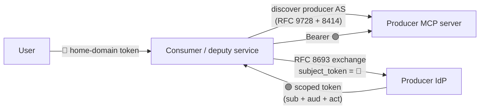
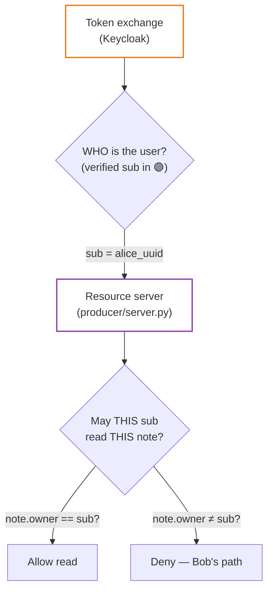

# 10 — Standards Context: Is Token Exchange a Normal Pattern?

> **Previous**: [02 — Protocol stack](02-protocols.md) (recommended) · **Related**:
> [05 — Exchange and denial](05-exchange.md), [08 — IdP stack](08-compose.md)
> **Back to start**: [README](../README.md)

---

**Short answer: yes.** The cross-domain delegation pattern in this demo — user
token in one security domain, exchange at the resource owner's IdP, scoped token
out — is built from published IETF standards and aligns with MCP authorization
(2025-11-25). What varies in production is *IdP support* and *policy*, not the
abstract shape of the flow.

---

## The standard pattern

At a high level, every implementation of "call a remote MCP server in another
org's domain" converges on the same choreography:

| Step | Standard | What it standardises |
|------|----------|----------------------|
| Find who protects the producer | **RFC 9728** Protected Resource Metadata | `authorization_servers[]` without prior config |
| Find the token endpoint | **RFC 8414** / OIDC discovery | `token_endpoint` URL |
| Swap 🔵 for 🟣 | **RFC 8693** Token Exchange | `grant_type=…token-exchange`, `subject_token`, minted delegation token |
| Bind 🟣 to one MCP server | **RFC 8707** Resource Indicators | `resource` parameter → JWT `aud` |
| Authorize on identity | JWT **`sub`** (and often **`act`**) | Verified claims only — not client-supplied metadata |

**MCP authorization (2025-11-25)** expects clients and servers to use this
discovery + token-acquisition model when crossing security domains. Passing the
user's home-domain token straight to a foreign MCP server is *not* the intended
pattern — audience binding and exchange exist precisely to prevent that.

---

## What RFC 8693 actually defines

[RFC 8693](https://datatracker.ietf.org/doc/html/rfc8693) (*OAuth 2.0 Token
Exchange*) is an IETF standard (2018). It defines:

- A **`token-exchange` grant type** at the authorization server's token endpoint.
- **`subject_token`** — the token being presented (here, Alice's 🔵 Dex JWT).
- **`requested_token_type`** — typically another access token.
- Optional **`resource`** and **`audience`** parameters to narrow scope.
- Response tokens that may carry an **`act`** (actor) claim when a service
  exchanges on behalf of a user.

It does **not** mandate a particular IdP product, federation layout, or MCP
URL scheme. It defines the *wire protocol* for "I have token A; give me token B
suitable for target C."

This demo's `common/token_exchange.py` is a direct client of that protocol.

---

## Standard vs demo-specific vs vendor-specific

Not every line in the compose stack is "what RFC 8693 always looks like."
Separate three layers:

### Layer 1 — Spec-defined (portable)

These properties hold regardless of Keycloak or Dex:

| Property | Why it matters |
|----------|----------------|
| Discover producer AS at runtime | No hard-coded producer IdP URLs in consumer code |
| Exchange, don't forward 🔵 | Preserves domain boundaries and audit (`act`) |
| 🟣 `aud` = producer MCP URL | RFC 8707 — token useless elsewhere |
| Authz on verified `sub` | MCP security baseline |
| Registered exchange client | Deputy services are explicit trust decisions (see [03 — Trust](03-trust.md)) |

### Layer 2 — IdP/vendor-specific (real deployments differ)

| Topic | In this demo | In general |
|-------|--------------|------------|
| Cross-domain exchange | Keycloak **legacy V1** + FGAP v1 + Dex as federated IdP | Also: Okta, Auth0, Azure AD B2B, custom AS — each with different policy models |
| `subject_issuer=dex` | Required by Keycloak when 🔵 comes from a brokered IdP | Other ASs may infer issuer from `subject_token` or use different params |
| `audience=resource-producer` | Keycloak legacy: names the **target OAuth client id** | Some ASs use `audience` for the resource URL; some ignore it |
| Federation | Dex registered in Keycloak; JWKS validated at exchange time | SAML/OIDC federation, trust frameworks, manual JWKS pinning |
| `sub` shape after exchange | Keycloak **UUID** (federated user) | May be opaque id, email, pairwise subject — depends on IdP |

Keycloak 26 is moving toward **Standard Token Exchange V2** for internal flows;
**external → internal** exchange (Dex 🔵 in, Keycloak 🟣 out) still relies on
legacy V1 in this stack. That is a **product lifecycle** detail, not an RFC
limitation. See [09 — Lessons learned](09-lessons-learned-compose.md).

### Layer 3 — Demo shortcuts (not production patterns)

| Shortcut | Production direction |
|----------|---------------------|
| Dex **password grant** for Alice/Bob | Authorization Code + PKCE; disable ROPC |
| 🔵 `aud` = `alice-desktop-app` (client id) | IdP with RFC 8707 resource indicators, or audience mapper |
| Public exchange clients (`client_id` only) | Confidential clients: `private_key_jwt`, mTLS, CIMD |
| `start-dev` + H2 Keycloak | `start` + PostgreSQL, TLS, proper hostname config |
| `configure-realm.sh` sidecar | Infrastructure-as-code (Terraform, Operator, config-cli) |

---

## Two jobs: exchange vs authorization

A common confusion: **token exchange answers identity in the producer domain;
resource authorization answers "may this identity access this object?"**

Bob's denial in the demo proves this split: Keycloak **correctly** mints a 🟣
token for Bob (exchange succeeds); the producer **correctly** denies the read
because `note.owner` is Alice's UUID. Exchange is not a substitute for
ownership checks at the resource.

---

## Where this pattern appears outside MCP

The same RFC 8693 delegation shape is widely used when a service acts for a user
across a trust boundary:

| Domain | Typical flow |
|--------|--------------|
| Enterprise / B2B SSO | Employee token from home IdP → exchanged or federated for partner API |
| Multi-tenant SaaS | Platform token → downstream service token with narrowed `aud` |
| API gateways | Gateway exchanges user/session token for backend microservice JWT |
| Cloud (AWS/GCP/Azure) | Workload or user assertion → scoped token for another service |
| MCP connectors | Host in org A calls tools/resources in org B via exchange, not passthrough |

MCP did not invent cross-domain delegation; it **names and requires** the OAuth
building blocks (RFC 9728 discovery, RFC 8693 exchange, RFC 8707 audience) so
implementations interoperate instead of each inventing a bespoke "forward the
Bearer token" shortcut.

---

## Reading map

| Question | Read |
|----------|------|
| Which RFC does what? | [02 — Protocol stack](02-protocols.md) |
| Which trust edges must be configured? | [03 — Trust and architecture](03-trust.md) |
| Step-by-step Alice flow | [04 — End-to-end flow](04-flow.md) |
| What Keycloak checks on exchange | [05 — Exchange and denial](05-exchange.md) |
| Keycloak + Dex wiring | [08 — IdP stack](08-compose.md) |
| Keycloak 26 gotchas | [09 — Lessons learned](09-lessons-learned-compose.md) |

---

> **Back to sequence**: [03 — Trust and architecture](03-trust.md) ·
> **Start**: [README](../README.md)
