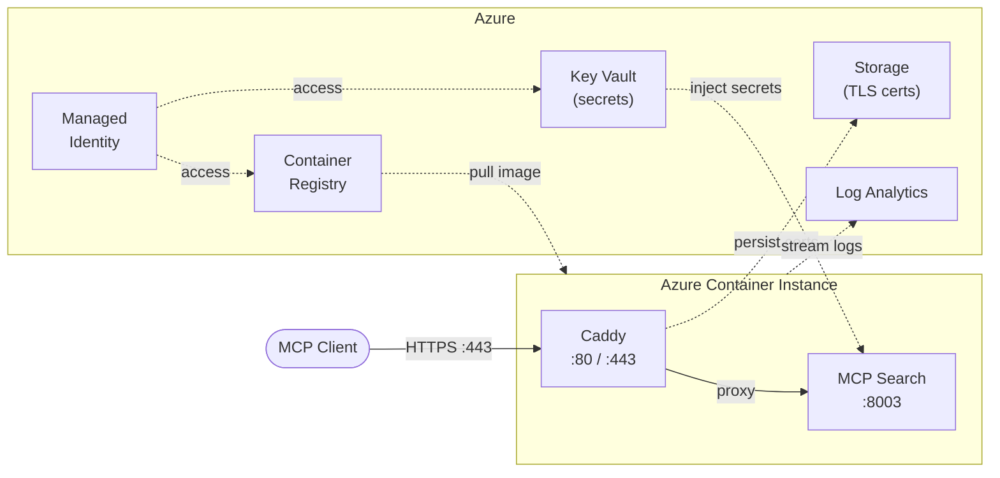

# Deploy to Azure Resource Group

The `terraform/` directory contains everything needed to deploy the server to Azure Container Instances with HTTPS, Key Vault secrets, and Log Analytics logging.

## Quick Start

```bash
cd terraform

# 1. Login to Azure
az login
az account set --subscription "Your Subscription Name"

# 2. Create a resource group (if it doesn't exist)
az group create --name rg-mcp-search --location westeurope

# 3. Configure variables
cp terraform.tfvars.example terraform.tfvars
# Edit terraform.tfvars with your actual values

# 4. Deploy everything
chmod +x deploy.sh
./deploy.sh deploy

# 5. Verify the deployment
./deploy.sh verify
```

The deploy script handles the full lifecycle: initializes Terraform, creates infrastructure, builds and pushes the Docker image to ACR, and launches the container group.

### Post-Deployment

```bash
# Check container status
./deploy.sh status

# Test the endpoint
./deploy.sh test

# View logs
./deploy.sh logs mcp-search
./deploy.sh logs caddy

# Show all Terraform outputs (URLs, commands, etc.)
./deploy.sh outputs
```

### DNS Setup

After deployment, point your domain to the container IP:

```bash
# Get the IP address
cd terraform && terraform output aci_ip_address
```

Create an A record: `your-domain.com` -> `<IP_ADDRESS>`

### Updating the Application

After code changes:

```bash
./deploy.sh build    # Build and push new image
./deploy.sh restart  # Restart container to pick up the new image
```

### Tear Down

```bash
./deploy.sh destroy
```

For full details on the infrastructure, variables, HTTPS configuration, secrets management, troubleshooting, and costs, see [`terraform/README.md`](terraform/README.md).

## Architecture



## Connecting MCP Clients

Get your server URL directly from the Azure CLI:

```bash
# FQDN (HTTP, for testing)
az container show \
  --name $(cd terraform && terraform output -raw aci_name) \
  --resource-group $(cd terraform && terraform output -raw resource_group_name) \
  --query fqdn -o tsv

# Or if you have a custom domain configured
cd terraform && terraform output -raw application_url
```

Then configure any MCP-compatible client (Claude Desktop, MCP Inspector, etc.) with:

- **Server URL**: `https://<fqdn-or-domain>/mcp`
- **Transport**: Streamable HTTP
- **Auth**: OAuth 2.0 via your Zitadel instance


Enter your server URL and authenticate through the Zitadel OAuth flow.

