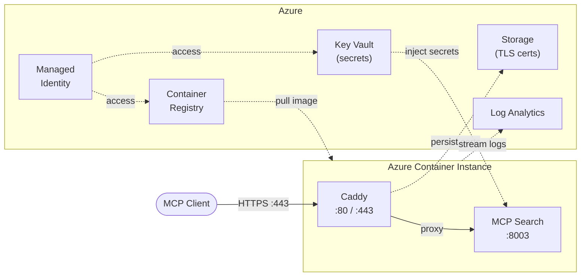

# MCP Search Tutorial

A complete tutorial for building and deploying an [MCP](https://modelcontextprotocol.io/) server that exposes Unique's Knowledge Base as a searchable tool. The server uses [FastMCP](https://github.com/jlowin/fastmcp) and authenticates via Zitadel OAuth, making it ready for production use behind HTTPS.

## What You'll Build

An MCP server with a single `search` tool that queries the Unique Knowledge Base using vector, keyword, or combined search. The server:

- Runs on [FastMCP](https://github.com/jlowin/fastmcp) with streamable HTTP transport
- Authenticates users through Zitadel OAuth proxy
- Deploys to Azure Container Instances with automatic HTTPS via Caddy
- Stores secrets in Azure Key Vault and logs in Log Analytics

## Prerequisites

| Tool | Version | Purpose |
|------|---------|---------|
| [Python](https://www.python.org/) | >= 3.12 | Runtime |
| [uv](https://docs.astral.sh/uv/) | latest | Package manager |
| [Azure CLI](https://docs.microsoft.com/en-us/cli/azure/install-azure-cli) | latest | Azure authentication and resource management |
| [Terraform](https://www.terraform.io/downloads) | >= 1.5.0 | Infrastructure provisioning |
| [Docker](https://docs.docker.com/get-docker/) | latest | Container image builds |

You also need:
- A **Unique platform** account with API credentials
- A **Zitadel** instance with a configured OAuth application
- An **Azure subscription** with permissions to create resources

## Local Development

### 1. Install dependencies

```bash
uv sync
```

### 2. Configure environment

```bash
cp unique.env.example unique.env
cp zitadel.env.example zitadel.env
```

Fill in your credentials in both files:

**`unique.env`** — your Unique platform credentials:
```
UNIQUE_APP_KEY=<your-app-key>
UNIQUE_APP_ID=<your-app-id>
UNIQUE_API_BASE_URL=https://api.unique.ch
UNIQUE_AUTH_COMPANY_ID=<your-company-id>
UNIQUE_AUTH_USER_ID=<your-user-id>
UNIQUE_APP_ENDPOINT=<your-app-endpoint>
UNIQUE_APP_ENDPOINT_SECRET=<your-endpoint-secret>
```

**`zitadel.env`** — your Zitadel OAuth credentials:
```
ZITADEL_BASE_URL=https://your-instance.zitadel.cloud
ZITADEL_CLIENT_ID=<your-client-id>
ZITADEL_CLIENT_SECRET=<your-client-secret>
```

You also need the server settings:
```bash
export MCP_SERVER_BASE_URL="http://localhost:8003"
export MCP_SERVER_LOCAL_BASE_URL="http://0.0.0.0:8003"
export MCP_SERVER_TRANSPORT="streamable-http"
```

### 3. Run the server

```bash
# Source your env files
set -a && source unique.env && source zitadel.env && set +a

# Start the server
uv run mcp-search
```

The server starts on `http://localhost:8003`. Verify it's running:

```bash
curl http://localhost:8003/health
# {"status": "healthy"}
```

### 4. Test the MCP endpoint

```bash
curl -X POST http://localhost:8003/mcp \
  -H "Content-Type: application/json" \
  -d '{
    "jsonrpc": "2.0",
    "id": 1,
    "method": "initialize",
    "params": {
      "protocolVersion": "2024-11-05",
      "capabilities": {},
      "clientInfo": {"name": "test-client", "version": "1.0"}
    }
  }'
```

## Deploy to Azure

The `terraform/` directory contains everything needed to deploy the server to Azure Container Instances with HTTPS, Key Vault secrets, and Log Analytics logging.

### Quick Start

```bash
cd terraform

# 1. Login to Azure
az login
az account set --subscription "Your Subscription Name"

# 2. Create a resource group (if it doesn't exist)
az group create --name rg-mcp-search --location westeurope

# 3. Configure variables
cp terraform.tfvars.example terraform.tfvars
# Edit terraform.tfvars with your actual values

# 4. Deploy everything
chmod +x deploy.sh
./deploy.sh deploy

# 5. Verify the deployment
./deploy.sh verify
```

The deploy script handles the full lifecycle: initializes Terraform, creates infrastructure, builds and pushes the Docker image to ACR, and launches the container group.

### Post-Deployment

```bash
# Check container status
./deploy.sh status

# Test the endpoint
./deploy.sh test

# View logs
./deploy.sh logs mcp-search
./deploy.sh logs caddy

# Show all Terraform outputs (URLs, commands, etc.)
./deploy.sh outputs
```

### DNS Setup

After deployment, point your domain to the container IP:

```bash
# Get the IP address
cd terraform && terraform output aci_ip_address
```

Create an A record: `your-domain.com` -> `<IP_ADDRESS>`

### Updating the Application

After code changes:

```bash
./deploy.sh build    # Build and push new image
./deploy.sh restart  # Restart container to pick up the new image
```

### Tear Down

```bash
./deploy.sh destroy
```

For full details on the infrastructure, variables, HTTPS configuration, secrets management, troubleshooting, and costs, see [`terraform/README.md`](terraform/README.md).

## Architecture



## Connecting MCP Clients

Get your server URL directly from the Azure CLI:

```bash
# FQDN (HTTP, for testing)
az container show \
  --name $(cd terraform && terraform output -raw aci_name) \
  --resource-group $(cd terraform && terraform output -raw resource_group_name) \
  --query fqdn -o tsv

# Or if you have a custom domain configured
cd terraform && terraform output -raw application_url
```

Then configure any MCP-compatible client (Claude Desktop, MCP Inspector, etc.) with:

- **Server URL**: `https://<fqdn-or-domain>/mcp`
- **Transport**: Streamable HTTP
- **Auth**: OAuth 2.0 via your Zitadel instance

### MCP Inspector

```bash
npx @modelcontextprotocol/inspector
```

Enter your server URL and authenticate through the Zitadel OAuth flow.

## Further Reading

- [Model Context Protocol specification](https://modelcontextprotocol.io/)
- [FastMCP documentation](https://gofastmcp.com/)
- [Unique Toolkit documentation](https://unique-ag.github.io/ai/)
- [Caddy automatic HTTPS](https://caddyserver.com/docs/automatic-https)
