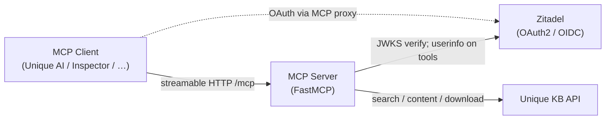
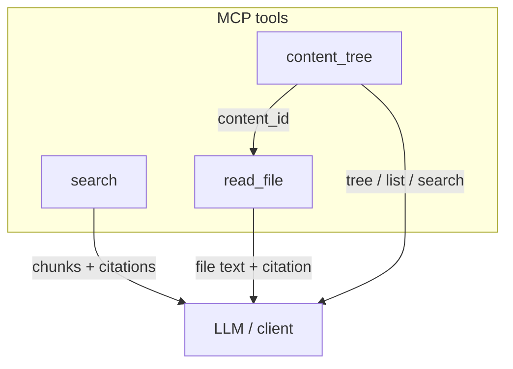
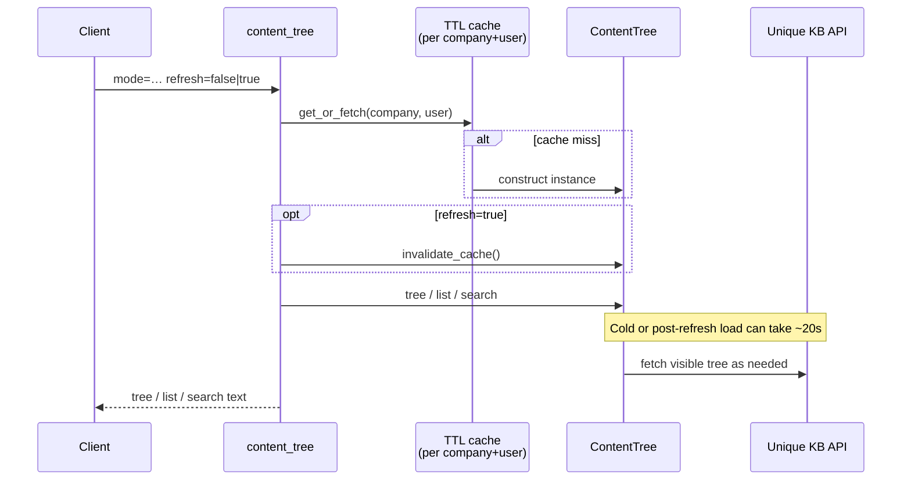
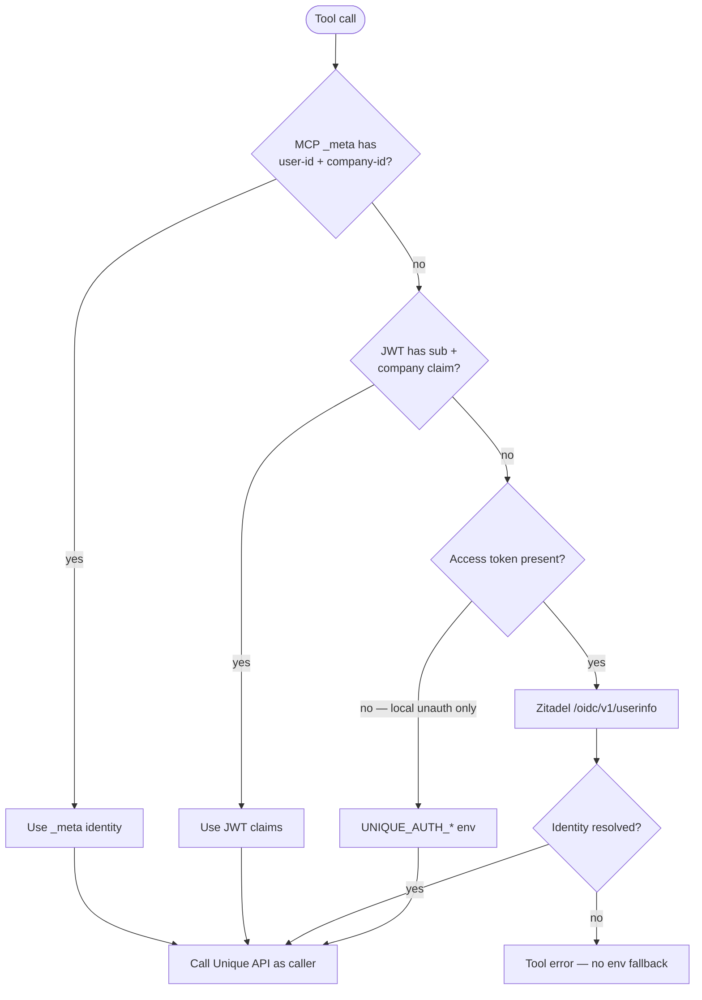
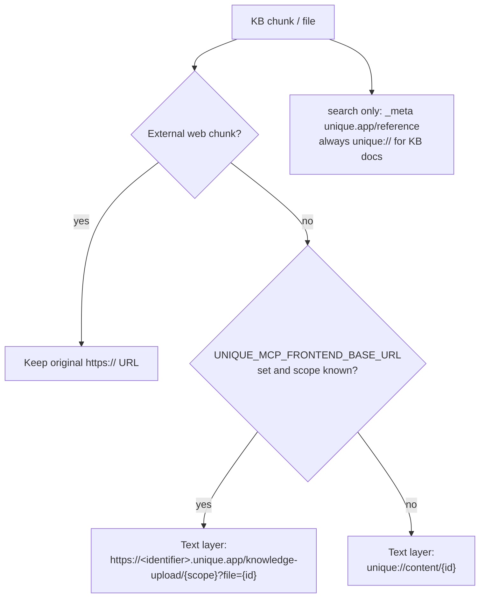

# MCP Search Tutorial

A complete tutorial for building and deploying an [MCP](https://modelcontextprotocol.io/) server that exposes Unique's Knowledge Base to MCP clients. The server uses [FastMCP](https://github.com/jlowin/fastmcp) and authenticates via Zitadel OAuth, and can be reached over HTTPS when deployed (or via a tunnel locally).

## What You'll Build

An MCP server with tools to **search**, **browse**, and **read** Unique Knowledge Base content. The server:

- Runs on [FastMCP](https://github.com/jlowin/fastmcp) with streamable HTTP transport
- Authenticates users through Zitadel OAuth proxy
- Tags results with document citations (markdown text layer; `search` also emits structured `unique.app/reference` in content-item `_meta`)
- Deploys to Azure via **App Service** (supported); Terraform/ACI is WIP — see [`deploy/`](./deploy/)

## Architecture



Tools are loaded from [`src/mcp_search/tools/`](./src/mcp_search/tools/) via FastMCP’s `FileSystemProvider`.



## Tools

| Tool | Purpose |
|------|---------|
| [`search`](#search) | Chunk search over the KB (`COMBINED` hybrid or `VECTOR`; admin config) |
| [`content_tree`](#content_tree) | Browse folders, list files, or fuzzy-find by name/path |
| [`read_file`](#read_file) | Read one file by `content_id` (full or page range) |

### `search`

Search the knowledge base and return relevant chunks with citation headers.

| Param | Required | Description |
|-------|----------|-------------|
| `search_string` | yes | Query text |

Retrieval and post-processing (limits, filters, reranking, token budget) are admin config (`SearchToolConfig`), not LLM tool args. Identity is the logged-in caller — see [Per-user identity](#per-user-identity-not-a-fixed-service-user).

### `content_tree`

Browse the caller’s visible file/folder structure. Pick a `mode`; only that mode’s args apply (others are ignored).

| Param | Modes | Default | Description |
|-------|-------|---------|-------------|
| `mode` | all | — | `tree` \| `list` \| `search` |
| `max_depth` | `tree` | unset | Max folder depth (`1` = top-level only) |
| `folder_path` | `list` | unset | Restrict listing, e.g. `Contracts/2024` |
| `query` | `search` | — | Fuzzy text (required when `mode=search`) |
| `limit` | `list`, `search` | config (`50`) | Max rows / matches |
| `min_score` | `search` | config (`0.6`) | Fuzzy score floor in `[0.0, 1.0]` |
| `match_on` | `search` | config (`both`) | `key` \| `path` \| `both` |
| `case_sensitive` | `search` | config (`false`) | Case-sensitive fuzzy match |
| `refresh` | all | `false` | Invalidate this caller’s `ContentTree` memo and refetch (~20s cold) |

`list` / `search` rows are markdown links plus `content_id=…` for a later `read_file` call. Paths that the toolkit marks with the orphan sentinel `_no_folder_path` strip that segment from the **display** label only; the citation URL is still built (knowledge-upload deep link when scope and `UNIQUE_MCP_FRONTEND_BASE_URL` are known, otherwise `unique://content/{id}`).

Listings are cached per `(company_id, user_id)` (~30 min TTL by default; override with `MCP_SEARCH_CONTENT_TREE_CACHE_TTL_SECONDS` / `_MAX_ENTRIES`). `refresh=true` invalidates only that caller’s `ContentTree` instance, not other users’ cache entries.



### `read_file`

Read one knowledge-base file’s text. Get `content_id` from a prior `content_tree` `list` / `search` (or elsewhere).

| Param | Required | Description |
|-------|----------|-------------|
| `content_id` | yes | File id |
| `start_page` | no | First page (1-indexed); real pages for PDF/DOCX, virtual token pages for plain text |
| `end_page` | no | Last page (inclusive) |

Supported: `.pdf`, `.docx` (chunked pages) and `.txt`, `.md`, `.html`, `.json`, `.csv` (downloaded text). Oversized reads without a range return an informative error (token/page counts) instead of silent truncation. Successful reads start with a markdown citation link. Admin cap: `ReadFileToolConfig.max_tokens_per_call` (default 8000).

## Per-user identity (not a fixed service user)

Search and other tools always run as the **logged-in caller**, not as a shared `UNIQUE_AUTH_*` service account:



| Priority | Source | When |
| -------- | ------ | ---- |
| 1 | MCP `_meta` (`unique.app/auth/user-id` + `company-id`) | Both keys present (e.g. Unique AI forwards the chat user) |
| 2 | Zitadel JWT claims (`sub` + `urn:zitadel:iam:user:resourceowner:id`) | OAuth login with a fully configured token |
| 3 | Zitadel `/oidc/v1/userinfo` | Access token present but JWT is missing the company claim (common) |
| — | Env `UNIQUE_AUTH_*` | **Only** when there is no access token (local unauthenticated dev) |

Tools call `get_unique_settings_async()` from `unique_mcp`. If an access token is present but identity cannot be resolved from `_meta` / JWT / userinfo, the tool **errors** instead of falling back to the env service user. See [`unique_mcp/src/unique_mcp/unique_injectors.py`](../../../unique_mcp/src/unique_mcp/unique_injectors.py).

On Azure, set `UNIQUE_APP_*` / `UNIQUE_API_BASE_URL` for the app’s API credentials. Prefer **not** setting `UNIQUE_AUTH_USER_ID` / `UNIQUE_AUTH_COMPANY_ID` on the Web App so a misconfigured token cannot silently search as one fixed user.

## Document Referencing

Citation behavior differs by tool:

| Tool | Text-layer markdown citation | Content-item `_meta` (`unique.app/reference`) |
|------|------------------------------|-----------------------------------------------|
| `search` | Yes (per chunk) | Yes |
| `content_tree` | Yes (list/search file rows) | No — one plain `TextContent`, no `_meta` |
| `read_file` | Yes (header prefixed on success) | No |

**Text layer** — results are prefixed with a ready-to-paste markdown citation. When `UNIQUE_MCP_FRONTEND_BASE_URL` is set (e.g. `https://<identifier>.unique.app`) and scope is known, the URL is a knowledge-upload deep link:

```
[Annual Report 2025.pdf](https://<identifier>.unique.app/knowledge-upload/scope_…?file=cont_…) (pages 12-14)

<chunk text...>
```

**Structured layer** (`search` only) — each search hit’s MCP content item carries a `unique.app/reference` entry in its `_meta`, shaped like Unique's `ContentReference` (name, url, sourceId, source, sequenceNumber). The structured `url` stays on the platform scheme (`unique://content/{contentId}` for KB docs). This is emitted for future/capable clients; Unique AI today uses the text layer and does not consume content-item `_meta` for chips:

```json
{
  "unique.app/reference": {
    "name": "Annual Report 2025 : 12,13,14",
    "url": "unique://content/cont_abcdefgehijklmnopqrstuvwx",
    "sourceId": "cont_abcdefgehijklmnopqrstuvwx_chunk_abcdefgehijklmnopqrstuv",
    "source": "node-ingestion-chunks",
    "sequenceNumber": 3
  }
}
```



`UNIQUE_MCP_FRONTEND_BASE_URL` is **optional**. Leave it empty / unset (or if folder/scope cannot be resolved) and text-layer URLs fall back to `unique://content/{contentId}` (resolved by the Unique platform frontend). Set it to your tenant web origin when generic MCP clients (e.g. Claude) should open documents in that Unique web deployment — deep links look like `{base}/knowledge-upload/{scopeId}?file={contentId}`. External web chunks keep their original `https://` URL. Models are instructed to paste the markdown links inline (never invent `[sourceN]` placeholders) and list them again under Sources. See [`src/mcp_search/references.py`](./src/mcp_search/references.py).

# Prerequisites

| Tool | Version | Purpose |
|------|---------|---------|
| [Python](https://www.python.org/) | >= 3.12 | Runtime |
| [uv](https://docs.astral.sh/uv/) | latest | Package manager |

You also need:
- A **Unique platform** account with API credentials
- A **Zitadel** instance with a configured OAuth application

Azure deploy tools (Azure CLI, Terraform, Docker) are listed under [`deploy/`](./deploy/).

# Local Development

## 1. Install dependencies

```bash
uv sync
```

## 2. Configure environment

```bash
cp unique.env.example unique.env
cp zitadel.env.example zitadel.env
cp unique_mcp.env.example unique_mcp.env
```

Fill in your credentials in all three files:

**`unique.env`** — your Unique platform credentials:
```
UNIQUE_APP_KEY=<your-app-key>
UNIQUE_APP_ID=<your-app-id>
UNIQUE_API_BASE_URL=https://api.unique.ch
UNIQUE_AUTH_COMPANY_ID=<your-company-id>
UNIQUE_AUTH_USER_ID=<your-user-id>
UNIQUE_APP_ENDPOINT=<your-app-endpoint>
UNIQUE_APP_ENDPOINT_SECRET=<your-endpoint-secret>
```

**`zitadel.env`** — your Zitadel OAuth credentials:
```
ZITADEL_BASE_URL=https://your-instance.zitadel.cloud
ZITADEL_CLIENT_ID=<your-client-id>
ZITADEL_CLIENT_SECRET=<your-client-secret>
```

**`unique_mcp.env`** — MCP server settings:
```
# Public URL clients use to reach the server (for OAuth callbacks, etc.)
# For local dev with ngrok: https://your-subdomain.ngrok-free.app
# Leave unset to default to LOCAL_BASE_URL
UNIQUE_MCP_PUBLIC_BASE_URL=https://your-public-url.example.com

# Local bind address
UNIQUE_MCP_LOCAL_BASE_URL=http://127.0.0.1:8003

# Optional Unique web origin for knowledge-upload deep links.
# See Document Referencing above. Example: https://<identifier>.unique.app
UNIQUE_MCP_FRONTEND_BASE_URL=
```

## 3. Run the server

```bash
# Source your env files
set -a && source unique.env && source zitadel.env && set +a

# Start the server (unique_mcp.env is loaded automatically by the server)
uv run mcp-search
```

The server starts on `http://localhost:8003`. Verify it's running:

```bash
curl http://localhost:8003/health
# {"status": "healthy"}
```

## 4. Test the MCP endpoint

```bash
curl -X POST http://localhost:8003/mcp \
  -H "Content-Type: application/json" \
  -d '{
    "jsonrpc": "2.0",
    "id": 1,
    "method": "initialize",
    "params": {
      "protocolVersion": "2024-11-05",
      "capabilities": {},
      "clientInfo": {"name": "test-client", "version": "1.0"}
    }
  }'
```


## 5. Debug OAuth with the verbose auth client

For end-to-end auth debugging against local or Azure (prints every OAuth HTTP
exchange and decoded JWTs, then lists tools / calls `search`):

```bash
# Against a deployed App Service (pass your APP URL)
uv run python scripts/debug_auth_client.py --url https://$APP.azurewebsites.net/mcp

# Against local server
uv run python scripts/debug_auth_client.py --url http://localhost:8003/mcp

# Auth + list_tools only
uv run python scripts/debug_auth_client.py --no-search

# Extra FastMCP/httpx logs
uv run python scripts/debug_auth_client.py --debug-logs
```

A browser window opens for the MCP consent page → Zitadel login. Tokens are
in-memory only for that process (no Inspector localStorage), so each run starts
a clean Dynamic Client Registration.

There is also a generic discovery script at
[`../client_scripts/debug_mcp_auth.py`](../client_scripts/debug_mcp_auth.py).

## 6. Developing with the MCP Inspector

Start the MCP Inspector against the local streamable HTTP endpoint defined in [`inspector_mcp_server.json`](./inspector_mcp_server.json):

```bash
npx @modelcontextprotocol/inspector --config ./inspector_mcp_server.json --server default-server
```

That config points the client at `http://localhost:8003/mcp` (run `uv run mcp-search` first). The Inspector acts as an MCP client; for OAuth you must register its redirect URI with your IdP (often `http://localhost:6274/oauth/callback` or similar—check the Inspector’s console output).

### `user_id` and `company_id` in tool calls

The Unique stack resolves **user** and **company** for tools from the MCP request. You can supply them in the **`_meta`** object sent with tool invocations, using these keys:

| Key | Purpose |
|-----|---------|
| `unique.app/auth/user-id` | User id |
| `unique.app/auth/company-id` | Company id |

**Both** keys must be set to non-empty strings in `_meta` for that path to apply; otherwise identity falls through to JWT claims, then Zitadel `/userinfo` if an access token is present. Env `UNIQUE_AUTH_USER_ID` / `UNIQUE_AUTH_COMPANY_ID` apply **only** when there is no access token (same rules as [Per-user identity](#per-user-identity-not-a-fixed-service-user)).

See also `MetaKeys` in `unique_mcp` and the example in [`src/mcp_search/mcp_client.py`](./src/mcp_search/mcp_client.py) (`call_tool(..., meta={...})`).


## 7. Expose the server for remote clients

Remote MCP clients (and the Zitadel OAuth redirect) need a public HTTPS URL for this server. During local development you can use [ngrok](https://ngrok.com/) to expose it.

### Expose the server via ngrok

```bash
ngrok http 8003
```

Copy the generated `https://<subdomain>.ngrok-free.app` URL — this is your **public base URL**.

Set it in `unique_mcp.env`:

```
UNIQUE_MCP_PUBLIC_BASE_URL=https://<subdomain>.ngrok-free.app
```

Traffic flows as: **MCP Client → ngrok → localhost:8003 (MCP Server)**.

### Register the callback URI in Zitadel

Add the ngrok-based redirect URI to your Zitadel OAuth application so the OAuth flow can complete:

```
https://<subdomain>.ngrok-free.app/auth/callback
```

See [`unique_mcp/docs/zitadel/README.md`](../../../unique_mcp/docs/zitadel/README.md) for full Zitadel setup instructions.


# Deploy

Deploy docs live under [`deploy/`](./deploy/):

- **[Deploy index](./deploy/README.md)** — App Service (supported) vs Terraform (WIP), auth warning
- **[App Service](./deploy/appservice/README.md)** — recommended path (`deploy/appservice/deploy.sh`)
- **[Terraform / ACI](./deploy/terraform/README.md)** — WIP / experimental; not the primary path

Do **not** set `UNIQUE_AUTH_USER_ID` / `UNIQUE_AUTH_COMPANY_ID` on a deployed app; see [Per-user identity](#per-user-identity-not-a-fixed-service-user).

## Further Reading

- [Model Context Protocol specification](https://modelcontextprotocol.io/)
- [FastMCP documentation](https://gofastmcp.com/)
- [Unique Toolkit documentation](https://unique-ag.github.io/ai/)
- [Caddy automatic HTTPS](https://caddyserver.com/docs/automatic-https)
