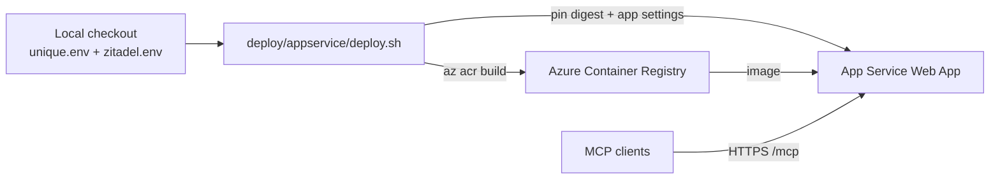

# Azure App Service deploy

**Supported deploy path** for mcp_search: build an image with `az acr build`,
deploy an App Service Web App pinned to the image digest, and push app/Zitadel
secrets from your local env files.

See the [deploy index](../README.md) for App Service vs Terraform (WIP), and the
[package README](../../README.md) for local development and identity resolution.



## Prerequisites

1. An Azure subscription and an existing resource group (set `SUBSCRIPTION` and
   `RG` in `deploy.env`)
2. [Azure CLI](https://learn.microsoft.com/en-us/cli/azure/install-azure-cli) installed and logged in (`az login`)
3. [Docker](https://docs.docker.com/get-docker/) is not required locally — the image is built in ACR
4. Zitadel app with redirect URI
   `https://$APP.azurewebsites.net/auth/callback` (match the `APP` you set in
   `deploy.env`)
5. Filled-in [`unique.env`](../../unique.env.example) and
   [`zitadel.env`](../../zitadel.env.example) at the **package root**
   (`tutorials/mcp/mcp_search/`; same credential files as local run;
   `unique_mcp.env` is local-only and not read by deploy)

## What deploy.sh does

- Creates the Azure Container Registry named `$ACR` on first run (idempotent).
- Builds the Docker image in Azure with `az acr build`. The build resolves
  `unique-mcp` and `unique-toolkit` from PyPI (`uv sync --no-sources`), so it
  works standalone without the monorepo checkout.
- Creates or updates the App Service plan (`$PLAN`, default `${APP}-plan`,
  Linux B1) and Web App `$APP`, and sets `WEBSITES_PORT=8003`, Always On, and
  the base-URL app settings (`UNIQUE_MCP_LOCAL_BASE_URL`,
  `UNIQUE_MCP_PUBLIC_BASE_URL`).

## Deploy

1. Copy `deploy.env.example` → `deploy.env` (next to this script; gitignored) and
   fill in `SUBSCRIPTION`, `RG`, `APP`, and `ACR`. Set `APP` to the Web App
   name you want; the public URL will be `https://$APP.azurewebsites.net`.
2. Ensure package-root `unique.env` and `zitadel.env` have real app + Zitadel
   secrets (not placeholders).
3. Run the script from either cwd — both are equivalent. The script always
   resolves its own directory for `deploy.env`, then `cd`s to the package root
   for the build context and default secret files:

```bash
# from package root (tutorials/mcp/mcp_search/):
deploy/appservice/deploy.sh

# or from this directory:
./deploy.sh
```

Re-running the script rebuilds the image, pins the new digest, and restarts the
app. Register `https://$APP.azurewebsites.net/auth/callback` in Zitadel for
whatever `APP` you deploy.

Target configuration comes from `deploy.env` or plain environment variables —
there are no baked-in defaults. Secrets are pushed as Web App settings from
package-root `unique.env` / `zitadel.env`. The script does **not** load
`unique_mcp.env`; `UNIQUE_MCP_LOCAL_BASE_URL` / `UNIQUE_MCP_PUBLIC_BASE_URL`
are set by the script, and optional `UNIQUE_MCP_FRONTEND_BASE_URL` comes from
`deploy.env` or the shell. It aborts on missing or placeholder values. Options:

- `--env-file <path>` — read secrets from other file(s) instead (repeatable)
- `--skip-secrets` — deploy without touching secrets (prints the manual
  `az webapp config appsettings set` command instead)

`UNIQUE_AUTH_USER_ID` / `UNIQUE_AUTH_COMPANY_ID` are **never** pushed, even if
present in the env files.

Do **not** set `UNIQUE_AUTH_USER_ID` / `UNIQUE_AUTH_COMPANY_ID` on the deployed app — those are for local unauthenticated testing only. Production identity comes from the OAuth login (JWT / userinfo) or Unique AI `_meta`. See [Per-user identity](../../README.md#per-user-identity-not-a-fixed-service-user).

After deploy, the app is at `https://$APP.azurewebsites.net` (`/health`, `/mcp`).

## Restart

```bash
az webapp restart -n "$APP" -g "$RG"   # values from deploy.env
```

Note: OAuth client registrations are kept in memory and are lost on restart — MCP clients will transparently re-register via Dynamic Client Registration.

## Notes

### Zitadel app configuration

- **App type:** Web Application
- **Token endpoint auth:** POST (`client_secret_post`)
- **Access token type:** JWT (not opaque)
- **Redirect URI:** `https://$APP.azurewebsites.net/auth/callback`

### Terraform (WIP)

A Terraform / ACI stack lives under [`../terraform/`](../terraform/) — see its
[README](../terraform/README.md). It is **experimental / WIP**, not the
supported path; use App Service unless you are intentionally working on that
stack.
