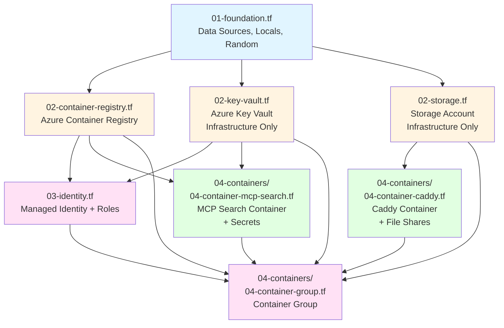

# Terraform Dependency Structure

This document visualizes the dependency relationships between Terraform resources. The file names are prefixed with numbers to reflect their dependency layer in the folder structure.

## File Structure (Dependency Visualization)

**Note**: All `.tf` files are in the root `terraform/` directory. Terraform only reads files from the directory where `terraform init` is run. The numbered prefixes organize files by dependency layer.

```
terraform/
├── 01-foundation.tf              ← Layer 0: Base (no dependencies)
├── 02-container-registry.tf      ← Layer 1: Core Infrastructure
├── 02-key-vault.tf               ← Layer 1: Core Infrastructure (parallel)
├── 02-storage.tf                 ← Layer 1: Core Infrastructure (parallel)
├── 03-identity.tf                ← Layer 2: Depends on Layer 1
├── 04-container-mcp-search.tf    ← Layer 3: MCP Search container + secrets
├── 04-container-caddy.tf         ← Layer 3: Caddy container + file shares
├── 04-container-group.tf          ← Layer 3: Container group (hosts all containers)
│
├── providers.tf                  (Configuration)
├── variables.tf                  (Inputs)
└── outputs.tf                    (Outputs)
```

**Key**: Files with the same prefix number can be read in any order (parallel dependencies). Higher numbers depend on lower numbers.

**Architecture Principle**: Each container is self-contained in its own file - it defines its own file shares and secrets. The only dependency is that Key Vault and Storage Account infrastructure exist. The container group file assembles all containers together.

## Dependency Graph



## Dependency Layers

### Layer 0: Foundation (01-)
- **01-foundation.tf** - No dependencies
  - Data sources (resource group, client config)
  - Random suffix generation
  - Local values (naming conventions)

### Layer 1: Core Infrastructure (02-)
These files provide infrastructure only (no application-specific resources):
- **02-container-registry.tf** - Azure Container Registry
- **02-key-vault.tf** - Azure Key Vault (infrastructure only)
- **02-storage.tf** - Storage Account (infrastructure only, plus Terraform state container)

### Layer 2: Identity & Access (03-)
- **03-identity.tf** - Managed Identity and role assignments (depends on Key Vault + ACR)

### Layer 3: Containers (04-)
**Self-contained container definitions** - each container defines its own dependencies:
- **04-container-mcp-search.tf** - MCP Search Container
  - Defines secrets it needs (all application secrets)
  - Defines container configuration
  - Depends on: ACR, Key Vault, Identity

- **04-container-caddy.tf** - Caddy Reverse Proxy Container
  - Defines file shares it needs (caddy_data, caddy_config)
  - Defines container configuration
  - Depends on: Storage Account

- **04-container-group.tf** - Container Group
  - Assembles all containers into a single Azure Container Group
  - Defines shared infrastructure (ACR credentials, identity, exposed ports)
  - Depends on: All container files, ACR, Key Vault, Storage Account, Identity

## File Dependency Matrix

| Directory/File | Prefix | Depends On | Contains |
|----------------|--------|-----------|---------|
| `01-foundation/01-foundation.tf` | 01 | None | Data sources, locals, random |
| `02-core-infrastructure/02-container-registry.tf` | 02 | `01-foundation.tf` | ACR infrastructure |
| `02-core-infrastructure/02-key-vault.tf` | 02 | `01-foundation.tf` | Key Vault infrastructure only |
| `02-core-infrastructure/02-storage.tf` | 02 | `01-foundation.tf` | Storage Account infrastructure only |
| `03-identity/03-identity.tf` | 03 | `02-key-vault.tf`, `02-container-registry.tf` | Managed Identity, roles |
| `04-containers/04-container-mcp-search.tf` | 04 | `02-key-vault.tf`, `02-container-registry.tf`, `03-identity.tf` | MCP Search container config, **secrets** |
| `04-containers/04-container-caddy.tf` | 04 | `02-storage.tf` | Caddy container config, **file shares** |
| `04-containers/04-container-group.tf` | 04 | All previous files | Container group (assembles all containers) |

## Reading Order

When reading the Terraform configuration, follow this order to understand dependencies:

1. **01-foundation/01-foundation.tf** - Understand base configuration
2. **02-core-infrastructure/** - Core infrastructure (can be read in any order)
   - `02-container-registry.tf`
   - `02-key-vault.tf`
   - `02-storage.tf`
3. **03-identity/03-identity.tf** - Identity and access management
4. **04-containers/** - Individual container definitions (can be read in any order)
   - `04-container-mcp-search.tf`
   - `04-container-caddy.tf`
   - `04-container-group.tf` - Container group assembly (brings all containers together)

## Benefits of Numbered Prefixes

- ✅ **Visual ordering**: Files are sorted by dependency level in file explorers
- ✅ **Clear hierarchy**: Numbers immediately show which layer a file belongs to
- ✅ **Easy navigation**: Find related files by their prefix number
- ✅ **Self-documenting**: The folder structure itself shows the dependency graph
