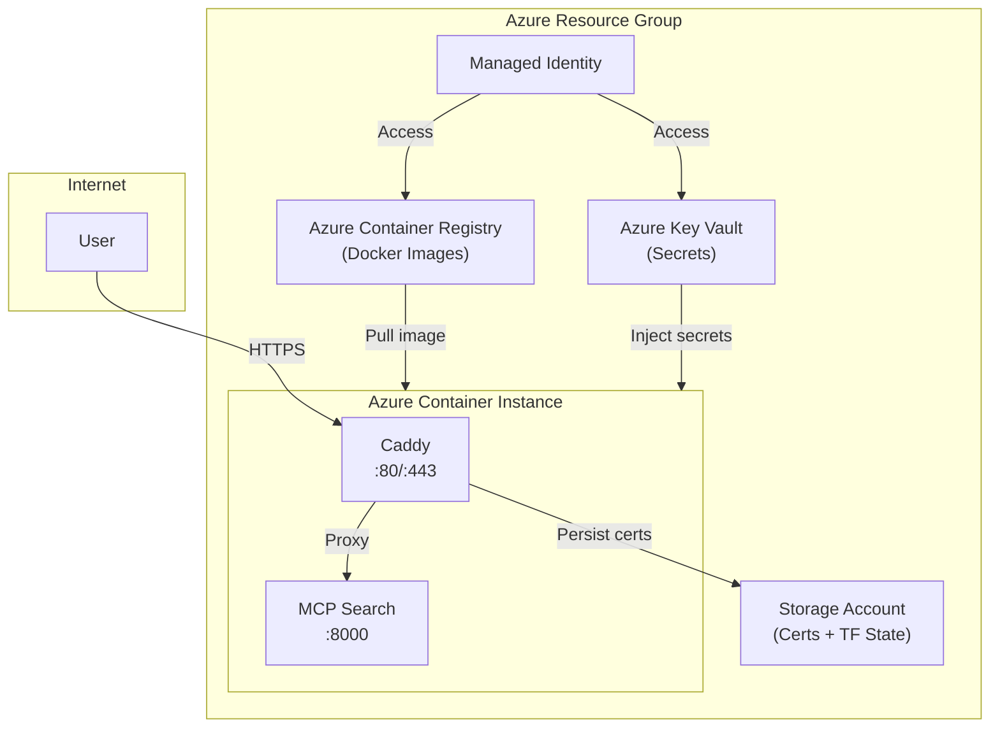

# MCP Search - Azure Terraform Deployment

This Terraform configuration deploys the MCP Search application to Azure with the following resources:

## Architecture



## Resources Created

| Resource | Name Pattern | Purpose |
|----------|-------------|---------|
| Container Registry | `acrsearchmcp<suffix>` | Stores Docker images |
| Key Vault | `kv-search-mcp-<suffix>` | Stores application secrets |
| Storage Account | `stsearchmcp<suffix>` | Stores Caddy certificates + Terraform state |
| Log Analytics Workspace | `law-search-mcp-<suffix>` | Centralized logging (30 days retention) |
| Container Instance | `aci-search-mcp-<suffix>` | Runs the application containers |
| Managed Identity | `id-search-mcp-<suffix>` | Provides secure access to resources |

## Prerequisites

1. **Azure CLI** - [Install](https://docs.microsoft.com/en-us/cli/azure/install-azure-cli)
2. **Terraform** >= 1.5.0 - [Install](https://www.terraform.io/downloads)
3. **Docker** - [Install](https://docs.docker.com/get-docker/)
4. **Azure Subscription** with appropriate permissions

## Remote State Backend (Optional but Recommended)

For team collaboration, consider using Azure Storage Account as a Terraform backend to store state remotely. See [BACKEND_SETUP.md](./BACKEND_SETUP.md) for setup instructions.

### Quick Setup (After First Deployment)

**Option 1: Using the deployment script** (easiest):
```bash
# After your first successful deployment with local state:
./deploy.sh create-backend    # Shows storage account details (already created!)
# Edit providers.tf with the storage account name from output
./deploy.sh migrate-backend  # Migrates state to remote backend
```

**Option 2: Manual setup:**
1. Deploy infrastructure first: `./deploy.sh deploy` (creates storage account automatically)
2. Get storage account name: `terraform output storage_account_name`
3. Uncomment backend config in `providers.tf` and use the storage account name
4. Run `terraform init` and answer "yes" when prompted to migrate state

**Note**: The storage account is shared between Caddy certificates and Terraform backend - no need for a separate storage account! You can deploy with local state first, then migrate to remote state later.

## Quick Start

### 1. Login to Azure

```bash
# Login to Azure
az login

# Set the default subscription (required for Terraform)
az account set --subscription "Your Subscription Name"

# Verify the subscription is set
az account show
```

**Note**: If you get a "subscription ID could not be determined" error, either:
- Set the subscription via Azure CLI (as shown above), or
- Set it in `terraform.tfvars`: `subscription_id = "your-subscription-id"`
- Or set environment variable: `export ARM_SUBSCRIPTION_ID="your-subscription-id"`

### 2. Create Resource Group (if it doesn't exist)

```bash
az group create --name rg-mcp-search --location westeurope
```

### 3. Configure Variables

```bash
cp terraform.tfvars.example terraform.tfvars
# Edit terraform.tfvars with your values
```

### 4. Deploy

Using the deployment script:

```bash
chmod +x deploy.sh
./deploy.sh deploy
```

Or manually:

```bash
# Initialize Terraform
terraform init

# Plan the deployment
terraform plan -out=tfplan

# Apply the configuration
terraform apply tfplan

# Build and push Docker image
az acr login --name $(terraform output -raw acr_name)
cd ..
az acr build --registry $(terraform output -raw acr_name) --image mcp-search:latest .
```

### 5. Configure DNS

After deployment, create a DNS record pointing your domain to the container IP:

```bash
# Get the IP address
terraform output aci_ip_address

# Create an A record:
# your-domain.com -> <IP_ADDRESS>
```

## Variables

### Required Variables

| Variable | Description |
|----------|-------------|
| `resource_group_name` | Name of the Azure Resource Group |
| `location` | Azure region (e.g., `westeurope`) |
| `domain_name` | Domain name for the application |
| `caddy_email` | Email for Let's Encrypt notifications |
| `unique_app_key` | UNIQUE_APP_KEY environment variable |
| `unique_app_id` | UNIQUE_APP_ID environment variable |
| `unique_api_base_url` | UNIQUE_API_BASE_URL environment variable |
| `unique_auth_company_id` | UNIQUE_AUTH_COMPANY_ID environment variable |
| `unique_auth_user_id` | UNIQUE_AUTH_USER_ID environment variable |
| `unique_app_endpoint` | UNIQUE_APP_ENDPOINT environment variable |
| `unique_app_endpoint_secret` | UNIQUE_APP_ENDPOINT_SECRET environment variable |
| `zitadel_base_url` | ZITADEL_BASE_URL environment variable |
| `zitadel_client_id` | ZITADEL_CLIENT_ID environment variable |
| `zitadel_client_secret` | ZITADEL_CLIENT_SECRET environment variable |

### Optional Variables

| Variable | Default | Description |
|----------|---------|-------------|
| `app_container_cpu` | `1` | CPU cores for app container |
| `app_container_memory` | `1.5` | Memory (GB) for app container |
| `caddy_container_cpu` | `0.5` | CPU cores for Caddy container |
| `caddy_container_memory` | `0.5` | Memory (GB) for Caddy container |
| `app_image_tag` | `latest` | Docker image tag |
| `tags` | See defaults | Resource tags |

## Secrets Management

**⚠️ IMPORTANT: Never commit secrets to version control!**

The `.gitignore` file is configured to exclude `terraform.tfvars` and other sensitive files. Always use `terraform.tfvars.example` as a template.

### Best Practices

1. **Local Development**: Use `terraform.tfvars` (gitignored) for local testing
2. **CI/CD**: Use environment variables or secret management systems
3. **Production**: Use Azure Key Vault, Terraform Cloud, or CI/CD secrets

### Option 1: Environment Variables (Recommended for CI/CD)

Set environment variables with the `TF_VAR_` prefix:

```bash
export TF_VAR_resource_group_name="rg-mcp-search"
export TF_VAR_location="westeurope"
export TF_VAR_domain_name="mcp-search.example.com"
export TF_VAR_caddy_email="admin@example.com"
export TF_VAR_unique_app_key="your-key"
export TF_VAR_unique_app_id="your-id"
export TF_VAR_unique_api_base_url="https://api.unique.ch"
export TF_VAR_unique_auth_company_id="your-company-id"
export TF_VAR_unique_auth_user_id="your-user-id"
export TF_VAR_unique_app_endpoint="https://your-app-endpoint"
export TF_VAR_unique_app_endpoint_secret="your-secret"
export TF_VAR_zitadel_base_url="https://your-zitadel.zitadel.cloud"
export TF_VAR_zitadel_client_id="your-client-id"
export TF_VAR_zitadel_client_secret="your-client-secret"
```

Then run Terraform normally:
```bash
terraform plan
terraform apply
```

### Option 2: terraform.tfvars (Local Development Only)

1. Copy the example file:
   ```bash
   cp terraform.tfvars.example terraform.tfvars
   ```

2. Edit `terraform.tfvars` with your actual values (this file is gitignored)

3. Run Terraform:
   ```bash
   terraform plan
   terraform apply
   ```

### Option 3: Azure Key Vault Integration (Advanced)

For production, you can use Azure Key Vault as a Terraform backend for variables:

```hcl
# In providers.tf or a separate file
data "azurerm_key_vault" "secrets" {
  name                = "your-key-vault-name"
  resource_group_name = "your-rg-name"
}

data "azurerm_key_vault_secret" "unique_app_key" {
  name         = "unique-app-key"
  key_vault_id = data.azurerm_key_vault.secrets.id
}

# Then reference in variables.tf or use directly
```

### Option 4: CI/CD Secrets (GitHub Actions, Azure DevOps)

Store secrets in your CI/CD platform's secret management:

**GitHub Actions:**
```yaml
env:
  TF_VAR_unique_app_key: ${{ secrets.UNIQUE_APP_KEY }}
  TF_VAR_unique_app_id: ${{ secrets.UNIQUE_APP_ID }}
  # ... etc
```

**Azure DevOps:**
```yaml
variables:
  - group: terraform-secrets
```

### What's Gitignored?

The following files are automatically excluded from git:
- `terraform.tfvars` - Your actual secrets (never commit!)
- `*.tfstate` - Terraform state files (may contain sensitive data)
- `.terraform/` - Provider plugins and modules
- `tfplan` - Plan files (may contain sensitive data)

**Always commit:**
- `terraform.tfvars.example` - Template with placeholder values
- `*.tf` - Terraform configuration files
- `providers.tf`, `variables.tf`, `main.tf`, `outputs.tf`

## Deployment Script Commands

```bash
./deploy.sh init            # Initialize Terraform
./deploy.sh plan            # Plan infrastructure changes
./deploy.sh apply           # Apply infrastructure changes
./deploy.sh build           # Build and push Docker image to ACR
./deploy.sh restart         # Restart the container instance
./deploy.sh deploy          # Full deployment (all of the above)
./deploy.sh status          # Check container instance status and health
./deploy.sh test            # Test MCP endpoint with curl (health check)
./deploy.sh logs [container] [-f]  # View container logs
./deploy.sh outputs         # Show Terraform outputs
./deploy.sh create-backend  # Show storage account details for Terraform backend
./deploy.sh migrate-backend # Migrate local state to Azure Storage backend
./deploy.sh destroy         # Destroy all infrastructure
```

### Checking Container Status

Check if your containers are running and view their current state:

```bash
# Check container status, health, and recent events
./deploy.sh status
```

This shows:
- Container group state (Running, Stopped, etc.)
- Individual container states
- Container images and resource allocation
- Recent events and errors
- Restart counts

### Testing the MCP Endpoint

Test if your MCP application is responding:

```bash
# Automated test (recommended)
./deploy.sh test
```

This will:
- Test the root endpoint (`/`)
- Test the health endpoint (`/health`)
- Test direct container access (bypassing Caddy)
- Test MCP protocol endpoint (`/mcp`)
- Show HTTP status codes and responses

**Quick manual tests:**
```bash
# Get endpoint URLs
terraform output application_url
terraform output aci_fqdn

# Test health endpoint
curl http://$(terraform output -raw aci_fqdn)/health

# Test direct container access
curl http://$(terraform output -raw aci_fqdn):8000/health

# Test MCP protocol endpoint
curl -X POST http://$(terraform output -raw aci_fqdn):8000/mcp \
  -H "Content-Type: application/json" \
  -d '{"jsonrpc":"2.0","id":1,"method":"initialize","params":{"protocolVersion":"2024-11-05","capabilities":{},"clientInfo":{"name":"test","version":"1.0"}}}'
```

**📖 For detailed testing instructions, see [TESTING.md](./TESTING.md)**

### Viewing Container Logs

View logs from your containers to monitor application behavior and troubleshoot issues. Logs are available in two ways:

#### 1. Real-time Container Logs (Limited Retention)

```bash
# View all container logs
./deploy.sh logs

# View logs from a specific container
./deploy.sh logs mcp-search   # MCP Search application logs
./deploy.sh logs caddy        # Caddy reverse proxy logs

# Follow logs in real-time (live updates)
./deploy.sh logs mcp-search -f
./deploy.sh logs caddy -f
```

#### 2. Log Analytics (Persistent Storage, 30 days retention)

For persistent logs with advanced querying capabilities:

```bash
# Query logs from Log Analytics workspace
./deploy.sh logs mcp-search --analytics
./deploy.sh logs caddy --analytics

# Or use Azure CLI directly
az monitor log-analytics query \
  --workspace $(terraform output -raw log_analytics_workspace_id) \
  --analytics-query "ContainerInstanceLog_CL | where ContainerGroup_s == '$(terraform output -raw aci_name)' | order by TimeGenerated desc | take 100"
```

**Access Log Analytics in Azure Portal:**
```bash
# Get the portal URL
terraform output log_analytics_portal_url
```

**Container Names:**
- `mcp-search` - The MCP Search application container
- `caddy` - The Caddy reverse proxy container

**Why Log Analytics?**
- ✅ **Persistent storage**: 30 days retention (configurable)
- ✅ **Advanced querying**: KQL queries for complex log analysis
- ✅ **Better troubleshooting**: Historical logs even if containers restart
- ✅ **Centralized**: All container logs in one place

## Updating the Application

After making code changes:

```bash
# Build and push new image
./deploy.sh build

# Restart container to pull new image
./deploy.sh restart
```

### Docker Build Issues

If you encounter network timeouts or Docker Hub rate limiting during `./deploy.sh build`:

**Option 1: Retry** (often resolves transient network issues)
```bash
./deploy.sh build
```

**Option 2: Build locally and push**
```bash
# Login to ACR
az acr login --name $(terraform output -raw acr_name)

# Build locally
docker build -t $(terraform output -raw acr_login_server)/mcp-search:latest .

# Push to ACR
docker push $(terraform output -raw acr_login_server)/mcp-search:latest

# Restart container
./deploy.sh restart
```

**Option 3: Use ACR's public image caching**
The build script automatically retries up to 3 times. If it still fails, wait a few minutes and try again, or use the local build method above.

## Troubleshooting

### No Logs or Containers Not Running

If you're not seeing logs or suspect containers aren't running:

```bash
# 1. Check container status first
./deploy.sh status

# 2. If containers are stopped, restart them
./deploy.sh restart

# 3. View logs after restart
./deploy.sh logs mcp-search -f

# 4. Check container events for errors
az container show \
  --name $(terraform output -raw aci_name) \
  --resource-group $(terraform output -raw resource_group_name) \
  --query "containers[*].instanceView.events" \
  --output table
```

**Common Issues:**

1. **Container Image Not Found**: Make sure you've built and pushed the image:
   ```bash
   ./deploy.sh build
   ```

2. **Container Crashed**: Check events for crash reasons:
   ```bash
   ./deploy.sh status
   ```

3. **No Logs Yet**: Containers might be starting up. Wait a few seconds and try again, or use `-f` to follow:
   ```bash
   ./deploy.sh logs mcp-search -f
   ```

4. **Container Group Stopped**: Restart the container group:
   ```bash
   ./deploy.sh restart
   ```

### Subscription ID Error

If you see: `Error: subscription ID could not be determined and was not specified`

**Solution 1** (Recommended): Set default subscription via Azure CLI
```bash
az account set --subscription "Your Subscription Name or ID"
az account show  # Verify it's set
```

**Solution 2**: Set subscription ID in `terraform.tfvars`
```hcl
subscription_id = "12345678-1234-1234-1234-123456789012"
```

**Solution 3**: Set environment variable
```bash
export ARM_SUBSCRIPTION_ID="12345678-1234-1234-1234-123456789012"
```

### Resource Provider Registration Error

If you see: `Error: Terraform does not have the necessary permissions to register Resource Providers`

This happens when Terraform tries to automatically register Azure Resource Providers but you don't have the required permissions. The configuration has been set to disable automatic registration (`resource_provider_registrations = "none"`).

**Required Resource Providers** (must be registered by a subscription admin):

```bash
# Register the required providers (requires Contributor or Owner role)
az provider register --namespace Microsoft.ContainerRegistry
az provider register --namespace Microsoft.KeyVault
az provider register --namespace Microsoft.Storage
az provider register --namespace Microsoft.ContainerInstance

# Check registration status
az provider show --namespace Microsoft.ContainerRegistry --query "registrationState"
az provider show --namespace Microsoft.KeyVault --query "registrationState"
az provider show --namespace Microsoft.Storage --query "registrationState"
az provider show --namespace Microsoft.ContainerInstance --query "registrationState"
```

**Required Resource Providers:**
- `Microsoft.ContainerRegistry` - For Azure Container Registry
- `Microsoft.KeyVault` - For Azure Key Vault
- `Microsoft.Storage` - For Storage Account
- `Microsoft.ContainerInstance` - For Azure Container Instances
- `Microsoft.OperationalInsights` - For Log Analytics workspace

**Note**: If you don't have permissions to register providers, ask your Azure subscription administrator to register them. Registration typically takes 1-2 minutes per provider.

### Role Assignment Permission Error

If you see: `Error: does not have authorization to perform action 'Microsoft.Authorization/roleAssignments/write'`

This happens when Terraform tries to assign the `AcrPull` role to the managed identity but you don't have User Access Administrator or Owner permissions. This is the default behavior (`use_managed_identity_for_acr = true`).

**📖 Want to understand why we need this?** See [ACR_AUTHENTICATION.md](./ACR_AUTHENTICATION.md) for a detailed explanation of authentication methods.

**Solution 1** (Quickest): Disable managed identity for ACR

If you don't have permissions, use ACR admin credentials instead:

Add to your `terraform.tfvars`:
```hcl
use_managed_identity_for_acr = false
```

**Solution 2** (Recommended): Grant yourself User Access Administrator at resource group level

If you have Contributor or Owner permissions on the resource group:

Add to your `terraform.tfvars`:
```hcl
grant_rg_user_access_admin = true
```

Run `terraform apply` once. After this succeeds, you can set `grant_rg_user_access_admin = false`.

**Solution 3**: Ask an admin to grant the role

Have a subscription Owner or User Access Administrator run:
```bash
az role assignment create \
  --assignee "your-email@domain.com" \
  --role "User Access Administrator" \
  --scope "/subscriptions/<subscription-id>/resourceGroups/<resource-group-name>"
```

**Note**: The managed identity is still created and used for Key Vault access (via access policies, not role assignments), so that works regardless of this setting.

### View Container Logs

```bash
az container logs --name $(terraform output -raw aci_name) \
    --resource-group $(terraform output -raw resource_group_name) \
    --container-name mcp-search

# For Caddy logs
az container logs --name $(terraform output -raw aci_name) \
    --resource-group $(terraform output -raw resource_group_name) \
    --container-name caddy
```

### Check Container Status

```bash
az container show --name $(terraform output -raw aci_name) \
    --resource-group $(terraform output -raw resource_group_name) \
    --query "containers[].instanceView.currentState"
```

### Restart Containers

```bash
az container restart --name $(terraform output -raw aci_name) \
    --resource-group $(terraform output -raw resource_group_name)
```

### Connect to Container (Debug)

```bash
az container exec --name $(terraform output -raw aci_name) \
    --resource-group $(terraform output -raw resource_group_name) \
    --container-name mcp-search \
    --exec-command "/bin/bash"
```

## Costs

Approximate monthly costs (West Europe, as of 2024):

| Resource | SKU | Estimated Cost |
|----------|-----|---------------|
| Container Registry | Basic | ~$5/month |
| Key Vault | Standard | ~$0.03/10k operations |
| Storage Account | Standard LRS | ~$0.02/GB |
| Container Instance | 1.5 CPU, 2GB RAM | ~$50-70/month |

**Total: ~$60-80/month**

## Security Considerations

1. **Secrets**: All sensitive values are stored in Azure Key Vault (for audit/backup) and passed securely to containers
2. **Container Registry**: Managed identity is used by default; set `use_managed_identity_for_acr = false` if you lack permissions
3. **HTTPS**: Caddy automatically provisions and renews Let's Encrypt certificates
4. **Network**: Consider adding NSG rules or using Azure Firewall for additional security
5. **Identity**: User-assigned managed identity is used for Key Vault access
6. **State**: Use remote backend (Azure Storage) for team collaboration - see [BACKEND_SETUP.md](./BACKEND_SETUP.md)

## Clean Up

To destroy all resources:

```bash
./deploy.sh destroy
# Or manually:
terraform destroy
```

**Warning**: This will delete all resources including the Key Vault and its secrets. Make sure to backup any important data first.
