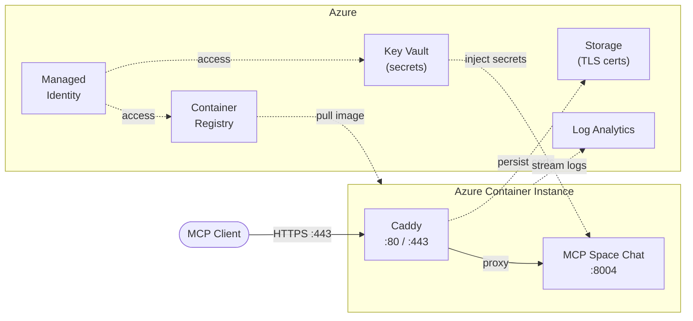

# Deploy to Azure

Two deployment paths are supported:

1. **Azure App Service** (quick, `./deploy.sh` at the package root) — Linux Web App pulling from ACR.
2. **Azure Container Instances + Caddy** (full HTTPS / Key Vault / Log Analytics, `terraform/`) — same shape as the `mcp_search` tutorial.

## Option A — App Service (recommended for demos)

Prerequisites: Azure CLI logged in, a resource group that already exists (or create one), Docker build happens in ACR via `az acr build`.

```bash
cd tutorials/mcp/mcp_space_chat

# Optional overrides
export SUBSCRIPTION=...
export RG=rg-lab-demo-001-unique-space-chat-mcp
export APP=unique-space-chat-mcp
export UNIQUE_FRONTEND_BASE_URL=https://next.qa.unique.app

# Create the RG once if needed
az group create --name "$RG" --location swedencentral

chmod +x deploy.sh
./deploy.sh
```

Then set secrets (not baked into the image):

```bash
az webapp config appsettings set -n "$APP" -g "$RG" --settings \
  UNIQUE_APP_KEY=... \
  UNIQUE_APP_ID=... \
  UNIQUE_API_BASE_URL=... \
  UNIQUE_APP_ENDPOINT=... \
  UNIQUE_APP_ENDPOINT_SECRET=... \
  ZITADEL_BASE_URL=... \
  ZITADEL_CLIENT_ID=... \
  ZITADEL_CLIENT_SECRET=...
```

Register the OAuth redirect URI in Zitadel:

```
https://unique-space-chat-mcp.azurewebsites.net/auth/callback
```

Endpoints after deploy:

| URL | Purpose |
|-----|---------|
| `https://<app>.azurewebsites.net/health` | Health check |
| `https://<app>.azurewebsites.net/mcp` | Streamable HTTP MCP endpoint |

## Option B — ACI + Caddy (Terraform)

The `terraform/` directory deploys ACR, Key Vault, Log Analytics, a managed identity, and an ACI group running the app on port **8004** behind Caddy on 80/443.

```bash
cd terraform

az login
az account set --subscription "Your Subscription Name"
az group create --name rg-mcp-space-chat --location westeurope

cp terraform.tfvars.example terraform.tfvars
# Edit terraform.tfvars — unique_frontend_base_url is required

chmod +x deploy.sh
./deploy.sh deploy
./deploy.sh verify
```

### Post-deployment

```bash
./deploy.sh status
./deploy.sh test
./deploy.sh logs mcp-space-chat
./deploy.sh logs caddy
./deploy.sh outputs
```

### DNS

```bash
cd terraform && terraform output aci_ip_address
# A record: your-domain.com -> <IP>
```

### Updating the image

```bash
./deploy.sh build    # Build and push new image
./deploy.sh restart  # Restart container to pick up the new image
```

### Tear down

```bash
./deploy.sh destroy
```

Full infrastructure details: [`terraform/README.md`](terraform/README.md).

## Architecture (ACI path)



## Required environment variables

| Variable | Where | Notes |
|----------|-------|-------|
| `UNIQUE_MCP_LOCAL_BASE_URL` | App settings | Bind address inside the container, e.g. `http://0.0.0.0:8004` |
| `UNIQUE_MCP_PUBLIC_BASE_URL` | App settings | Public HTTPS URL clients use (drives OIDC redirect URIs) |
| `UNIQUE_FRONTEND_BASE_URL` | App settings | **Required.** Unique web app origin for `/chat/embed` |
| `UNIQUE_APP_KEY` / `UNIQUE_APP_ID` / `UNIQUE_API_BASE_URL` | Secrets | Platform API credentials |
| `ZITADEL_*` | Secrets | OIDC proxy upstream |
| `UNIQUE_AUTH_*` | Optional only | Prefer OAuth identity; do not set on the Web App for production |

## Platform prerequisites (chat iframe)

Deploying the MCP server is not enough for the embedded chat window to render inside Claude / MCP-UI hosts:

1. **CSP `frame-ancestors`** on the Unique chat app must allowlist the host sandbox origin (same mechanism as the browser extension).
2. **Auth in third-party iframes** — `/chat/embed` uses OIDC tokens in `localStorage`, which is partitioned; expect the "Open Unique to sign in" state until a token handoff exists.

See the package [README.md](README.md) for details.

## Connecting MCP clients

- **Server URL**: `https://<app-or-domain>/mcp`
- **Transport**: Streamable HTTP
- **Auth**: OAuth 2.0 via your Zitadel instance
