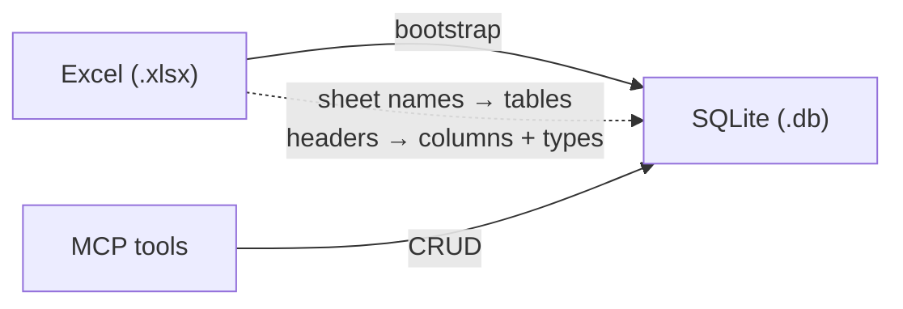

# MCP SQLite Excel CRUD

Schema-driven MCP server that loads an Excel workbook into SQLite and exposes full CRUD tools. Column names and types are inferred from the spreadsheet — swap the `.xlsx` and restart (or call `reset_from_excel`) without changing tool code.

## What it does

1. Reads `data/sample_portfolio.xlsx` (or `EXCEL_PATH`)
2. Creates one SQLite table per sheet (headers → columns, values → type inference)
3. Adds `row_id INTEGER PRIMARY KEY AUTOINCREMENT` when the sheet has no `id` column
4. Exposes MCP tools: `list_schema`, `list_rows`, `count_by`, `get_row`, `create_row`, `update_row`, `escalate_row`, `delete_row`, `reset_from_excel`



## Quick start (local, no auth)

```bash
cd tutorials/mcp/mcp_sqlite_excel
uv sync
uv run generate-sample-excel   # writes data/sample_portfolio.xlsx
AUTH_DISABLED=true UNIQUE_MCP_LOCAL_BASE_URL=http://127.0.0.1:8004 uv run mcp-sqlite-excel
```

Server listens on `http://127.0.0.1:8004` (from `UNIQUE_MCP_LOCAL_BASE_URL`).

Health check: `curl http://127.0.0.1:8004/`

## Using your own Excel file

Point at any workbook:

```bash
EXCEL_PATH=/path/to/data.xlsx SQLITE_PATH=/tmp/demo.db AUTH_DISABLED=true uv run mcp-sqlite-excel
```

Rules:

| Excel | SQLite |
|-------|--------|
| Sheet name | Table name (sanitized) |
| Header row | Auto-detected (skips title/blank preamble), or `EXCEL_HEADER_ROW` |
| Cell values | Type inferred: `INTEGER` / `REAL` / `TEXT` |
| Column named `id` | Used as primary key |
| No `id` column | Synthetic `row_id` autoincrement PK |

Multiple sheets become multiple tables. Sheets without a wide enough header
(default ≥ `EXCEL_MIN_HEADER_CELLS=3` text cells) are skipped — useful for
KPI/legend tabs next to real data tables.

## MCP tools

| Tool | Purpose |
|------|---------|
| `list_schema` | Tables, columns, types, PKs |
| `list_rows` | Exact `filters`, substring `search`, `sort`, paginate; rows at path `rows` |
| `count_by` | `COUNT(*)` grouped by a column (default `status`) for KPI tiles |
| `get_row` | Fetch by PK |
| `create_row` | Insert; `fields` is an object |
| `update_row` | Patch by PK (no elicitation — use for status menus / silent edits) |
| `escalate_row` | Escalate with form elicitation + demo notify email |
| `delete_row` | Delete by PK (MCP elicitation confirm first) |
| `reset_from_excel` | Rebuild DB from the workbook (elicitation confirm; destructive) |

`filters` / `fields` accept a JSON **object** (preferred for Unique iframe `data-unique-source-args` / `callTool`) or a JSON object string. `sort` is a JSON array of `{ "field", "dir" }` objects.

Example Account Review `list_rows`:

```json
{
  "table": "clients",
  "filters": { "status": "Needs Remediation" },
  "search": "vol",
  "sort": [{ "field": "due_date", "dir": "asc" }],
  "limit": 50
}
```

`data/account_review_dataset.xlsx` includes client identity columns (`date_of_birth`,
`occupation`, `residential_address`, `email`, `phone`, `fatca_us_person`,
`marital_status`, `crd_number`), a `risk_level` column (`High` / `Medium` / `Low`,
alongside `criticality` RED/AMBER/—), and `smart_actions.button_target` deep links.

`clients` also carries `action_owner` / `action_title` / `action_explanation` /
`action_button` / `action_button_target` — the matching `smart_actions` row for
that client's `rule_code`, denormalized onto `clients` by
`data/merge_smart_actions.py` so dashboards can bind one live list (no join)
per the 6 RM use cases (see `data/acount_review/dashboard-v005-astro/src/data/cases.json`).
Re-run that script (then rebuild `data/portfolio.db` from the workbook) after
editing `Smart Actions` in the Excel source.

`clients` also carries `fig1_label` / `fig1_value` / `fig1_status` / `fig1_pct`
(and `fig2_*`, `fig3_*`) — a generic 3-row "figure" shape authored per client
by `data/add_case_figures.py`, so each RM use case can render its own
structured view (allocation bars, documents checklist, rule-impact panel, …)
from one reusable component. `fig{n}_status` is `ok` / `warn` / `danger` / `-`;
`fig{n}_pct` (0-100) only matters for the allocation-bar case.

The portfolio-breach case additionally carries a second, independent figure —
`perf1_label` / `perf1_value` / `perf1_status` / `perf1_pct` (and `perf2_*`,
`perf3_*`) — authored by `data/add_portfolio_performance.py`, rendered as
"Portfolio Performance vs Benchmark" alongside the allocation figure
("Portfolio and Mandate"). Same shape/semantics as `fig{n}_*`, just a
different prefix so both figures can live on one row.

Example `create_row` args:

```json
{
  "table": "positions",
  "fields": {
    "sleeve": "Equity Long",
    "ticker": "NVDA",
    "instrument": "NVIDIA Corp",
    "direction": "Long",
    "target_weight": 0.05,
    "position_mm": 100,
    "email": "alice@alphabet.example"
  }
}
```

### Unique iframe list binding

```html
<section data-unique-list="positions"
         data-unique-source-server="<your-mcp-server-name>"
         data-unique-source-tool="list_rows"
         data-unique-source-args='{"table":"positions","filters":{"direction":"Long"},"limit":100}'
         data-unique-source-path="rows">
  <ul>
    <template data-unique-item>
      <li data-unique-key="row_id">
        <span data-unique-field="ticker"></span>
        <span data-unique-field="instrument"></span>
        <span data-unique-field="direction"></span>
      </li>
    </template>
  </ul>
  <p data-unique-state="loading">Loading…</p>
  <p data-unique-state="empty">No positions.</p>
  <p data-unique-state="error">Failed to load.</p>
  <button data-unique-action="refresh" data-unique-source-list="positions">Reload</button>
</section>
```

Mutations use `data-unique-action="callTool"` with a JSON **object** for args, e.g. `{"table":"positions","fields":{"ticker":"NVDA","direction":"Long"}}`, then `data-unique-source-refresh="positions"`.

## Auth (Zitadel via unique_mcp)

Production auth matches [`mcp_search`](../mcp_search/): **`unique_mcp`** `create_zitadel_oidc_proxy` + `ZitadelOIDCProxySettings` / `ServerSettings`.

```bash
cp zitadel.env.example zitadel.env
cp unique_mcp.env.example unique_mcp.env
# fill ZITADEL_* and UNIQUE_MCP_PUBLIC_BASE_URL
uv run mcp-sqlite-excel
```

| File | Variables |
|------|-----------|
| `zitadel.env` | `ZITADEL_BASE_URL`, `ZITADEL_CLIENT_ID`, `ZITADEL_CLIENT_SECRET` |
| `unique_mcp.env` | `UNIQUE_MCP_PUBLIC_BASE_URL`, `UNIQUE_MCP_LOCAL_BASE_URL` |

Register the callback in Zitadel:

```
https://<your-public-host>/auth/callback
```

See [`unique_mcp/docs/zitadel/README.md`](../../../unique_mcp/docs/zitadel/README.md). For local demos only, set `AUTH_DISABLED=true`.

## Configuration

| Variable | Source | Description |
|----------|--------|-------------|
| `EXCEL_PATH` / `SQLITE_PATH` | `AppSettings` / `.env` | Workbook and DB paths |
| `AUTH_DISABLED` | `AppSettings` / `.env` | Skip Zitadel (local only) |
| `ZITADEL_*` | `zitadel.env` | OIDC client (unique_mcp) |
| `UNIQUE_MCP_*` | `unique_mcp.env` | Public/bind URLs (unique_mcp) |

CRUD responses (`BootstrapSummary`, `ListRowsResult`, `RowResult`, …) are Pydantic models in `models.py`.

## Sample workbook

`uv run generate-sample-excel` creates two sheets:

- **positions** — sleeve, ticker, instrument, direction, weights, email
- **instruments** — ticker, asset class, sector, currency

## Deploy to Azure

Uses the same pattern as [`mcp_uk_companies_house/deploy.sh`](../mcp_uk_companies_house/deploy.sh): ACR build + Linux Web App.

### Prerequisites

1. Azure CLI logged in (`az login`)
2. Existing resource group **`rg-lab-demo-001-unique-search-mcp`** (same as [`mcp_search`](../mcp_search/) — override with `RG=...`)
3. `.env` with `AZURE_SUBSCRIPTION_ID`
4. `zitadel.env` with `ZITADEL_BASE_URL`, `ZITADEL_CLIENT_ID`, `ZITADEL_CLIENT_SECRET`
5. Zitadel redirect URI: `https://sqlite-excel-mcp.azurewebsites.net/auth/callback`

### Deploy

```bash
chmod +x deploy.sh
./deploy.sh
```

What it does:

- Uses existing resource group `rg-lab-demo-001-unique-search-mcp` (does **not** create a new RG)
- Builds the Docker image in ACR `sqliteexcelmcpacr` (PyPI `unique-mcp` via `UV_NO_SOURCES=1`)
- Creates/updates Web App `sqlite-excel-mcp` (B1 plan) in that RG
- Sets `WEBSITES_PORT=8004`, `UNIQUE_MCP_*`, `ZITADEL_*`, persisted `SQLITE_PATH=/home/data/portfolio.db`
- Restarts the app

| URL | |
|-----|--|
| App | `https://sqlite-excel-mcp.azurewebsites.net` |
| MCP | `https://sqlite-excel-mcp.azurewebsites.net/mcp` |

For a smoke test without Zitadel, put `AUTH_DISABLED=true` in `.env` before deploying.

### Redeploy (code only)

```bash
az acr build -t sqlite-excel-mcp:latest -r sqliteexcelmcpacr .
az webapp config container set -n sqlite-excel-mcp -g rg-lab-demo-001-unique-search-mcp \
  --container-image-name "sqliteexcelmcpacr.azurecr.io/sqlite-excel-mcp:latest"
az webapp restart -n sqlite-excel-mcp -g rg-lab-demo-001-unique-search-mcp
```

## Tests

```bash
uv run pytest
```
