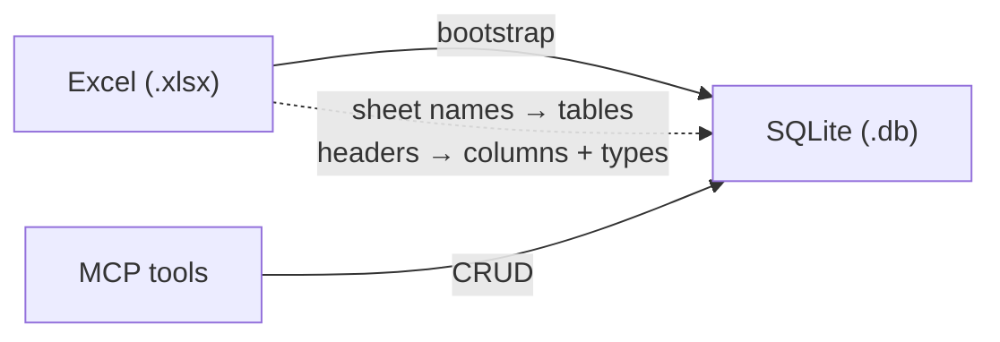

# MCP SQLite Excel CRUD

Schema-driven MCP server that loads an Excel workbook into SQLite and exposes full CRUD tools. Column names and types are inferred from the spreadsheet — swap the `.xlsx` and restart (or call `reset_from_excel`) without changing tool code.

## What it does

1. Reads `data/sample_portfolio.xlsx` (or `EXCEL_PATH`)
2. Creates one SQLite table per sheet (headers → columns, values → type inference)
3. Adds `row_id INTEGER PRIMARY KEY AUTOINCREMENT` when the sheet has no `id` column
4. Exposes MCP tools: `list_schema`, `list_rows`, `get_row`, `create_row`, `update_row`, `delete_row`, `reset_from_excel`



## Quick start (local, no auth)

```bash
cd tutorials/mcp/mcp_sqlite_excel
uv sync
uv run generate-sample-excel   # writes data/sample_portfolio.xlsx
AUTH_DISABLED=true uv run mcp-sqlite-excel
```

Server listens on `http://127.0.0.1:8004` (override with `PORT`).

Health check: `curl http://127.0.0.1:8004/`

## Using your own Excel file

Point at any workbook:

```bash
EXCEL_PATH=/path/to/data.xlsx SQLITE_PATH=/tmp/demo.db AUTH_DISABLED=true uv run mcp-sqlite-excel
```

Rules:

| Excel | SQLite |
|-------|--------|
| Sheet name | Table name (sanitized) |
| First row | Column headers (sanitized to `snake_case`) |
| Cell values | Type inferred: `INTEGER` / `REAL` / `TEXT` |
| Column named `id` | Used as primary key |
| No `id` column | Synthetic `row_id` autoincrement PK |

Multiple sheets become multiple tables.

## MCP tools

| Tool | Purpose |
|------|---------|
| `list_schema` | Tables, columns, types, PKs |
| `list_rows` | Filter with object `{"ticker":"MSFT"}`, paginate; rows at path `rows` |
| `get_row` | Fetch by PK |
| `create_row` | Insert; `fields` is an object |
| `update_row` | Patch by PK |
| `delete_row` | Delete by PK |
| `reset_from_excel` | Rebuild DB from the workbook (destructive) |

`filters` / `fields` accept a JSON **object** (preferred for Unique iframe `data-unique-source-args` / `callTool`) or a JSON object string.

Example `create_row` args:

```json
{
  "table": "positions",
  "fields": {
    "sleeve": "Equity Long",
    "ticker": "NVDA",
    "instrument": "NVIDIA Corp",
    "direction": "Long",
    "target_weight": 0.05,
    "position_mm": 100,
    "email": "alice@alphabet.example"
  }
}
```

### Unique iframe list binding

```html
<section data-unique-list="positions"
         data-unique-source-server="<your-mcp-server-name>"
         data-unique-source-tool="list_rows"
         data-unique-source-args='{"table":"positions","filters":{"direction":"Long"},"limit":100}'
         data-unique-source-path="rows">
  <ul>
    <template data-unique-item>
      <li data-unique-key="row_id">
        <span data-unique-field="ticker"></span>
        <span data-unique-field="instrument"></span>
        <span data-unique-field="direction"></span>
      </li>
    </template>
  </ul>
  <p data-unique-state="loading">Loading…</p>
  <p data-unique-state="empty">No positions.</p>
  <p data-unique-state="error">Failed to load.</p>
  <button data-unique-action="refresh" data-unique-source-list="positions">Reload</button>
</section>
```

Mutations use `data-unique-action="callTool"` with a JSON **object** for args, e.g. `{"table":"positions","fields":{"ticker":"NVDA","direction":"Long"}}`, then `data-unique-source-refresh="positions"`.

## Auth (Unique / Zitadel)

By default the server uses the same OAuth proxy pattern as the other MCP tutorials. For local demos set `AUTH_DISABLED=true`.

```bash
# .env
ZITADEL_URL=https://your-zitadel-instance.com
UPSTREAM_CLIENT_ID=...
UPSTREAM_CLIENT_SECRET=...
BASE_URL_ENV=https://your-public-url.ngrok-free.app
```

```bash
uv run mcp-sqlite-excel
```

## Configuration

Settings are loaded via **pydantic-settings** (`AppSettings` in `settings.py`) from env vars and an optional `.env` file.

| Variable | Default | Description |
|----------|---------|-------------|
| `EXCEL_PATH` | `data/sample_portfolio.xlsx` | Workbook to seed from |
| `SQLITE_PATH` | `data/portfolio.db` | SQLite file |
| `AUTH_DISABLED` | `false` | Skip OAuth when `true` |
| `PORT` | `8004` | HTTP port |
| `ZITADEL_URL` / `UPSTREAM_CLIENT_*` / `BASE_URL_ENV` | — | OAuth (when auth enabled) |

CRUD responses (`BootstrapSummary`, `ListRowsResult`, `RowResult`, …) are Pydantic models in `models.py`.

## Sample workbook

`uv run generate-sample-excel` creates two sheets:

- **positions** — sleeve, ticker, instrument, direction, weights, email
- **instruments** — ticker, asset class, sector, currency

## Deploy to Azure

Uses the same pattern as [`mcp_uk_companies_house/deploy.sh`](../mcp_uk_companies_house/deploy.sh): ACR build + Linux Web App.

### Prerequisites

1. Azure CLI logged in (`az login`)
2. `.env` with at least `AZURE_SUBSCRIPTION_ID`
3. For OAuth: `UPSTREAM_CLIENT_ID`, `UPSTREAM_CLIENT_SECRET`, `ZITADEL_URL` (and Zitadel redirect URI `https://sqlite-excel-mcp.azurewebsites.net/auth/callback`)

### Deploy

```bash
chmod +x deploy.sh
./deploy.sh
```

What it does:

- Creates resource group `rg-lab-demo-001-sqlite-excel-mcp` (Sweden Central)
- Builds the Docker image in ACR `sqliteexcelmcpacr`
- Creates/updates Web App `sqlite-excel-mcp` (B1 plan)
- Sets `WEBSITES_PORT=8004`, `HOST=0.0.0.0`, persisted `SQLITE_PATH=/home/data/portfolio.db`
- Restarts the app

| URL | |
|-----|--|
| App | `https://sqlite-excel-mcp.azurewebsites.net` |
| MCP | `https://sqlite-excel-mcp.azurewebsites.net/mcp` |

For a local-only Azure smoke test without Zitadel, put `AUTH_DISABLED=true` in `.env` before deploying.

### Redeploy (code only)

```bash
az acr build -t sqlite-excel-mcp:latest -r sqliteexcelmcpacr .
az webapp config container set -n sqlite-excel-mcp -g rg-lab-demo-001-sqlite-excel-mcp \
  --container-image-name "sqliteexcelmcpacr.azurecr.io/sqlite-excel-mcp:latest"
az webapp restart -n sqlite-excel-mcp -g rg-lab-demo-001-sqlite-excel-mcp
```

## Tests

```bash
uv run pytest
```
