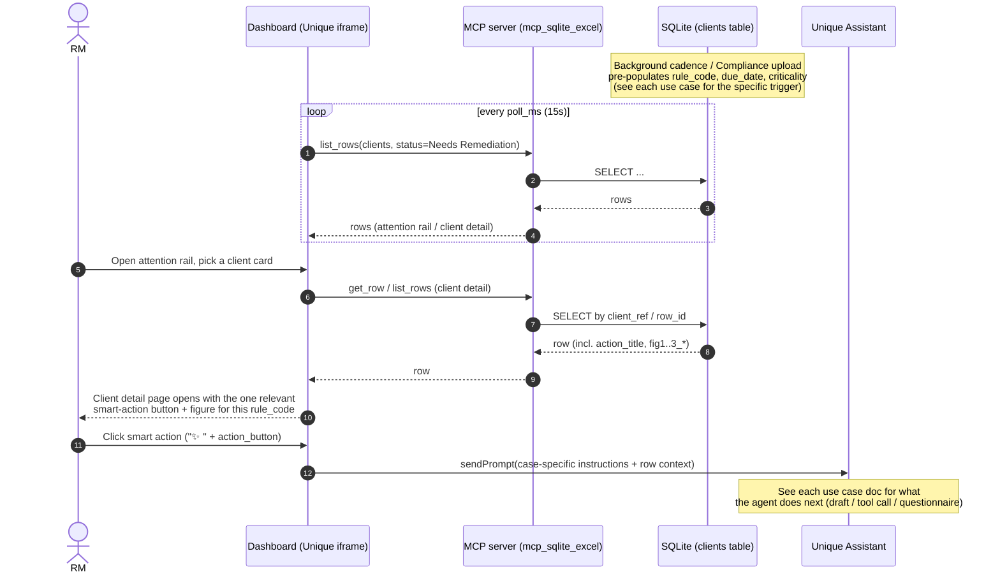

# RM Account-Remediation Dashboard — Use Cases

Engineering-facing companion to the Product doc [_RM Account-Remediation Dashboard — Use Cases (for RM Pod review)_](https://unique-ch.atlassian.net/wiki/spaces/Product/pages/2508980226/RM+Account-Remediation+Dashboard+Use+Cases+for+RM+Pod+review), cross-referenced against the actual demo build in [`data/acount_review/dashboard-v005-astro`](../../data/acount_review/dashboard-v005-astro/).

**Purpose.** One folder, one file per use case, so each can be reviewed, estimated and built independently. Every file gives: the pages involved, the actions and entities involved, what already works in the current build vs. what still needs to be developed, and a Mermaid sequence diagram of the flow.

## The idea in one paragraph

An "account review" stops being a periodic ceremony and becomes the moment a client stops being compliant with something — an expired document, a portfolio that drifted, a new regulation, a screening hit, a wealth event that doesn't add up. Every morning the Relationship Manager (RM) refreshes the dashboard and sees exactly which of their clients need attention, why, and a **smart action** that starts closing the gap. The same engine also powers a compliance-officer view (separate workstream, not covered here).

## How the dashboard reads

Every item carries a due date and a traffic-light state:

| State | Meaning |
| --- | --- |
| 🔴 Red | A breach already in effect (expired document, screening hit, portfolio outside its band, client already in scope of a new rule). Hard ~15-day window for KYC-critical items. |
| 🟠 Orange | A ~30-day early-warning band — the point is to be told *before* something breaks, not after. |
| 🟢 Green | Already picked up (e.g. handed to Compliance); no RM action needed. |

## Where the data comes from (honest framing)

No live feeds into regulators or screening providers for the demo. Screening runs on a background cadence (typically overnight); Compliance manually uploads new regulations/policies into a knowledge base; the agent reads from those sources and tells the RM which accounts are affected. Direct ingestion from screening/regulatory bodies is roadmap, not build.

## Use cases at a glance

| # | Use case | Tag | Trigger | Primary smart action | Criticality | Doc |
| --- | --- | --- | --- | --- | --- | --- |
| 1 | Document / KYC refresh due | `R-DOC-EXPIRY` | ID document expiring or periodic KYC due | Auto-draft Outlook email to client | 🟠 → 🔴 | [use-case-1-document-kyc-refresh.md](./use-case-1-document-kyc-refresh.md) |
| 2 | Adverse-media / PEP hit | `R-SCR-ADVMEDIA`, `R-SCR-PEP` | Overnight screen surfaces an article or PEP change | Review & escalate to Compliance | 🔴 | [use-case-2-adverse-media-pep.md](./use-case-2-adverse-media-pep.md) |
| 3 | Portfolio breaches risk profile | `R-SUIT-ALLOC` | Allocation drifts past the bank's threshold | Open rebalancing proposal | 🔴 | [use-case-3-portfolio-breach.md](./use-case-3-portfolio-breach.md) |
| 4 | Suitability review due | `R-SUIT-REVIEW` | Ongoing suitability review falls due | Launch the questionnaire | 🟠 → 🔴 | [use-case-4-suitability-review.md](./use-case-4-suitability-review.md) |
| 5 | Regulatory change | `R-REG-CHANGE`, `R-REG-NONDOM` | New rule (uploaded by Compliance) pulls client into scope | Start reassessment / remediation | 🔴 | [use-case-5-regulatory-change.md](./use-case-5-regulatory-change.md) |
| 6 | Source of Wealth re-assessment | `R-SOW-REFRESH` | Wealth event contradicts the story on file | Launch SoW assessment | 🟠 → 🔴 | [use-case-6-source-of-wealth.md](./use-case-6-source-of-wealth.md) |

Only **use case 1** is a live, end-to-end demo anchor today (drafts a real email, nothing sent automatically). The other five are illustrative in the current build — see each use case's "What needs to be developed" section for the gap to production.

## Pages involved (current build)

| Page | File | Purpose |
| --- | --- | --- |
| Main / attention rail | `src/pages/main.html` | Morning triage view — KPI tiles + the "Needs Remediation" list across all 6 cases, sorted by due date/criticality |
| Client detail | `src/pages/clients.html` | One reusable page per client: executive summary, identity, history, documents & KYC, and exactly one case-specific figure + smart action, chosen live by that row's `rule_code` |
| *(Compliance dashboard)* | *not built* | Mirror view for Compliance — receives escalations from use cases 2 and 5. Separate workstream per the product doc. |

## Actions & entities involved (cross-cutting)

| Entity | Role |
| --- | --- |
| **RM (Relationship Manager)** | Opens the dashboard, triages the attention rail, triggers the smart action, reviews/sends drafted emails |
| **Client** | Receives emailed requests; may supply documents, evidence or consent |
| **Compliance** | Receives escalations (use cases 2, 5); owns sanctions and the compliance-side dashboard (out of scope here) |
| **Dashboard (Unique iframe)** | Renders live lists via `data-unique-source-*` bindings polling MCP (`poll_ms`, default 15s) |
| **Agent (Unique Assistant)** | Invoked by `sendPrompt` ("✨ Analyse with AI"); drafts analysis, emails, proposals, or calls a tool depending on the case's `instructions` |
| **MCP server** (`mcp_sqlite_excel`) | Schema-agnostic CRUD over the client book: `list_rows`, `count_by`, `get_row`, `update_row`, `escalate_row` |
| **SQLite DB** (`portfolio.db`) | Bootstrapped from `data/account_review_dataset.xlsx`; `clients` table carries the denormalized `action_*` and `fig*_*` columns consumed by the dashboard (see `data/merge_smart_actions.py`, `data/add_case_figures.py`) |
| **Outlook** | The RM's own mailbox — the agent drafts text, the RM pastes/sends; no email is sent automatically |
| **Screening feed** (e.g. WorldCheck) | Overnight background cadence; today: pre-loaded demo data, not a live connector (use case 2) |
| **Knowledge Base** | Compliance-curated regulations/policies with versioned references (use case 5); today: not built — cited in card copy only |
| **CRM** | Source of review cadence / last-completed dates (use case 4); today: not built — `clients` table stands in |
| **Corporate registry / business-info source** | Corroborates Source-of-Wealth events (use case 6); today: not built — agent drafts a plan only |

## Generic flow (applies to every use case)

## Cross-cutting build notes

* **One engine, two dashboards.** Everything here is the RM view. A parallel compliance-officer dashboard is a separate workstream; sanctions only ever shows on the RM side as a "restricted — handled by Compliance" state, never actionable.
* **Auditability.** Use case 5's versioned rule references (`ref KB-REG-2026-07 v2`) are the trust anchor for a compliance audience — any flagged action should be traceable to a specific paragraph of a specific regulation version. Not built; needs a Knowledge Base entity with versioning.
* **Escalation path already works.** `escalate_row` (form elicitation for recipient + note, then `update_row` + demo notify email) is real and shared by use cases 2 and 5 — the compliance hand-off mechanism does not need to be rebuilt per case.
* **Email drafting is agent text, not an integration.** Every "email client" action (use cases 1, 5, 6) is the agent composing the email body in chat; the RM copies it into Outlook and sends. There is no Outlook API call today.
* **Denormalization keeps the MCP server schema-agnostic.** Smart-action copy and figure data are baked onto `clients` ahead of time by one-off scripts (`merge_smart_actions.py`, `add_case_figures.py`, `add_portfolio_performance.py`) rather than joined at query time — new use cases follow the same pattern (see the dashboard README's "Adding a 7th use case").

## Open questions carried over from the product doc

1. **Home jurisdiction & currency** — pick one consistent regulator + currency + client-ID prefix (UK/FCA/GBP vs. Swiss/FINMA/CHF); the current mock mixes both.
2. **Client-ID reconciliation** — mock IDs (`CH-priv-XXXX`) vs. demo DB IDs (`CL-1XXX`) need aligning.
3. **Suitability depth (use case 4)** — commit to base (launch questionnaire) vs. ambitious (chat-driven end-to-end CRM completion) for the demo.
4. **Configurable threshold UI (use case 3)** — decide whether to surface the drift threshold as a visible setting.
5. **Regulatory example (use case 5)** — confirm the product-eligibility example vs. the jurisdiction-change variant.

## Glossary

* **KYC (Know Your Customer)** — the checks a bank does to verify who a client is.
* **CDD / EDD (Customer / Enhanced Due Diligence)** — standard vs. deeper checks; EDD applies to higher-risk clients or events.
* **PEP (Politically Exposed Person)** — someone in a prominent public role (or close to one), carrying higher risk and extra scrutiny.
* **Adverse media** — negative news about a client surfaced by screening.
* **Sanctions screening** — checking clients against government sanctions lists; strictly a compliance/financial-crime function.
* **Suitability** — the check that advice and investments fit the client's needs, objectives and risk appetite.
* **Source of Wealth (SoW)** — evidence of how a client's overall wealth was generated.
* **Mandate (advisory vs discretionary)** — advisory: client approves each move; discretionary: the manager acts within agreed limits.
* **Client categorisation (retail / professional / elective-professional)** — regulatory client types that determine which products and protections apply.
* **FCA / FINMA** — the UK and Swiss financial regulators, respectively.
* **Consumer Duty** — the FCA's requirement to deliver good client outcomes and avoid foreseeable harm; pushes firms toward continuous, needs-based reviews.
* **CRM** — the customer relationship system holding client data.
* **Smart KYC** — the perpetual background screening/monitoring capability this dashboard visualizes.
