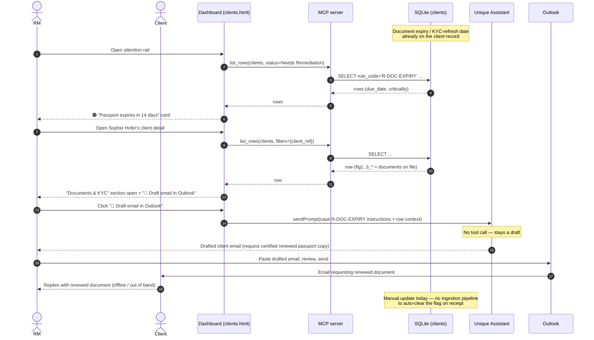

# Use case 1 — Document / KYC refresh due · `R-DOC-EXPIRY`

> ⭐ **Live demo anchor.** The only action already working end-to-end (drafting into the RM's real Outlook). Show this one live; frame the rest as illustrative.

## In plain terms

An identity document the bank holds for the client is about to expire (or a scheduled Know-Your-Customer refresh is coming due). Left alone, the client's file goes out of date and the RM ends up chasing it after the fact.

## Trigger

The agent watches document expiry dates and review cadences held on the client record and raises the item inside a chosen lead-time window — so the RM is warned *before* expiry, not after.

## Card the RM sees

> 🟠 **Passport expires in 14 days** · `R-DOC-EXPIRY`
> Client: **Sophie Hofer** · CH-priv-0847
> Passport on file expires 3 Aug 2026. Requesting a renewed copy now keeps the file current.
> *Expires in 14 days · Client DB*
> **[ Draft email in Outlook ]**

## Pages involved

| Page | What it shows for this case |
| --- | --- |
| Main / attention rail (`pages/main.html`) | Card for any client with `rule_code = R-DOC-EXPIRY`, sorted into 🟠/🔴 by days-to-expiry |
| Client detail (`pages/clients.html`) | "Documents & KYC" figure section forced open (`open_sections: ["docs-kyc"]`), listing documents on file + expiry; single smart-action button "📄 Draft email in Outlook" |

## Actions & entities involved

| Entity | Role in this flow |
| --- | --- |
| RM | Opens the client card, clicks the smart action, reviews the drafted email, pastes it into Outlook and sends |
| Client | Recipient of the request; replies with a certified copy of the renewed document (out of band — email/post) |
| Dashboard (Unique iframe) | Renders the card + client detail page; live-bound to `clients` via `list_rows` |
| MCP server (`mcp_sqlite_excel`) | Serves `list_rows` for the card + detail page; no mutation happens in this flow (the DB stays untouched until the client actually sends back a document, which is a manual/offline update today) |
| Agent (Unique Assistant) | Drafts the client email on `sendPrompt`; **does not call any tool** for this step per `cases.json` instructions — it stays a draft |
| Outlook | The RM's own mailbox; agent output is plain text the RM copies in, not an API call |
| Client DB (`clients` table) | Source of the expiry date / KYC due date driving the card |

## What already works vs. what needs to be developed

| Already built | Still to build |
| --- | --- |
| Live card + client-detail rendering from `clients` (`rule_code = R-DOC-EXPIRY`) | A real trigger job that computes "expires in N days" from actual document-expiry fields on a lead-time schedule (today: static demo data, not a scheduler) |
| `sendPrompt` → agent drafts a ready-to-send client email in chat | Wiring the drafted email into the RM's actual Outlook (e.g. via Microsoft Graph "create draft") instead of copy/paste |
| "Documents & KYC" figure section with per-document status | Marking the item resolved automatically once a renewed document is received (today: no inbound-document ingestion) |
| | Configurable lead-time window per document type / per bank (currently implicit in the demo data) |

## Sequence diagram

