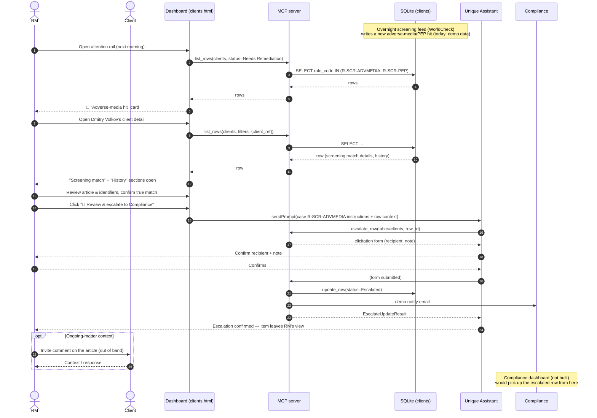

# Use case 2 — Adverse-media / PEP hit · `R-SCR-ADVMEDIA` / `R-SCR-PEP`

## In plain terms

Overnight background screening flags something new about a client — a news article (e.g. litigation), or a change in their Politically-Exposed-Person (PEP) status. It's waiting on the dashboard when the RM logs in.

## Trigger

Smart KYC runs as a perpetual background cadence (in practice, overnight). Any newly surfaced item is attached to the client and raised to the RM the next morning.

## Card the RM sees

> 🔴 **Adverse-media hit** · `R-SCR-ADVMEDIA`
> Client: **Dmitry Volkov** · CH-priv-0231
> Overnight screen matched a new article on ongoing litigation. Review the identifiers and confirm it's a true match before anything downstream happens.
> *Review today · WorldCheck*
> **[ Review & escalate to Compliance ]**

## Pages involved

| Page | What it shows for this case |
| --- | --- |
| Main / attention rail | 🔴 card for any client with `rule_code` in `{R-SCR-ADVMEDIA, R-SCR-PEP}` |
| Client detail | "Screening match" figure section; "History" section forced open (`open_sections: ["history"]`) so last/next review dates sit next to the new hit; single smart-action button "🔎 Review & escalate to Compliance" |
| *(Compliance dashboard)* | Not built — receiving side of the escalation; separate workstream |

## Actions & entities involved

| Entity | Role in this flow |
| --- | --- |
| RM | Opens the article/identifiers side by side with the client record, confirms it's a true match, escalates in-tool |
| Client | May be asked to comment on the article where appropriate for an ongoing matter (not modeled as a tool call today) |
| Compliance | Receives the escalation email + the row moves to `status = Escalated`; owns the decision from here |
| Dashboard | Renders card + client detail; live-bound via `list_rows` |
| MCP server | `list_rows` for read; `escalate_row` for the hand-off (form elicitation + demo notify email) |
| Agent | On `sendPrompt`, analyses the hit, then calls `escalate_row` (not `update_row`) per `cases.json` instructions |
| Screening feed (e.g. WorldCheck) | Source of the adverse-media/PEP hit; today: pre-loaded demo data, not a live feed |

## What already works vs. what needs to be developed

| Already built | Still to build |
| --- | --- |
| Live card + "Screening match" / "History" sections from `clients` | A real overnight screening connector (WorldCheck or equivalent) that writes new hits onto the client record on a schedule |
| `escalate_row` end-to-end: form elicitation (recipient + note) → `update_row(status=Escalated)` → demo notify email | Wiring the notify email to a real Compliance inbox/queue instead of a demo send |
| Agent instructed to call `escalate_row`, not `update_row`, keeping the audit trail correct | A true article/identifier side-by-side comparison UI (today the agent narrates this in chat, no dedicated compare view) |
| | The receiving compliance dashboard where escalated rows actually land and get worked (separate workstream, not built) |
| | Client-comment capture step ("ask the client to comment on the article") — currently only described narratively, no UI/tool |

## Sequence diagram

