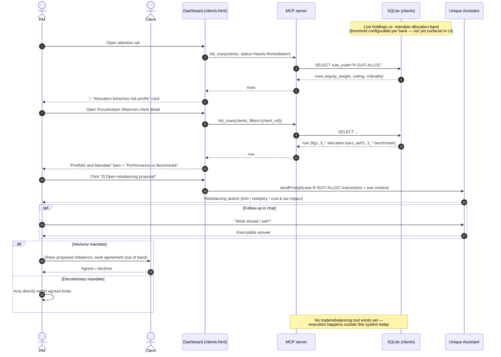

# Use case 3 — Portfolio breaches risk profile · `R-SUIT-ALLOC`

## In plain terms

The client's investments have drifted away from the risk profile they agreed to — e.g. too much in equities for a "balanced" mandate. The portfolio needs bringing back into line.

## Trigger

The agent compares live holdings against the allocation band for the client's mandate. The threshold is **configurable per bank** (some tolerate 1–2% drift, others act past ~5%) — this should be exposed as a setting, not hard-coded.

## Card the RM sees

> 🔴 **Allocation breaches risk profile** · `R-SUIT-ALLOC`
> Client: **Purushottam R Sharma** · CH-priv-0512
> Equity weight 72% vs a 60% balanced-profile ceiling — beyond drift tolerance. A rebalancing proposal is ready.
> *Immediate — beyond tolerance · Portfolio*
> **[ Open rebalancing proposal ]**

## Pages involved

| Page | What it shows for this case |
| --- | --- |
| Main / attention rail | 🔴 card for `rule_code = R-SUIT-ALLOC` |
| Client detail | Two figure sections: "Portfolio and Mandate" (rendered as **progress bars**, `figure_bars: true`) and a second, independent figure "Portfolio Performance vs Benchmark" (`figure2_title`, `perf1..3_*` fields); single smart-action button "⚖️ Open rebalancing proposal" |

## Actions & entities involved

| Entity | Role in this flow |
| --- | --- |
| RM | Opens the proposal, optionally asks the agent follow-ups ("what should I sell?"), shares with the client (advisory mandate) or acts directly (discretionary mandate) |
| Client | For advisory mandates, must agree to the proposed rebalance before execution |
| Dashboard | Renders card + the two figure sections (allocation bars + performance vs. benchmark) |
| MCP server | `list_rows` for read only in this flow — no mutation/trade tool exists yet |
| Agent | On `sendPrompt`, sketches a rebalancing proposal (what to trim, what to redeploy into, rough cost/tax impact) in chat; can continue the conversation ("what should I sell?") |
| Portfolio / positions data | Source of the live holdings vs. the mandate's allocation band |

## What already works vs. what needs to be developed

| Already built | Still to build |
| --- | --- |
| Live allocation bars + performance-vs-benchmark figures, both denormalized onto `clients` (`data/add_case_figures.py`, `data/add_portfolio_performance.py`) | A configurable, per-bank drift-threshold **setting** surfaced in the UI (today: implicit in the demo data, not adjustable) |
| Agent drafts a rebalancing proposal (trim/redeploy/cost-tax sketch) in chat | An actual rebalancing/trade tool the agent can call (today: text sketch only, no `positions` mutation, no broker/OMS integration) |
| Card + threshold breach detection expressed in demo data | A live comparison job that recomputes drift from real holdings on a schedule, rather than static "72% vs 60%" seed data |
| | Mandate-type-aware wording/flow: advisory (seek client agreement) vs. discretionary (act directly) — today the card/instructions don't branch on mandate type |
| | Client-facing share/consent step for advisory mandates (e.g. drafted client message) — not modeled as a distinct action today |

## Sequence diagram

