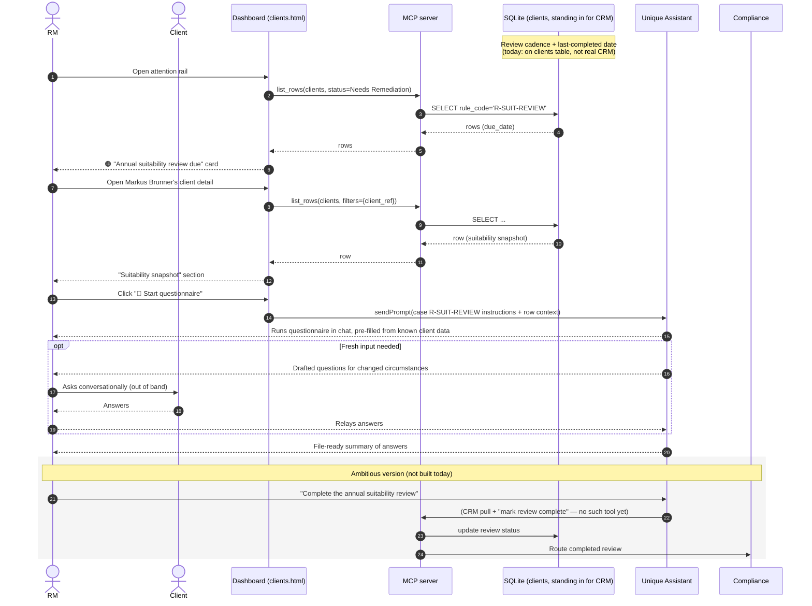

# Use case 4 — Suitability review due · `R-SUIT-REVIEW`

## In plain terms

The client's suitability review — the periodic check that the advice and investments still fit their needs, objectives and risk appetite — is falling due.

## Trigger

The agent tracks the review cadence and last-completed date from the customer relationship system (CRM) and raises the item with enough lead time to complete it comfortably.

## Card the RM sees

> 🟠 **Annual suitability review due** · `R-SUIT-REVIEW`
> Client: **Markus Brunner** · CH-priv-0093
> Suitability review due before 2 Aug 2026. I can pre-fill from CRM and run it with you.
> *Due in 13 days · CRM*
> **[ Start questionnaire ]**

## Pages involved

| Page | What it shows for this case |
| --- | --- |
| Main / attention rail | 🟠→🔴 card for `rule_code = R-SUIT-REVIEW`, keyed off due date |
| Client detail | "Suitability snapshot" figure section; single smart-action button "📝 Start questionnaire" |

## Actions & entities involved

| Entity | Role in this flow |
| --- | --- |
| RM | Triggers the questionnaire, runs it with the client (base version) or lets the agent drive it end-to-end (ambitious version) |
| Client | Provides fresh input where circumstances, objectives or risk appetite have changed |
| CRM | Source of the review cadence, last-completed date, and pre-fill data (today: `clients` table stands in for CRM) |
| Dashboard | Renders card + "Suitability snapshot" |
| MCP server | `list_rows` for read; no dedicated "complete review" tool exists yet |
| Agent | On `sendPrompt`, runs a short suitability questionnaire in chat using known client data and summarises the answers ready for the file |
| Compliance | Ultimate recipient once a review is marked complete (ambitious version only — not built) |

## What already works vs. what needs to be developed

This use case has two committed depths per the product doc's open question #3 — pick one for the demo:

**Base version (built today):**
- Card + "Suitability snapshot" render live from `clients`.
- `sendPrompt` → agent runs a short questionnaire conversationally and produces a file-ready summary in chat.

**Ambitious version (not built):**
- RM says "complete the annual suitability review" and the agent autonomously: pulls everything from CRM, runs the full questionnaire, marks the review complete, and routes it to Compliance.
- Requires: a real CRM connector (or CRM-shaped tool over the existing DB), a "mark review complete" mutation (analogous to `escalate_row` but for suitability sign-off), and a compliance hand-off path.

| Already built | Still to build |
| --- | --- |
| Live due-date card + "Suitability snapshot" figure | Real CRM integration for cadence/last-completed dates (today: denormalized onto `clients`) |
| Chat-driven questionnaire (agent asks, RM/client answer, agent summarises) | A "complete review" tool (`update_row`-style mutation) to persist the outcome and move it to Compliance |
| | Decision on base vs. ambitious depth for the demo (open question #3 in the product doc) |
| | Change-triggered re-asks: prompting only when circumstances/objectives/risk appetite actually changed, vs. a flat fixed cadence |

## Sequence diagram

