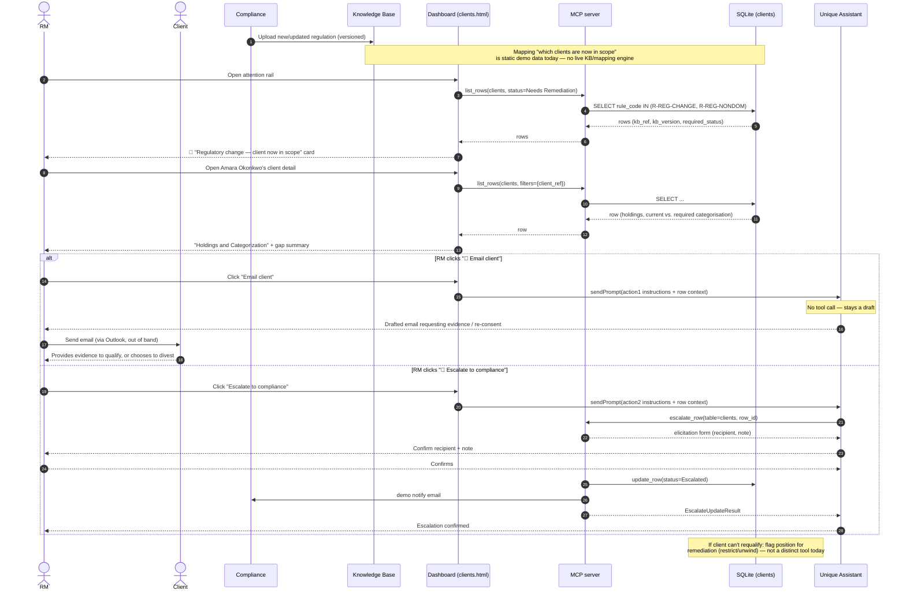

# Use case 5 — Regulatory change · `R-REG-CHANGE` / `R-REG-NONDOM`

> ⚠️ Most sensitive use case to frame — see the "Demo & build note" below. `R-REG-NONDOM` is a legacy rule code kept in `cases.json` alongside the newer `R-REG-CHANGE`; the product doc points at a product-eligibility/classification example (or a jurisdiction-change variant) rather than the earlier "non-dom" framing.

## In plain terms

A rule changes, and specific existing clients are now *in scope* — impacted and potentially non-compliant until something is done. The agent tells the RM which of their clients are affected and what's now required.

## Trigger

Compliance uploads the new/updated regulation or policy into the knowledge base. The agent maps it against the book and flags every account pulled into scope. Every flag carries a **versioned reference** to the exact rule and version that triggered it, so the RM can trace *why* the account is in scope.

## Card the RM sees

> 🔴 **Regulatory change — client now in scope** · `R-REG-CHANGE`
> Client: **Amara Okonkwo** · CH-priv-0431
> An updated FCA rule (uploaded by Compliance, ref KB-REG-2026-07 v2, effective 1 Jul 2026) tightens the investor-eligibility criteria for a product this client holds. Amara is currently categorised **retail** and now needs **elective-professional** status to keep the position — her account is in scope.
> *In scope now — action required · Knowledge Base*
> **[ Start reassessment ]**

## Pages involved

| Page | What it shows for this case |
| --- | --- |
| Main / attention rail | 🔴 card for `rule_code` in `{R-REG-CHANGE, R-REG-NONDOM}` |
| Client detail | "Holdings and Categorization" figure section; **two** smart-action buttons via `dual_action`: "📨 Email client" and "🚨 Escalate to compliance" |
| *(Compliance dashboard)* | Not built — receiving side for the escalation path |
| *(Knowledge Base admin)* | Not built — where Compliance would upload/version regulations |

## Actions & entities involved

| Entity | Role in this flow |
| --- | --- |
| RM | Opens the agent's gap summary, chooses to email the client or escalate to Compliance (or both, over time) |
| Client | Recipient of a request for evidence/acknowledgement/re-consent, or the party who chooses to provide evidence vs. divest |
| Compliance | Uploads the regulation/policy version that creates the trigger; receives escalations for clients who can't requalify |
| Knowledge Base | Holds the versioned regulation/policy text (e.g. `KB-REG-2026-07 v2`); today: not built — cited as flavour text in the card copy only |
| Dashboard | Renders card + client detail with dual actions |
| MCP server | `list_rows` for read; `escalate_row` for the "Escalate to compliance" branch |
| Agent | On `sendPrompt`, either (a) drafts a client email (no tool call, per `cases.json`) or (b) calls `escalate_row` — selected by which of the two buttons the RM clicks |

## What already works vs. what needs to be developed

| Already built | Still to build |
| --- | --- |
| Dual-action UI (`actionbar_case_dual.html`) — two independent buttons, each with its own label/toast/instructions | The Knowledge Base itself: ingesting a regulation/policy upload from Compliance, versioning it, and mapping it against the client book to compute "who's in scope" (today: which clients are in scope is static demo data) |
| "Email client" branch: agent drafts a client email requesting evidence/acknowledgement (no tool call) | Versioned rule references wired end-to-end — the card cites `KB-REG-2026-07 v2` as text today; there's no real KB entity to trace back to |
| "Escalate to compliance" branch: reuses the same `escalate_row` flow as use case 2 (elicitation + notify email) | A "reassessment" record/tool distinct from a plain escalation — e.g. persisting the reassessment outcome (re-categorised / re-papered / divested) rather than just a status flip |
| "Holdings and Categorization" figure showing current vs. required categorisation | Remediation-option branching in the tool layer: re-categorise, re-paper, ask client for evidence, or divest are currently just narrated by the agent, not distinct actionable steps |
| | Resolving the open product question of which regulatory example (product-eligibility vs. jurisdiction-change) ships in the demo |

## Sequence diagram

