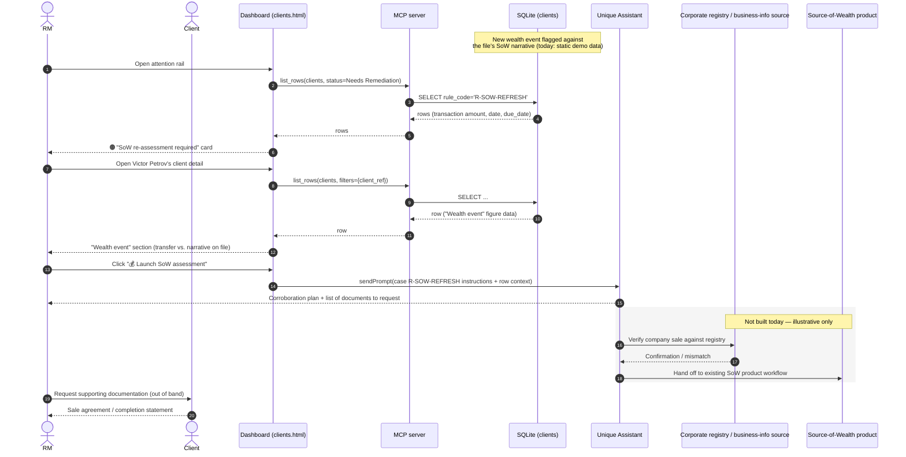

# Use case 6 — Source of Wealth re-assessment · `R-SOW-REFRESH`

## In plain terms

A new wealth event — a large incoming transfer — doesn't match the source-of-wealth (SoW) story the bank has on file. Before the money is treated as business-as-usual, the RM needs to understand and corroborate where it came from.

## Trigger

The agent checks a new transaction against the recorded source-of-wealth narrative and flags the mismatch, kicking off enhanced due diligence (EDD).

## Card the RM sees

> 🟠 **SoW re-assessment required** · `R-SOW-REFRESH`
> Client: **Victor Petrov** · CH-priv-0774
> Incoming transfer of £2.1m (18 Jul) references a private company sale not covered by the source-of-wealth narrative on file.
> *Due 5 Aug 2026 · Client DB*
> **[ Launch SoW assessment ]**

## Pages involved

| Page | What it shows for this case |
| --- | --- |
| Main / attention rail | 🟠→🔴 card for `rule_code = R-SOW-REFRESH` |
| Client detail | "Wealth event" figure section (transaction amount, date, stated source vs. file narrative); single smart-action button "💰 Launch SoW assessment" |

## Actions & entities involved

| Entity | Role in this flow |
| --- | --- |
| RM | Launches the SoW assessment, requests supporting documentation from the client where needed |
| Client | Supplies supporting documentation (e.g. sale agreement, completion statement) |
| Dashboard | Renders card + "Wealth event" figure |
| MCP server | `list_rows` for read only in this flow — no dedicated SoW/EDD tool exists yet |
| Agent | On `sendPrompt`, drafts a Source-of-Wealth corroboration plan, including which supporting documents to request |
| Corporate registry / business-info source | Would corroborate a company-sale event (e.g. company registry lookup); today: not built — the agent only narrates that this verification would happen |
| Existing Source-of-Wealth product | The plugged-in product this use case is meant to hand off to for the actual corroboration workflow (referenced, not integrated in this dashboard build) |

## What already works vs. what needs to be developed

| Already built | Still to build |
| --- | --- |
| Live card + "Wealth event" figure showing the mismatched transaction vs. the file narrative | A real transaction-monitoring feed that compares new transfers against the SoW narrative (today: static demo data, not computed from live transactions) |
| `sendPrompt` → agent drafts a corroboration plan + a list of documents to request | Integration with the existing Source-of-Wealth product/agent so "Launch SoW assessment" actually opens that workflow rather than producing a text plan in this chat |
| | Corporate-registry / business-information lookups to verify claims like "company sale" (e.g. verifying a company sale against a registry) — not built, currently narrated only |
| | A client document-request flow analogous to use case 1's Outlook draft (today: the agent describes what to request, but doesn't produce a ready-to-send draft the way use case 1 does) |
| | Currency/jurisdiction consistency with whatever home market is chosen for the demo (see the product doc's open question #1) |

## Sequence diagram

