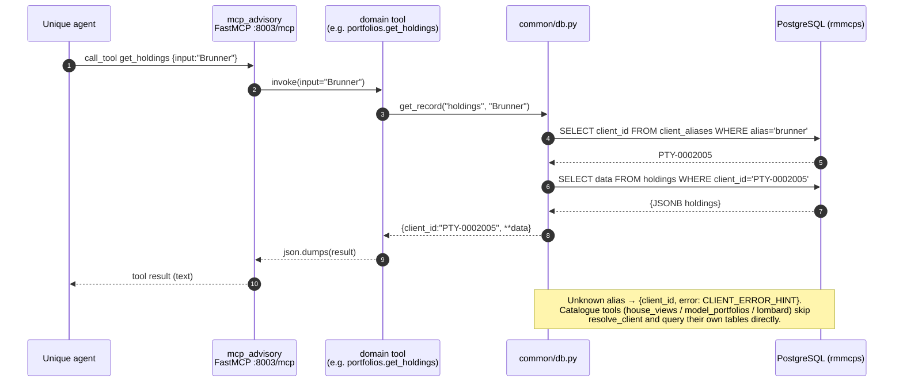
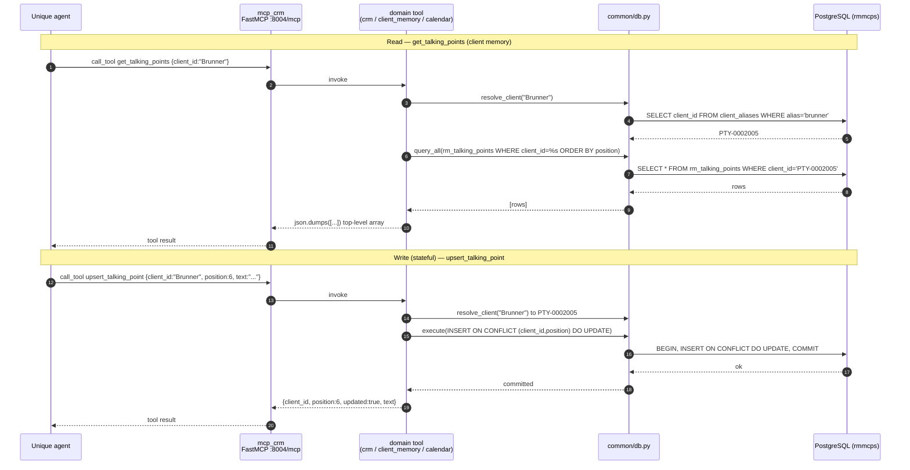

# RM Agent MCPs — Architecture

How the RM Agent MCP layer is built, why it's shaped this way, and how to extend it.

---

## 1. Background & goals

The RM Agent wealth-management demo originally ran its MCP tools as **n8n**
workflows: one persistent SSE trigger per "server", with the data embedded inline
in JavaScript (`toolCode` nodes) or in n8n Data Tables. That layer kept **running
out of memory** — the persistent triggers plus large inline data blobs blew past
the instance's heap, and it crash-looped.

This project re-implements the same tool surface as real, deployable **MCP
servers**, following [`mcp_sql_demo`](../mcp_sql_demo) as the template:

- **FastMCP** HTTP servers (streamable HTTP at `/mcp`),
- data in **PostgreSQL** (read with psycopg2), not inline JS,
- packaged + deployed to **Azure Web Apps** exactly like the SQL demo.

Goals: **stateless** servers that restart cleanly, **identical tool contract** so
the agent behaves exactly as before (same tool names, descriptions, output
shapes, and the single `client_id` identifier), and a **uniform, extensible**
codebase.

---

## 2. Two servers, split by what the data *is*

The nine n8n workflows consolidate into **two** servers:

| Server | Package | Domains | Azure app | Endpoint |
|---|---|---|---|---|
| **Advisory** — investment/portfolio side | `mcp_advisory` | house views · portfolios · transactions · model portfolios · lombard coverage | `rm-advisory-mcp` | `:8003/mcp` |
| **CRM** — relationship side | `mcp_crm` | crm · client memory · calendar | `rm-crm-mcp` | `:8004/mcp` |

Plus a `Reset_Demo_Data` tool on each. The split is by *domain of data*:
"what we manage" (Advisory) vs. "who we serve" (CRM). Both share **one** Postgres
database, one container registry, and one resource group.

```
                Unique connectors (MCP over HTTP)
                 │                          │
        RM Agent - Advisory          RM Agent - CRM
                 │                          │
     ┌───────────▼───────────┐  ┌───────────▼───────────┐
     │   mcp_advisory (:8003) │  │    mcp_crm (:8004)     │
     │  house_views           │  │  crm                   │
     │  portfolios            │  │  client_memory (R/W)   │
     │  transactions          │  │  calendar              │
     │  model_portfolios      │  │  Reset_Demo_Data       │
     │  lombard               │  └───────────┬───────────┘
     │  Reset_Demo_Data       │              │
     └───────────┬───────────┘              │
                 └──────────────┬───────────┘
                                ▼
                   PostgreSQL  (db: rmmcps)
        clients / client_aliases  · per-domain tables
```

---

## 3. Repository layout

Both packages are **structurally identical** (a deliberate consistency goal):

```
mcp_<server>/
  pyproject.toml            # standalone package, PyPI-only deps (no editable paths)
  Dockerfile                # python:3.12-slim + uv sync; runs the server script
  docker_compose.yaml       # local Postgres (port 5432, db mcpdb)
  deploy_pg.sh              # Azure: Postgres Flexible Server + ACR + Web App
  README.md
  src/mcp_<server>/
    mcp_<server>.py         # FastMCP server: build_auth, middleware, registers
                            #   each domain's register(mcp), status + favicon routes,
                            #   Reset_Demo_Data
    common/
      db.py                 # shared: connection, client resolution, tool factory, reset
    <domain>.py             # one module per domain, each exposing register(mcp)
    sql/                    # one <domain>.sql per domain + clients.sql (GENERATED)
    favicon.ico
```

Every domain is a **single module** exposing `register(mcp)`; every domain talks
to the database **only** through `common/db.py`. The two `common/db.py` files are
kept byte-identical.

---

## 4. A request, end to end

1. The Unique connector opens an MCP session to `…/mcp` and calls a tool, e.g.
   `get_holdings({"input": "Brunner"})`.
2. The `@mcp.tool` wrapper (built by the factory in `common/db.py`) calls
   `get_record("holdings", "Brunner")`.
3. `resolve_client("Brunner")` → `SELECT client_id FROM client_aliases WHERE
   alias = 'brunner'` → `PTY-0002005`.
4. `SELECT data FROM holdings WHERE client_id = 'PTY-0002005'` → a JSONB object.
5. The tool returns `json.dumps({"client_id": "PTY-0002005", **data})` — exactly
   the shape the n8n tool returned.

Each call uses one short-lived connection (read-only for reads). Nothing is held
between calls — that statelessness is the whole point of leaving n8n.

### Advisory — request flow

A per-client read (`get_holdings`): resolve the alias, then fetch the JSONB
record. Catalogue tools (house views / models / lombard) skip resolution and
query their own tables directly.



### CRM — request flow

CRM is the same read path plus the **stateful** client-memory writes: `get_*`
return a top-level array; `upsert_*` / `delete_*` go through `execute()` (a
committed transaction) keyed by `(client_id, position)`.



---

## 5. Storage model

The data that used to be inline JS / Data Tables now lives in Postgres, generated
from the canonical sources (§7). Conventions:

| Kind | Schema | Tools | Returned as |
|---|---|---|---|
| **Read-only per-client record** | `<table>(client_id TEXT PK, data JSONB)` where `data` is an **object** | `get_holdings`, `get_party_identity`, `get_tax_lots`, … | `{client_id, **data}` |
| **Read-only per-client list** | same table, `data` is a **JSON array** | `get_portfolio_transactions`, `get_corporate_actions`, … | `{client_id, <field>: [...], count}` |
| **Roster & resolution** | `clients(client_id PK, data JSONB)`, `client_aliases(alias PK, client_id)` | `list_clients`, all resolution | roster page / canonical id |
| **Editable client memory** | `rm_talking_points / rm_open_questions / rm_documents (client_id, position, …)` rows | `get_/upsert_/delete_*` | top-level array (get) / status (write) |
| **Catalogue / bank-wide** | `house_view*`, `cio_themes`, `tactical_calls`, `model_catalog`, `model_portfolios(code PK)`, `lombard_coverage(party, scenario_id)`, `calendar_events`, `documents_catalog` | house view, models, lombard, calendar, doc catalog | as per the n8n shape |
| **Env-specific KB content ids** (CRM) | `content_id_map(env, map_key, content_id)` (PK `env, map_key`) | `list_clients`, `list_available_documents` — resolved per **caller env** (§7, [env_map](mcp_crm/src/mcp_crm/common/env_map.py)) | the caller-env's `cont_…`, or `""` → open by `filePath` |

**Why JSONB-per-client rather than fully normalized tables?** The tools are
deterministic *key lookups* ("give me this client's holdings"), not the ad-hoc
querying `mcp_sql_demo` does (it normalizes because it generates SQL `WHERE`
clauses from natural language). The registry records are nested and
heterogeneous; storing each as one JSONB document keeps the schema small and
returns the **exact** n8n payload with zero reshaping. The only place we use real
columns is where we actually query/sort by them: the editable memory rows
(by `position`), the catalogue keys, and `calendar_events` (filtered by
`client_id` / `rm` / `start_at`).

---

## 6. Client resolution

One identifier everywhere: **`client_id`** (textual — `PTY-…`, `CH-PB-…`,
`CH-PROS-…`). The `client_aliases` table maps, case-insensitively, every
**name** (e.g. `brunner`, `katharina brunner`), every **legacy numeric id**
(e.g. `0002002`, `800870664420`), and each canonical id (lowercased) → the
canonical `client_id`. `resolve_client()` is a single indexed lookup; an
unresolved value yields the standard `CLIENT_ERROR_HINT`. (Lombard is the one
exception: it keeps its own Markus-only party-alias map, mirroring the n8n tool.)

---

## 7. Data pipeline (how `sql/*.sql` is produced)

The seed SQL is **generated**, not hand-written, from canonical sources in the
**sandbox** repo (single source of truth = `client_registry.py`):

```
python/rm-demo/src/client_registry.py    # all per-client data + roster + resolution maps
python/rm-demo/src/reference_data.json    # frozen non-per-client data (attribution,
        │                                   entity_ownership, model catalogue, lombard)
        ▼
python/rm-demo/src/generate_sql.py
        │
        ▼
   writes sql/*.sql into BOTH ai-repo packages
```

- `generate_sql.py` reads the registry + `reference_data.json` and emits idempotent
  `CREATE TABLE IF NOT EXISTS … INSERT … ON CONFLICT DO NOTHING`, dollar-quoting JSON
  (`$rmj$…$rmj$`) so nothing needs escaping. (The old `harvest_n8n.js` step is gone —
  the n8n-only blobs were captured once and frozen into `reference_data.json`.)
- **Env-specific KB content ids** → `sql/content_id_map.sql` (CRM only): one row per
  `(env, map_key)` from `resources/rm-demo/{dashboard,document}_content_ids.<env>.json`
  (refreshed per env by `fetch_*_ids.py --env user.<env>.env` after KB uploads). Resolved
  at request time per caller env — see §5 and `mcp_crm/common/env_map.py`.

Regenerate with:

```bash
uv run --project python/rm-demo python python/rm-demo/src/generate_sql.py
```

`clients.sql` is generated identically into both packages (both servers resolve
clients against the same shared tables).

---

## 8. Domain module patterns

There are three shapes a domain module takes — pick the lightest that fits:

**a) Spec-driven (most per-client tools)** — a declarative list + the factory:

```python
from common.db import make_client_tools
SPECS = [
    {"name": "get_holdings", "table": "holdings", "style": "record", "description": "…"},
    {"name": "get_portfolio_transactions", "table": "portfolio_transactions",
     "style": "list", "field": "items", "description": "…"},
]
def register(mcp):
    make_client_tools(mcp, SPECS)
```

`make_client_tools` builds one `@mcp.tool` per spec; each accepts `input` (name or
client_id) plus an optional `client_id`, and returns a `record` or `list` payload.

**b) Custom read (catalogue / bank-wide)** — `house_views`, `model_portfolios`,
`lombard`, `calendar`: a `register(mcp)` that defines tools with bespoke queries
via `query_one` / `query_all` (e.g. fuzzy scenario matching, model code/name
matching, week/RM calendar filters).

**c) Custom write (stateful)** — `client_memory`: `get_*` return a top-level array;
`upsert_*` / `delete_*` use `execute()` with `INSERT … ON CONFLICT … DO UPDATE` /
`DELETE` keyed by `(client_id, position)`.

`common/db.py` is the single place that knows about connections and SQL:
`get_conn`, `query_one`, `query_all`, `execute`, `resolve_client`, `unknown`,
`get_record`, `get_list`, `make_client_tools`, and `reset_demo_data`.

---

## 9. Reset_Demo_Data

Each server exposes `Reset_Demo_Data` (modelled on `mcp_trade_reconciliation`).
Because our seeds are idempotent (`ON CONFLICT DO NOTHING`), a plain re-run would
*not* undo demo edits — so `reset_demo_data(sql_dir)`:

1. parses the `CREATE TABLE IF NOT EXISTS` names from this server's `sql/*.sql`,
2. `TRUNCATE`s the ones that exist,
3. re-executes every seed file,

all in one transaction, then returns per-table row counts. This is what restores
the **editable CRM client memory** to baseline (added rows removed, deleted rows
back) between demo runs. It is DESTRUCTIVE and intended for demos.

---

## 10. Authentication

Auth mirrors `mcp_sql_demo`'s **Zitadel OAuth proxy**, but is **optional**:
`build_auth()` returns the `OAuthProxy` only when `ZITADEL_URL` /
`UPSTREAM_CLIENT_ID` / `UPSTREAM_CLIENT_SECRET` are set, otherwise `None` (open
server). The RM data here is bank-wide / per-client demo data with no per-user
row filtering, so local and demo runs need no auth infrastructure; production can
enable the same OAuth the SQL demo uses.

---

## 11. Local development

The two servers share **one** database — run a single Postgres and seed both:

```bash
cd tutorials/mcp/rm_mcps/mcp_advisory
docker compose -f docker_compose.yaml up -d                       # postgres :5432, db mcpdb
for f in ../mcp_advisory/src/mcp_advisory/sql/*.sql ../mcp_crm/src/mcp_crm/sql/*.sql; do
  psql -h localhost -p 5432 -U postgres -d mcpdb -f "$f"          # password: postgres
done
( cd ../mcp_advisory && uv sync && uv run python src/mcp_advisory/mcp_advisory.py )   # :8003
( cd ../mcp_crm      && uv sync && uv run python src/mcp_crm/mcp_crm.py )             # :8004
```

Health: `curl localhost:8003/` and `curl localhost:8004/`. The MCP endpoints are
`…/mcp`.

---

## 12. Deployment (Azure)

Shared infra in resource group `rg-lab-demo-001-rm-agent-mcp`: one ACR (`rmmcpsacr`),
one Postgres Flexible Server (`rm-mcps-pg-db`), one database (`rmmcps`). Deploy
**Advisory first** (it creates the shared ACR + Postgres), then **CRM** (reuses
them):

```bash
( cd mcp_advisory && ./deploy_pg.sh )   # prompts for PG_ADMIN_PASSWORD on first run
( cd mcp_crm      && ./deploy_pg.sh )   # same PG_ADMIN_PASSWORD
```

Each `deploy_pg.sh`: ensures the Postgres server/db, seeds `sql/*.sql` via `psql`,
`az acr build`s the image, and creates/updates a Linux Web App
(`rm-advisory-mcp` / `rm-crm-mcp`, `WEBSITES_PORT` 8003/8004) with the Postgres
app settings. Then rewire the two Unique connectors (`RM Agent - Advisory`,
`RM Agent - CRM`) to the new `…/mcp` endpoints.

**Redeploying code / seed changes** (after the initial `deploy_pg.sh`): use
`.local/redeploy.sh [advisory|crm|both]`. The web apps are **pinned to timestamp
tags** (not `:latest`), so building `:latest` + restarting does nothing — the script
`az acr build`s a fresh timestamp tag, `az webapp config container set`s the app to it,
and restarts. It needs **Web App Contributor** on `rg-lab-demo-001-rm-agent-mcp` (the
`deploy_pg.sh` fallback path — direct `psql` seeding — additionally needs
`PG_ADMIN_PASSWORD`; `redeploy.sh` avoids it). **Seed SQL is baked into the image**, so
after a redeploy run **`Reset_Demo_Data`** (chat: "reset the demo data", or the
`.local/mcp_call.py … call Reset_Demo_Data '{}'` helper) to apply new/changed seed data
— e.g. a refreshed `content_id_map`. Resetting *before* redeploy restores the old data.

> The build context is each package dir; deps are PyPI-only (no editable paths),
> so `az acr build` resolves cleanly — unlike the SQL demo's local-path deps.

---

## 13. Extending

**Add a domain to a server:**
1. add a `sql/<domain>.sql` (or extend `generate_sql.py` to emit it),
2. add `<domain>.py` exposing `register(mcp)` (spec-driven if it's per-client),
3. add one `import <domain>` + `<domain>.register(mcp)` line in the server.

**Add a server:** copy a package, swap the name/port/app in
`pyproject.toml` / `Dockerfile` / `deploy_pg.sh` / `mcp_<server>.py`, keep
`common/db.py` identical, add its domains. It shares the same database.

---

## 14. Tests

Each package ships `tests/unit/` and `tests/integration/` (pytest; `pytest>=8` in
the dev group, configured in `pyproject.toml`).

- **Unit — environment-agnostic.** They monkeypatch the `common/db.py` layer
  (`resolve_client`, `query_one`, `query_all`, `execute`, `get_record`,
  `get_list`) and exercise the pure logic: alias/shape handling, the tool
  factory, house-view synonyms, lombard party/scenario resolution, model
  code/name matching, `list_clients` filtering, and the client-memory
  upsert/delete/truncation rules. A `FakeMCP` (in `tests/conftest.py`) captures
  `@mcp.tool` registrations so the *real* tool callables — including the closures
  defined inside `register()` — are invoked without a server. No Postgres needed
  (verified by running with a bogus `PGHOST`).
- **Integration — exercise the env setup, separately.** Marked `integration`;
  they assert real results against the seeded database and the live `…/mcp`
  endpoint (tool inventory, known lookups, a client-memory CRUD round-trip, a
  `Reset_Demo_Data` baseline check) and verify **graceful failure** (unknown
  client → error payload, not a crash). Each module **skips itself** when the DB
  or server is unavailable, so they never break an env-agnostic run.

```bash
uv run pytest tests/unit       # anywhere
uv run pytest -m integration   # with docker compose up + seeds (+ server for http tests)
```

## 15. Key design decisions

| Decision | Why |
|---|---|
| FastMCP + Postgres, per `mcp_sql_demo` | Stateless, restartable; fixes the n8n OOM; same deploy story. |
| Two servers (Advisory / CRM) | Clean domain split; smaller blast radius; matches how the agent reasons. |
| JSONB-per-client for reads | Tools are key lookups, not ad-hoc queries; preserves exact n8n payloads with a tiny schema. |
| One shared database | The data is one dataset; avoids cross-server duplication and sync. |
| Single module per domain + `register(mcp)` | Uniform, low-ceremony, easy to read and extend. |
| All DB access via `common/db.py` | One place for connections, resolution, the tool factory, and reset. |
| Generated seed SQL | Fidelity to the canonical registry + n8n data; reproducible; no hand-copying. |
| Optional OAuth | Frictionless local/demo; same Zitadel auth as the SQL demo in prod. |
| `client_id` everywhere (+ aliases) | One identifier for the agent; names and legacy ids still resolve. |
