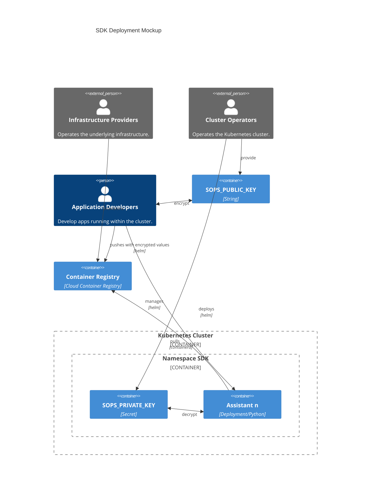

## Plan

### Disclaimer
Remember the [disclaimer](../). Planning the deployment from your engineers is your accountability and responsibility.

### High level overview

This deployment architecture **illustrates** a role-separated SDK deployment pipeline on a managed Kubernetes service using SOPS encryption for sensitive data management. **This is a conceptual example only** - actual security implementation requires thorough analysis and adaptation to your specific environment.

#### 🏗️ Key Stakeholders

- **🔧 Infrastructure Providers**: Provision and manage the underlying cloud infrastructure, including the container registry
- **⚙️ Cluster Operators**: Operate and maintain the Kubernetes cluster, manage secrets via Helm, and provide public keys to developers
- **👩‍💻 Application Developers**: Build applications, encrypt sensitive configurations, and deploy them to the cluster

#### 🔐 Example Security Model

The system **demonstrates** SOPS (Secrets OPerationS) encryption with asymmetric key cryptography:

- **Public Key**: Distributed to application developers for encrypting sensitive values
- **Private Key**: Stored as a Kubernetes secret within the SDK namespace, accessible only to assistant deployments

**⚠️ Important**: This is a simplified illustration. Real-world security requires comprehensive threat modeling, security reviews, and compliance with your organization's security policies.

#### 🚀 Example Deployment Flow

1. **Encryption Phase**: Application developers encrypt their configuration values using the SOPS public key
2. **Publishing Phase**: Encrypted configurations and container images are pushed to the container registry via Helm
3. **Deployment Phase**: Developers deploy applications using Helm, creating Python-based "Assistant" deployments in the SDK namespace
4. **Runtime Phase**: Assistant containers decrypt sensitive values using the private key and pull necessary images from the registry

#### 🛡️ Illustrated Security Concepts

This example demonstrates concepts such as:
- **Encrypted secrets**: Sensitive data remains encrypted until runtime
- **Role separation**: Each stakeholder group has different access levels
- **Centralized key management**: Private keys are managed by cluster operators
- **Audit trail**: All deployments go through controlled Helm processes

**⚠️ Critical Note**: These are conceptual benefits only. Actual security depends on proper implementation, configuration, monitoring, and ongoing security practices that must be designed for your specific environment and requirements.

### Thoughts
The mocks do not depict details about any cloud provider specific entities or resources. You must decide whether to use SOPS or alternative solutions for secrets management. These are design decisions that you need to make based on your specific requirements - this is just one possible approach among many.