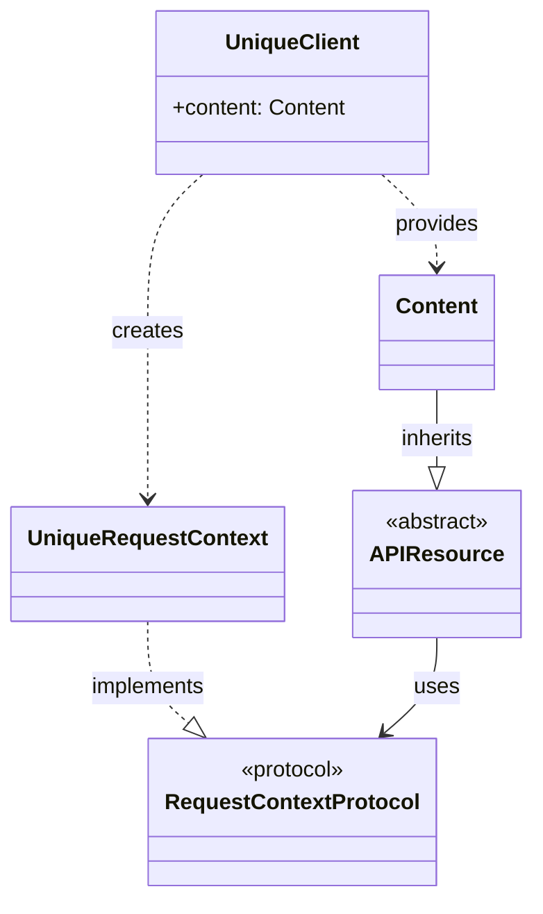
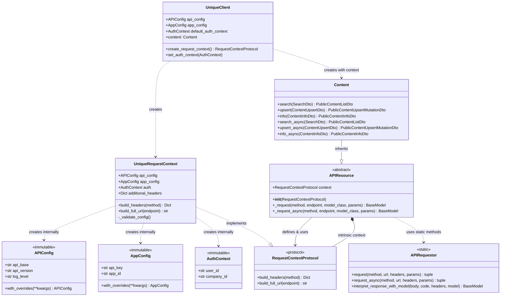
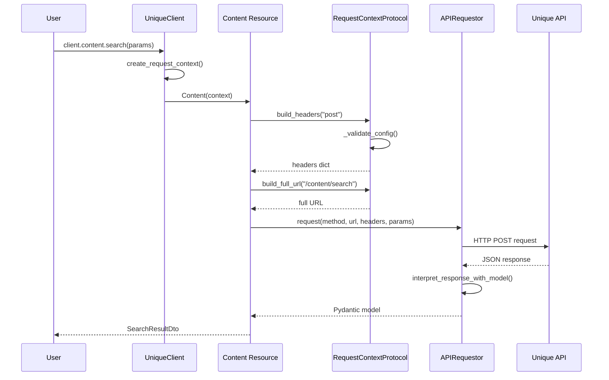

# Unique SDK v2 Architecture

## Overview

The Unique SDK v2 follows an **intrinsic context architecture** with **protocol-based decoupling** where API resources define their own context interface through protocols. This provides a clean, modern SDK pattern similar to OpenAI and Anthropic SDKs, with complete sync/async support and zero parameter passing for context.

## Core Architecture



## Design Principles

### 1. **Protocol-Based Decoupling**
- API resources define `RequestContextProtocol` interface
- Client implements the protocol without direct dependencies
- Clear separation between interface and implementation
- Enables independent evolution of client and resource layers

### 2. **Intrinsic Context Pattern**
- API resources store `RequestContextProtocol` as `self.context`
- No context passing between method calls
- Context encapsulates all request preparation logic
- Clean, predictable method signatures

### 3. **Client-Managed Auth Context**
- Client stores default auth context
- Resources automatically use client's context
- Flexible auth context override when needed
- Zero configuration for simple usage

### 4. **Complete Sync/Async Parity**
- Every method has both sync and async versions
- Same business logic, different execution models
- Choose based on performance vs simplicity needs
- Concurrent operations with `asyncio.gather()`

### 5. **Separation of Concerns**
- **Configuration**: Only in client classes
- **Protocol Definition**: In API resource layer
- **Protocol Implementation**: In client layer  
- **Request Preparation**: Only in context implementations
- **Business Logic**: Only in API resources
- **HTTP Operations**: Only in APIRequestor

## Component Details

### UniqueClient
**Purpose**: Configuration management and resource creation
**Key Responsibilities**:
- Store API configuration (`api_base`, `api_version`, etc.)
- Store app configuration (`api_key`, `app_id`)
- Manage default authentication context
- Create `RequestContextProtocol` implementations
- Provide resource property accessors

**Key Methods**:
```python
def create_request_context(self, auth_context=None, **headers) -> RequestContextProtocol
def set_auth_context(self, auth_context: AuthContext) -> None

@property
def content(self) -> Content  # Returns Content(context) instance
```

**Design Choice**: Client acts as factory for configured resources, implementing protocols defined by the resource layer.

### RequestContextProtocol (in _api_resource.py)
**Purpose**: Define the interface contract for request context
**Key Responsibilities**:
- Define required methods for request preparation
- Provide type safety for context implementations
- Enable decoupling between client and resource layers
- Document the context interface contract

**Interface Definition**:
```python
class RequestContextProtocol(Protocol):
    def build_full_url(self, endpoint: str) -> str: ...
    def build_headers(self, method: str) -> Dict[str, str]: ...
```

**Design Choice**: Protocol defined in resource layer creates clear dependency direction and enables independent development.

### UniqueRequestContext (in _client.py)
**Purpose**: Concrete implementation of RequestContextProtocol
**Key Responsibilities**:
- Build complete HTTP headers with authentication
- Construct full URLs from endpoints
- Validate configuration before requests
- Encapsulate all request metadata

**Key Methods**:
```python
def build_headers(self, method: str) -> Dict[str, str]
def build_full_url(self, endpoint: str) -> str
def _validate_config(self) -> None
```

**Design Choice**: Implementation separated from interface enables flexible context implementations while maintaining type safety.

### APIResource (Base Class)
**Purpose**: Provide intrinsic context pattern and common request methods
**Key Responsibilities**:
- Define `RequestContextProtocol` interface
- Store protocol implementation as instance variable
- Provide `_request()` and `_request_async()` base methods
- Handle automatic header/URL generation
- Apply retry logic and error handling

**Key Methods**:
```python
def __init__(self, context: RequestContextProtocol)
def _request(self, method, endpoint, model_class, params=None) -> BaseModel
async def _request_async(self, method, endpoint, model_class, params=None) -> BaseModel
```

**Design Choice**: Protocol-based design eliminates direct client dependencies while maintaining clean inheritance.

### Content (API Resource)
**Purpose**: Content-specific business logic and endpoint mapping
**Key Responsibilities**:
- Define all content API endpoints
- Handle request/response data transformation
- Provide both sync and async method variants
- Use intrinsic context for automatic request handling

**Method Pattern**:
```python
# Sync methods
def search(self, params: SearchDto) -> PublicContentListDto
def upsert(self, params: ContentUpsertDto) -> PublicContentUpsertMutationDto

# Async methods  
async def search_async(self, params: SearchDto) -> PublicContentListDto
async def upsert_async(self, params: ContentUpsertDto) -> PublicContentUpsertMutationDto
```

**Design Choice**: Complete sync/async API coverage with consistent naming and behavior.

### APIRequestor
**Purpose**: Pure HTTP operations with no business logic
**Key Responsibilities**:
- Make HTTP requests with full URLs and headers
- Handle request/response serialization
- Provide both sync and async HTTP methods
- Parse responses into Pydantic models

**Key Methods**:
```python
@classmethod
def request(cls, method, full_url, headers, params=None) -> tuple
@classmethod  
async def request_async(cls, method, full_url, headers, params=None) -> tuple
@classmethod
def interpret_response_with_model(cls, rbody, rcode, rheaders, model_class) -> BaseModel
```

**Design Choice**: Static methods with no dependencies enable pure HTTP operations and easy testing.

## Dependency Graph



**Key Design Improvement**: Protocol-based decoupling eliminates direct dependencies between client and resource layers while maintaining type safety.

## Usage Patterns

### Simple Usage (Recommended)
```python
# One-time setup
client = UniqueClient(
    api_key="...", 
    app_id="...",
    user_id="...",  
    company_id="..."
)

# Zero-config usage
results = client.content.search(search_params)
await client.content.search_async(search_params)  # Async version
```

### Advanced Usage
```python
# Custom auth context per request
custom_context = AuthContext(user_id="other", company_id="other") 
client.set_auth_context(custom_context)

# Custom headers
context = client.create_request_context(
    custom_auth_context,
    **{"X-Custom-Header": "value"}
)
content = Content(context)
results = content.search(params)
```

### Concurrent Operations
```python
# Run multiple operations concurrently
tasks = [
    client.content.search_async(search_params),
    client.content.info_async(info_params),
    client.content.export_excel_async(export_params),
]
results = await asyncio.gather(*tasks)
```

## Request Flow Sequence



## Benefits

### 1. **Protocol-Based Decoupling**
- Clean separation between interface definition and implementation
- API resources define their own context requirements
- Client layer implements context without direct resource dependencies
- Enables independent development and testing of each layer
- Type safety maintained through Protocol contracts

### 2. **Zero Configuration Complexity**
- Simple: `client.content.search(params)` 
- No context passing or client injection
- Auth context handled automatically
- Modern SDK user experience

### 3. **Complete Flexibility**
- Override auth context when needed
- Add custom headers per request
- Choose sync vs async based on needs
- Mix patterns as required
- Multiple context implementations possible

### 4. **Excellent Performance**
- Async support for concurrent operations
- Context reused across multiple calls
- Minimal object creation overhead
- HTTP connection pooling

### 5. **Easy Testing & Mocking**
```python
# Mock the protocol for testing
mock_context = Mock(spec=RequestContextProtocol)
mock_context.build_full_url.return_value = "https://test.com/endpoint"
mock_context.build_headers.return_value = {"Authorization": "Bearer test"}

content = Content(mock_context)
# Test business logic without HTTP calls
```

### 6. **Type Safety**
- Full Pydantic model validation
- Protocol-based type checking
- Type hints throughout
- IDE autocompletion support
- Compile-time error detection

## Decoupling Architecture Benefits

### Clean Layer Separation
```
┌─────────────────────────────────────┐
│          Client Layer               │
│  • Configuration management         │
│  • Context implementation           │
│  • Resource factory                 │
└─────────────────────────────────────┘
                    │
                    │ implements protocol
                    ▼
┌─────────────────────────────────────┐
│        API Resource Layer           │
│  • Protocol definition             │
│  • Business logic                  │
│  • Request orchestration           │
└─────────────────────────────────────┘
                    │
                    │ uses static methods
                    ▼
┌─────────────────────────────────────┐
│         HTTP Layer                  │
│  • Pure HTTP operations             │
│  • No business dependencies        │
│  • Sync & async support            │
└─────────────────────────────────────┘
```

### Independent Evolution
- **API Resources** can evolve their protocol requirements
- **Client implementations** can change without affecting resources
- **HTTP layer** remains completely independent
- **Testing** each layer in isolation becomes trivial

### Dependency Inversion Principle
- High-level modules (API resources) define abstractions (protocols)
- Low-level modules (client) depend on abstractions
- Details depend on abstractions, not the reverse
- Enables flexible architecture evolution

## Eliminated Anti-Patterns

### ❌ Context Passing (Avoided)
```python
# Bad: Context passed everywhere
def search(context, params):
    headers = context.build_headers()  # Context dependency
    return request(headers, params)
```

### ❌ Client Injection (Avoided)  
```python
# Bad: Client passed to every method
def search(client, auth_context, params):
    headers = client.build_headers(auth_context)  # Complex coupling
    return request(headers, params)
```

### ❌ Global State (Avoided)
```python
# Bad: Global configuration
configure_api(api_base="...", api_key="...")  # Global state
result = Content.search(params)  # Implicit dependencies
```

### ✅ Intrinsic Context (Current)
```python
# Good: Context built into resource
client = UniqueClient(api_key="...", user_id="...")
result = client.content.search(params)  # Clean, simple, predictable
```

## Modern SDK Comparison

This architecture follows patterns used by leading SDK providers:

**OpenAI**: `client.chat.completions.create()`
**Anthropic**: `client.messages.create()`  
**Unique**: `client.content.search()`

All follow the pattern of:
1. Client handles configuration
2. Resources accessed as properties
3. Methods take business parameters only
4. Context/auth handled automatically

## Future Extensions

The architecture easily supports:

- **New API Resources**: Add new classes inheriting from APIResource
- **Custom Authentication**: Override auth context per request
- **Middleware**: Add request/response middleware to RequestContextProtocol
- **Caching**: Add caching layer to APIRequestor
- **Retries**: Already implemented with configurable retry logic
- **Rate Limiting**: Can be added to RequestContextProtocol or APIRequestor

This intrinsic context architecture provides the perfect balance of simplicity, flexibility, and performance for a modern Python SDK. 