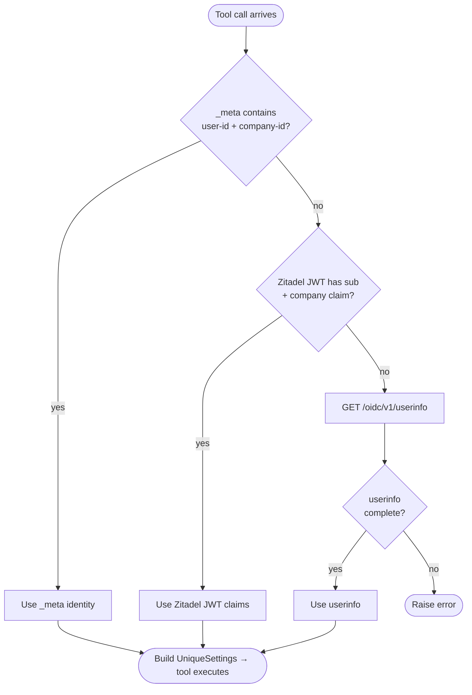
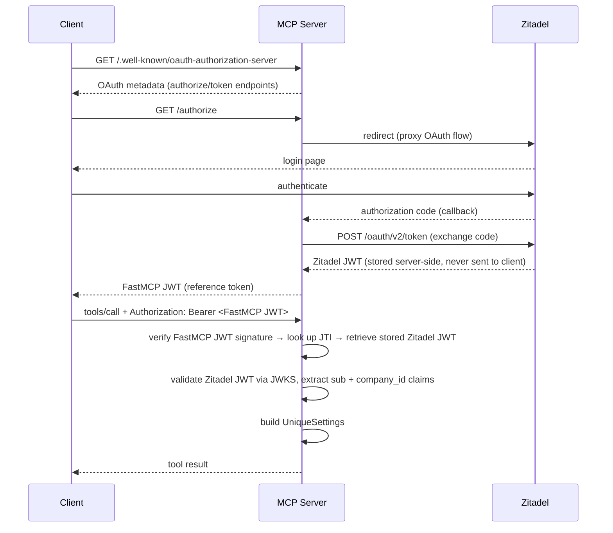
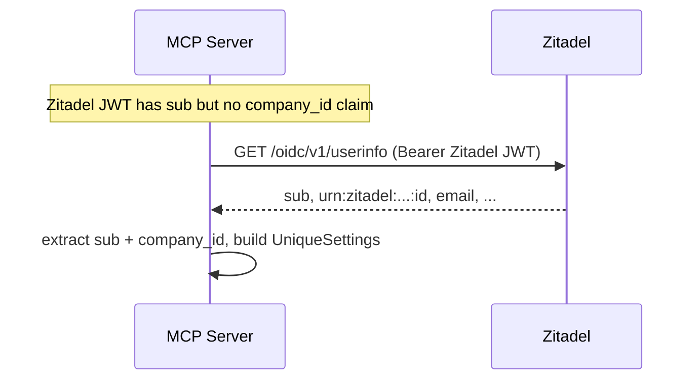
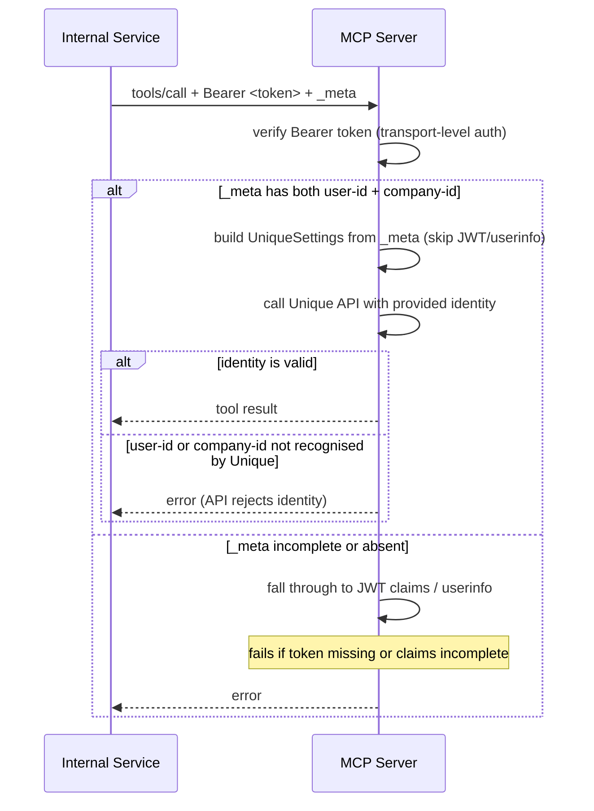

# unique_mcp

Shared auth and context wiring for [FastMCP](https://github.com/jlowin/fastmcp) servers in the Unique platform. Used as a dependency by MCP servers in this repo to handle per-request authentication against Zitadel.

---

## Problem → Solution

MCP tools must call Unique APIs on behalf of the requesting user — every tool invocation needs a `UniqueSettings` with the correct `user_id` and `company_id`. Hard-coding a single identity in env vars breaks multi-tenant deployments and leaks credentials.

The MCP server acts as an OAuth proxy: clients receive a FastMCP-issued JWT, which the server swaps server-side for the stored Zitadel token on every request. The Zitadel token _should_ contain `sub` and the company claim, but this depends on token configuration and can't be assumed.

**`UniqueContextProvider`** solves this: created once at startup and injected via `Depends()` into each tool, it resolves the right identity per request using a three-priority strategy:

| Priority     | Source                          | Fields                                         | When it wins                                  |
| ------------ | ------------------------------- | ---------------------------------------------- | --------------------------------------------- |
| 1 (highest)  | `_meta` keys in the MCP request | `unique.app/user-id`, `unique.app/company-id`  | Trusted internal callers overriding identity  |
| 2            | Zitadel JWT claims (server-side token swap) | `sub`, `urn:zitadel:iam:user:resourceowner:id` | Normal OAuth flow with fully-configured token |
| 3 (fallback) | Zitadel `/userinfo` endpoint    | same as JWT                                    | JWT present but claims incomplete             |

Both fields must be present in whichever source wins. If only one is found the provider falls through to the next priority level.



### OAuth scopes

The OAuthProxy advertises these valid scopes:

| Scope                                | Purpose                            |
| ------------------------------------ | ---------------------------------- |
| `openid`                             | Base OIDC scope                    |
| `profile`                            | Name and basic profile claims      |
| `email`                              | Email claim                        |
| `urn:zitadel:iam:user:resourceowner` | Embeds company/org ID in the token |
| `mcp:tools`                          | Access to MCP tools                |
| `mcp:prompts`                        | Access to MCP prompts              |
| `mcp:resources`                      | Access to MCP resources            |
| `mcp:resource-templates`             | Access to MCP resource templates   |

---

## Usage

```python
from fastmcp.server.dependencies import Depends
from unique_mcp.server import create_unique_mcp_server

bundle = create_unique_mcp_server("my-server")
mcp = bundle.mcp
provider = bundle.context_provider


@mcp.tool()
async def search(query: str, settings=Depends(provider.get_settings)) -> str:
    # `settings` carries the correct user_id + company_id for this request
    return await some_unique_api_call(settings, query)


if __name__ == "__main__":
    s = bundle.server_settings
    mcp.run(
        transport=s.transport_scheme,
        host=s.local_base_url.host,
        port=s.local_base_url.port,
    )
```

`create_unique_mcp_server()` returns an `UniqueMCPServerBundle`:

| Field              | Type                    | Purpose                               |
| ------------------ | ----------------------- | ------------------------------------- |
| `mcp`              | `FastMCP`               | Server instance — register tools here |
| `context_provider` | `UniqueContextProvider` | Per-request auth resolver             |
| `server_settings`  | `ServerSettings`        | Transport/URL config                  |

`UniqueContextProvider` exposes three async methods:

```python
settings = await provider.get_settings()   # UniqueSettings (app + api config + auth)
context  = await provider.get_context()    # UniqueContext (auth only, lighter weight)
info     = await provider.get_userinfo()   # Raw Zitadel userinfo (email, name, etc.)
```

---

## Scenarios

### 1 — Normal OAuth flow (JWT with full claims)

The common case. The MCP server acts as an OAuth Authorization Server and proxies the login to Zitadel using the **token swap pattern**:

1. The client authenticates against the MCP server's OAuth endpoints (not Zitadel directly).
2. The MCP server proxies to Zitadel, obtains a Zitadel token, and stores it server-side.
3. The MCP server issues its own short-lived **FastMCP JWT** to the client.
4. On every tool call, the MCP server swaps the FastMCP JWT for the stored Zitadel token, validates it against Zitadel's JWKS, and extracts claims — no extra network call needed when the Zitadel JWT contains `sub` + `urn:zitadel:iam:user:resourceowner:id`.



### 2 — JWT without company claim (userinfo fallback)

The default for newly registered Zitadel apps until the JWT action is configured. The Zitadel JWT carries `sub` but no company claim, so the provider falls back to `/userinfo`. This adds one HTTP round-trip per request; avoid it by configuring Zitadel to embed the `urn:zitadel:iam:user:resourceowner` scope in the JWT — see [`docs/zitadel/README.md`](docs/zitadel/README.md).



### 3 — Trusted internal caller with `_meta` override

An internal service calls the tool on behalf of a known user by passing identity directly in the MCP `_meta` field. This takes highest priority — but **only works if both `unique.app/user-id` and `unique.app/company-id` are present**. If either is missing, the provider falls through to JWT/userinfo resolution, which will fail if no valid Bearer token is present.

> **Security:** The server takes `_meta` values as-is without further validation. Only use this from callers you fully trust — never expose it to external users.

```json
{
  "method": "tools/call",
  "params": {
    "name": "search",
    "arguments": { "query": "hello" },
    "_meta": {
      "unique.app/user-id": "user-abc123",
      "unique.app/company-id": "company-xyz456"
    }
  }
}
```



---

## Configuration

**`UNIQUE_MCP_*`** — server settings:

| Variable                     | Default                 | Purpose                                 |
| ---------------------------- | ----------------------- | --------------------------------------- |
| `UNIQUE_MCP_PUBLIC_BASE_URL` | _(none)_                | Public URL advertised in OAuth metadata |
| `UNIQUE_MCP_LOCAL_BASE_URL`  | `http://localhost:8003` | Bind address                            |

**`ZITADEL_*`** — OAuth proxy settings:

| Variable                | Default                  | Purpose              |
| ----------------------- | ------------------------ | -------------------- |
| `ZITADEL_BASE_URL`      | `http://localhost:10116` | Zitadel instance URL |
| `ZITADEL_CLIENT_ID`     | _(required in prod)_     | OAuth client ID      |
| `ZITADEL_CLIENT_SECRET` | _(required in prod)_     | OAuth client secret  |

---

## Zitadel setup

See [`docs/zitadel/README.md`](docs/zitadel/README.md) for step-by-step instructions: creating the OAuth app, enabling JWT token type with embedded org claims, configuring redirect URIs (including ngrok for local dev), and required scopes.

---

## Development

```bash
cd unique_mcp && uv run pytest tests/ -q
```
