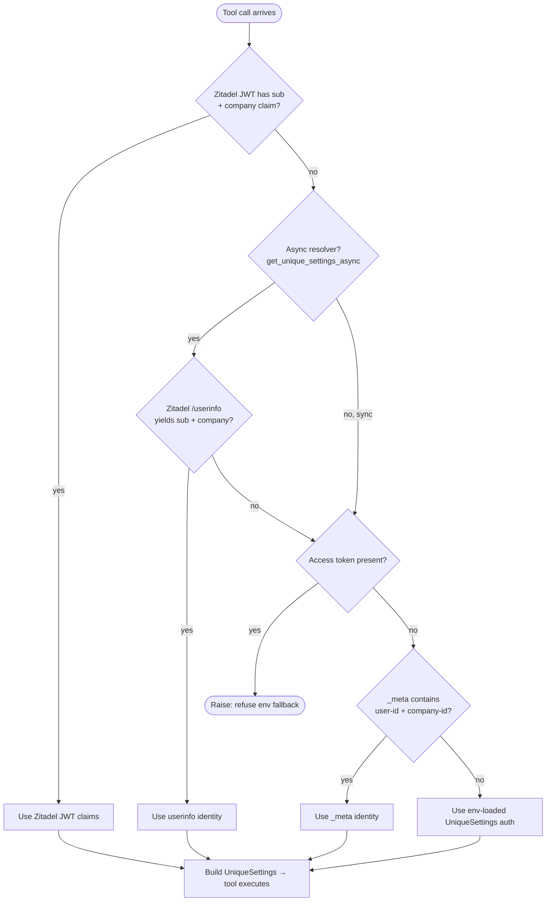
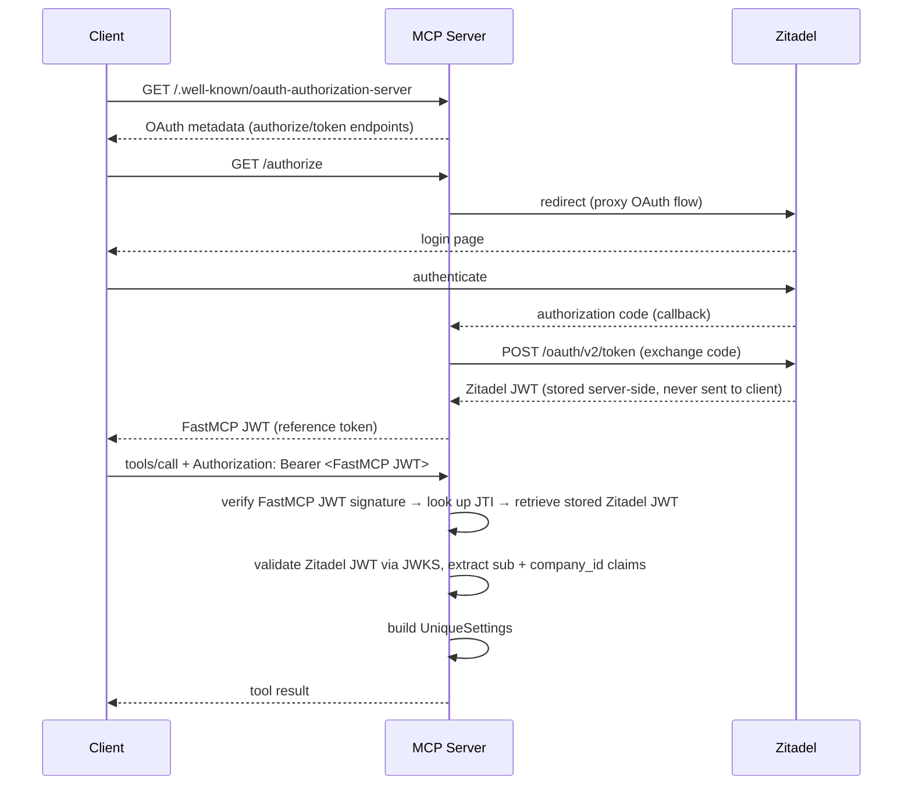
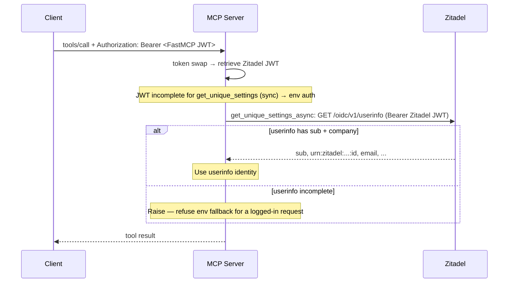
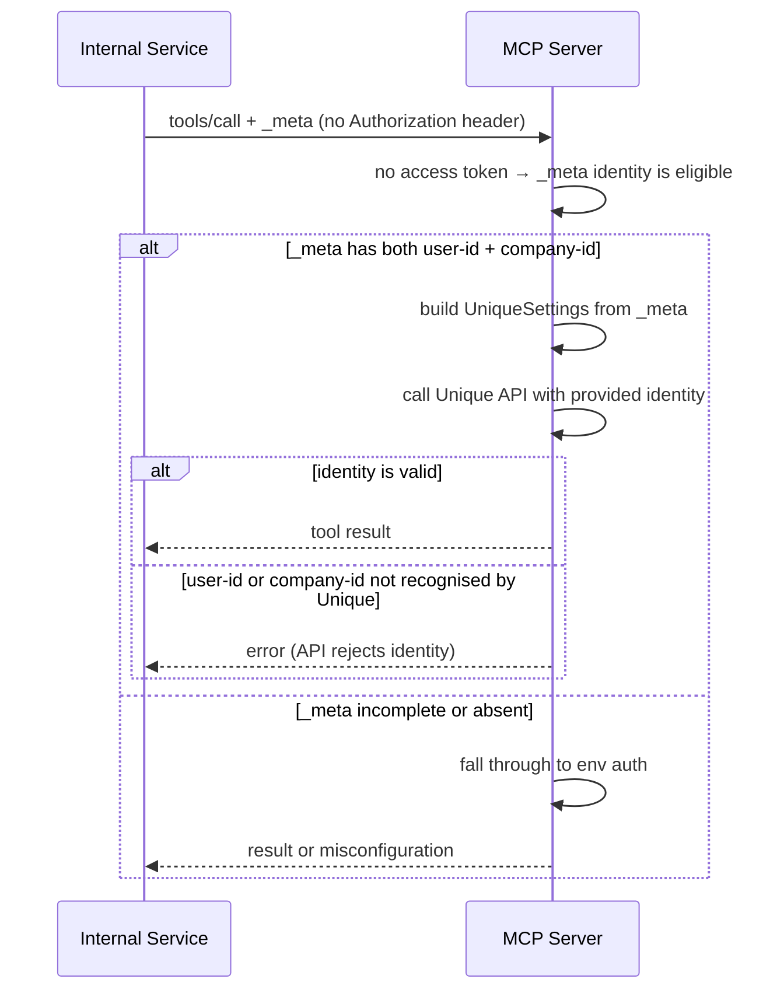

# Per-request identity

MCP tools must call Unique APIs on behalf of the requesting user. Every invocation needs a `UniqueSettings` with the correct `user_id` and `company_id`. Hard-coding a single identity in env vars breaks multi-tenant deployments and leaks credentials.

The MCP server acts as an OAuth proxy: clients receive a FastMCP-issued JWT, which the server swaps server-side for the stored Zitadel token on every request. The Zitadel token *should* contain `sub` and the company claim, but that depends on token configuration and cannot be assumed.

Wire a normal `FastMCP` instance with [`create_zitadel_oauth_proxy`](../README.md#usage), then resolve identity with **`get_unique_settings_async`** (preferred) or **`get_unique_settings`**. Optionally use **`get_unique_userinfo`** / **`get_unique_service_factory`**.

App registration, JWT token type, and redirect URIs are in [Zitadel setup](zitadel.md). How `_meta` carries identity versus config is in [MCP `_meta`](meta.md). Env vars are in [Configuration](configuration.md).

---

## Resolution order

**`get_unique_settings` (sync)** — three-priority strategy:

| Priority     | Source                          | Fields                                         | When it wins                                  |
| ------------ | ------------------------------- | ---------------------------------------------- | --------------------------------------------- |
| 1 (highest)  | Zitadel JWT claims (server-side token swap) | `sub`, `urn:zitadel:iam:user:resourceowner:id` | Normal OAuth flow with a fully-configured token |
| 2            | `_meta` keys in the MCP request | `unique.app/auth/user-id`, `unique.app/auth/company-id` | **Only when the request carries no access token** — trusted platform-internal callers |
| 3 (fallback) | Environment-loaded settings     | `UniqueSettings.from_env_auto_with_sdk_init()` | No token and no usable `_meta`                |

Both `user-id` and `company-id` must be present for priority 1 or 2 to apply. The sync helper does **not** call Zitadel `/userinfo` — incomplete JWTs fall through to env `UNIQUE_AUTH_*`.

> **Why `_meta` ranks below the token:** `_meta` is caller-supplied and not bound to the bearer token. If it outranked the JWT, any client able to set `tools/call._meta` could assert an arbitrary `user_id`/`company_id` and read another tenant's data. It is therefore ignored entirely once an access token is present.

**`get_unique_settings_async`** — same as above, but inserts Zitadel `/userinfo` **before** the env fallback. Prefer this in tools that must act as the **logged-in** user. If an access token is present but neither JWT nor userinfo yield both IDs, it **raises** instead of using the fixed service user.

**`get_unique_userinfo`** is also available on its own when you need profile fields (e.g. email).



Call identity resolvers **in the tool body** (not as `Depends`) if you want a refused-identity `ValueError` to surface as a tool error rather than a FastMCP dependency failure.

---

## OAuth scopes

The OAuth proxy advertises these valid scopes:

| Scope                                | Purpose                            |
| ------------------------------------ | ---------------------------------- |
| `openid`                             | Base OIDC scope                    |
| `profile`                            | Name and basic profile claims      |
| `email`                              | Email claim                        |
| `urn:zitadel:iam:user:resourceowner` | Embeds company/org ID in the token |
| `mcp:tools`                          | Access to MCP tools                |
| `mcp:prompts`                        | Access to MCP prompts              |
| `mcp:resources`                      | Access to MCP resources            |
| `mcp:resource-templates`             | Access to MCP resource templates   |

---

## Scenarios

### 1 — Normal OAuth flow (JWT with full claims)

The common case. The MCP server acts as an OAuth Authorization Server and proxies the login to Zitadel using the **token swap pattern**:

1. The client authenticates against the MCP server's OAuth endpoints (not Zitadel directly).
2. The MCP server proxies to Zitadel, obtains a Zitadel token, and stores it server-side.
3. The MCP server issues its own short-lived **FastMCP JWT** to the client.
4. On every tool call, the MCP server swaps the FastMCP JWT for the stored Zitadel token, validates it against Zitadel's JWKS, and extracts claims — no extra network call needed when the Zitadel JWT contains `sub` + `urn:zitadel:iam:user:resourceowner:id`.



### 2 — JWT without company claim (userinfo before env)

If the Zitadel JWT carries `sub` but not the company claim, **`get_unique_settings`** (sync) falls back to **environment** identity (`UNIQUE_AUTH_*`). That is wrong for multi-user servers.

Use **`await get_unique_settings_async()`** (or call **`get_unique_userinfo`**) so identity comes from Zitadel `/userinfo` instead. Configure Zitadel so JWTs embed the resourceowner claim when possible — see [Zitadel setup](zitadel.md) — to avoid the extra userinfo round-trip.



### 3 — Platform-internal caller supplying identity via `_meta`

An internal service calls the tool on behalf of a known user by passing identity directly in the MCP `_meta` field. Both `unique.app/auth/user-id` and `unique.app/auth/company-id` must be present; if either is missing the provider falls through to env resolution.

> **Security:** `_meta` values are taken as-is, with no validation and no binding to the bearer token. They are therefore honoured **only when the request carries no access token**. Sending `_meta` identity alongside a Bearer token has no effect — the token wins, and on the async resolver an unresolvable token raises rather than falling back. Use `_meta` only from callers you fully trust, and never expose it to external users.

```json
{
  "method": "tools/call",
  "params": {
    "name": "search",
    "arguments": { "query": "hello" },
    "_meta": {
      "unique.app/auth/user-id": "user-abc123",
      "unique.app/auth/company-id": "company-xyz456"
    }
  }
}
```



Chat context (`unique.app/chat/*`) is independent of this ranking: if `_meta` contains `chat-id`, it is always applied. See [MCP `_meta`](meta.md#identity-and-chat-uniqueappauth-uniqueappchat).
