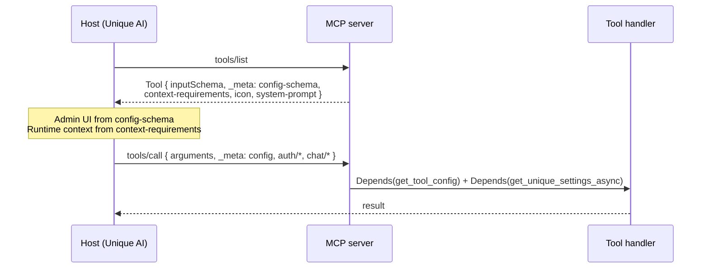

# MCP `_meta` convention

Unique MCP servers use the protocol's reserved [`_meta`](https://modelcontextprotocol.io/specification/2025-06-18/basic#general-fields) field as a side channel. Tool **arguments** stay LLM-visible (the query, the file id). Admin config, chat context, and identity travel in `_meta`, which Unique AI and other trusted hosts can set without putting those values in the tool schema.

This page is the package-level reference. For a shorter Unique-AI-oriented overview, see the [MCP tutorials `_meta` page](../../tutorials/docs/mcp/mcp_meta.md).

---

## Why `_meta`

MCP JSON-RPC requests, tool definitions, and content items may all carry an optional `_meta` object. The spec treats it as opaque extra data:

- Implementations **must not** fail on unknown keys.
- Custom keys **should** be reverse-DNS namespaced. Prefixes whose second label is `modelcontextprotocol` or `mcp` are reserved for the protocol.
- Unique therefore publishes every key under `unique.app/`.

That makes `_meta` the right place for data the LLM should not invent: tenant identity, chat ids, and admin-chosen retrieval settings.

Two MCP surfaces use the same field for **opposite directions**:

| When | Who writes `_meta` | Purpose |
| ---- | ------------------ | ------- |
| `tools/list` (tool definition) | The MCP **server** | Advertise what the host should collect and how Unique AI should present the tool |
| `tools/call` (invocation) | The MCP **host** | Send the collected config and context so injectors can bind it into the handler |



---

## Advertise on `tools/list`

Attach Unique metadata when you register the tool. `merge_tool_meta` copies a base dict and then lets each `MetaPart` write one (or more) namespaced keys.

```python
from fastmcp.tools import tool
from pydantic import BaseModel

from unique_mcp import (
    ConfigSchemaMeta,
    ContextRequirements,
    MetaKeys,
    UniqueAIToolMeta,
    merge_tool_meta,
)


class SearchToolConfig(BaseModel):
    limit: int = 20


_META = merge_tool_meta(
    {"unique.app/icon": "search"},
    ContextRequirements(required=[MetaKeys.USER_ID, MetaKeys.COMPANY_ID]),
    ConfigSchemaMeta(SearchToolConfig),
    UniqueAIToolMeta(
        tool_description_for_system_prompt=(
            "Choose this tool to search the knowledge base."
        ),
        tool_format_information_for_system_prompt=(
            "Cite results with the markdown links the tool returns."
        ),
    ),
)


@tool(name="search", description="Search the knowledge base.", meta=_META)
async def search(search_string: str) -> str: ...
```

`mcp_search` is the in-repo example of this pattern (`tutorials/mcp/mcp_search/src/mcp_search/tools/`).

### Config schema (`unique.app/config-schema`)

`ConfigSchemaMeta(YourModel)` publishes an RJSF payload so Unique AI can render an admin form:

```json
{
  "unique.app/config-schema": {
    "json_schema": { "...": "JSON Schema of YourModel" },
    "ui_schema": { "...": "RJSF uiSchema, including alias_generator keys" },
    "default_config": { "...": "YourModel() dumped by alias" }
  }
}
```

Every field on the model **must have a default**. The host needs a complete starting config; `ConfigSchemaMeta` raises `TypeError` at construction if any field is required.

Use `unique_toolkit` RJSF tags (`RJSFMetaTag`, `get_configuration_dict`) when a field needs a custom widget. CamelCase aliases from Pydantic `alias_generator` are forwarded into both `ui_schema` and `default_config`.

### Context requirements (`unique.app/context-requirements`)

`ContextRequirements` tells the host which `_meta` keys to send on `tools/call`:

| Field | Meaning |
| ----- | ------- |
| `required` | Host must supply these keys or the call is underspecified |
| `optional` | Host may supply these keys |
| `accepts_custom` | Host may attach extra keys beyond the lists |

Keys are usually `MetaKeys` members (`unique.app/auth/user-id`, `unique.app/chat/chat-id`, …). Domain-specific keys are allowed too, for example `unique.app/search/content-ids`.

```json
{
  "unique.app/context-requirements": {
    "required": ["unique.app/auth/user-id", "unique.app/auth/company-id"],
    "optional": [],
    "accepts_custom": false
  }
}
```

This is a **declaration**. The server does not enforce it; injectors simply look up whatever arrived. Unique AI uses the declaration to know which chat/auth fields to forward.

### Unique AI presentation keys

These are listed on the tool so Unique AI can render and prompt correctly. They are **not** sent back on `tools/call`.

| Key | Constant | Role |
| --- | -------- | ---- |
| `unique.app/icon` | `MetaKeys.TOOL_ICON` | Icon name or data URI shown in the space UI |
| `unique.app/system-prompt` | `MetaKeys.UNIQUE_AI_TOOL_SYSTEM_PROMPT` | When to pick this tool (injected into the Unique AI system prompt) |
| `unique.app/tool-format-information` | `MetaKeys.UNIQUE_AI_TOOL_FORMAT_INFORMATION` | How the model should format / cite the tool's output |
| `unique.app/user-prompt` | `MetaKeys.UNIQUE_AI_TOOL_USER_PROMPT` | Optional extra user-prompt fragment |

`UniqueAIToolMeta` writes the system-prompt and format-information keys. You can also set them in the `merge_tool_meta` base dict, which is what `mcp_search` currently does.

---

## Inject on `tools/call`

The host copies saved admin config and the current chat/user into `params._meta`. FastMCP exposes that dict as `request_context.meta`; Unique injectors read it instead of having every tool reach into FastMCP internals.

```json
{
  "method": "tools/call",
  "params": {
    "name": "search",
    "arguments": { "search_string": "Q3 revenue" },
    "_meta": {
      "unique.app/config": { "limit": 10 },
      "unique.app/auth/user-id": "user-abc",
      "unique.app/auth/company-id": "company-xyz",
      "unique.app/chat/chat-id": "chat-123",
      "unique.app/chat/user-message-id": "msg-456"
    }
  }
}
```

A FastMCP client does the same with `call_tool(..., meta={...})` — see `tutorials/mcp/mcp_search/src/mcp_search/mcp_client.py`.

### Config (`unique.app/config`)

`get_tool_config(YourModel)` is a FastMCP `Depends` factory. Lookup order:

1. `_meta["unique.app/config"]` — dict or JSON string from the host (production path)
2. Env override `UNIQUE_MCP_TOOL_{SERVER}_{CONFIG}_CONFIG` — process env, then `unique_mcp.env` / `.env`
3. `YourModel()` defaults

```python
from fastmcp.dependencies import Depends

from unique_mcp import get_tool_config, get_unique_settings_async


@tool(name="search", meta=_META)
async def search(
    search_string: str,
    config: SearchToolConfig = Depends(get_tool_config(SearchToolConfig)),
) -> str:
    settings = await get_unique_settings_async()
    ...
```

The env-var name is derived from the FastMCP server name and the model class. Example: server `mcp-search` + `SearchToolConfig` → `UNIQUE_MCP_TOOL_MCP_SEARCH_SEARCH_TOOL_CONFIG`. The value is a JSON object matching the model.

Use this split deliberately: **LLM-filled state** is tool arguments; **admin-set behaviour** is config.

### Identity and chat (`unique.app/auth/*`, `unique.app/chat/*`)

`get_unique_settings` / `get_unique_settings_async` compose `UniqueSettings` for the current request.

**Auth** (both `user-id` and `company-id` required for a source to win):

| Priority | Source | Notes |
| -------- | ------ | ----- |
| 1 | Zitadel JWT claims | `sub` + `urn:zitadel:iam:user:resourceowner:id` after the token swap |
| 2 | Zitadel `/userinfo` | Async resolver only |
| 3 | `_meta` auth keys | **Only when the request has no access token** |
| 4 | Env `UNIQUE_AUTH_*` | Last resort; async resolver **raises** if a token is present but identity is incomplete |

`_meta` identity is caller-supplied and not bound to the bearer token. Honouring it while a token is present would let any client assert another tenant. That is why it is ignored entirely once `Authorization` is set. Use it only from trusted internal callers.

**Chat** is independent of that ranking. If `_meta` contains `unique.app/chat/chat-id`, a `ChatContext` is always applied. Missing companion fields (`assistant-id`, message ids, …) fall back to the sentinel `mcp-unknown`.

Full auth flows, OAuth proxy setup, and the token-swap sequence live in [Per-request identity](identity.md). Env vars are in [Configuration](configuration.md).

### Raw `_meta`

When you need a key that is not auth, chat, or config:

```python
from unique_mcp import get_request_meta

meta = get_request_meta()  # dict | None — the active request's _meta
```

Prefer this over `get_context().request_context.meta` so the source can change without touching tools.

---

## Key catalogue

All Unique keys start with `unique.app/`. Canonical names are in `unique_mcp.meta.keys.MetaKeys` and the three dedicated constants.

### Auth

| Key | `MetaKeys` |
| --- | ---------- |
| `unique.app/auth/user-id` | `USER_ID` |
| `unique.app/auth/company-id` | `COMPANY_ID` |

### Chat

| Key | `MetaKeys` |
| --- | ---------- |
| `unique.app/chat/chat-id` | `CHAT_ID` |
| `unique.app/chat/user-message-id` | `USER_MESSAGE_ID` |
| `unique.app/chat/assistant-id` | `ASSISTANT_ID` |
| `unique.app/chat/parent-chat-id` | `PARENT_CHAT_ID` |
| `unique.app/chat/last-assistant-message-id` | `LAST_ASSISTANT_MESSAGE_ID` |
| `unique.app/chat/last-user-message-text` | `LAST_USER_MESSAGE_TEXT` |

### Tool listing / Unique AI

| Key | `MetaKeys` / constant |
| --- | --------------------- |
| `unique.app/icon` | `TOOL_ICON` |
| `unique.app/system-prompt` | `UNIQUE_AI_TOOL_SYSTEM_PROMPT` |
| `unique.app/user-prompt` | `UNIQUE_AI_TOOL_USER_PROMPT` |
| `unique.app/tool-format-information` | `UNIQUE_AI_TOOL_FORMAT_INFORMATION` |

### Config and requirements (not on `MetaKeys`)

| Key | Constant |
| --- | -------- |
| `unique.app/config-schema` | `CONFIG_SCHEMA_META_KEY` |
| `unique.app/config` | `CONFIG_META_KEY` |
| `unique.app/context-requirements` | `CONTEXT_REQUIREMENTS_META_KEY` |

### Flat aliases

`META_FLAT_ALIASES` maps a few canonical keys to un-namespaced camelCase (`userId`, `companyId`, `chatId`, `messageId`). Injectors read those **only** when the feature flag `enable_mcp_metadata_fallback_un_19145` is on **and** the canonical key is absent. New code should always write the namespaced keys.

---

## Dependency injection map

| You need | Injector | Reads |
| -------- | -------- | ----- |
| Validated admin config | `Depends(get_tool_config(YourModel))` | `_meta[unique.app/config]`, else env, else defaults |
| `UniqueSettings` as the logged-in user | `await get_unique_settings_async()` | JWT → userinfo → `_meta` auth (no token) → env; plus chat from `_meta` |
| `UniqueSettings` (sync, no userinfo) | `get_unique_settings()` | Same without userinfo; **deprecated** for new tools |
| `UniqueServiceFactory` | `get_unique_service_factory()` | Built from sync settings; **deprecated** |
| Zitadel profile | `await get_unique_userinfo()` | `/userinfo` (requires access token) |
| Arbitrary keys | `get_request_meta()` | Whole `_meta` dict |

Call identity resolvers **in the tool body** (not as `Depends`) if you want a refused-identity `ValueError` to surface as a tool error rather than a FastMCP dependency failure.

---

## Extending `_meta`

Implement `MetaPart`: a class with `_META_KEY` and `merge_into_meta(meta)`. Pass instances to `merge_tool_meta`. `ContextRequirements`, `ConfigSchemaMeta`, and `UniqueAIToolMeta` are the built-in parts.

For a new **call-time** key:

1. Add a namespaced constant under `unique.app/…`.
2. List it in `ContextRequirements.required` or `.optional` so Unique AI knows to send it.
3. Read it with `get_request_meta()` (or extend an injector if it belongs in `UniqueSettings`).

Do not put secrets in `_meta`. Do not trust `_meta` identity on authenticated requests — the injectors already refuse that.

---

## Related

- [Per-request identity](identity.md) — token swap, resolution order, auth scenarios
- [Configuration](configuration.md) — env vars, logging, metrics
- [Zitadel setup](zitadel.md) — JWT token type and resourceowner claim
- [Agent skill](../../skills/unique-mcp/) — install with `npx skills add Unique-AG/ai/skills/unique-mcp`
- [mcp_search](../../tutorials/mcp/mcp_search/) — production-shaped tools using this convention
- [MCP specification: `_meta`](https://modelcontextprotocol.io/specification/2025-06-18/basic#general-fields)
