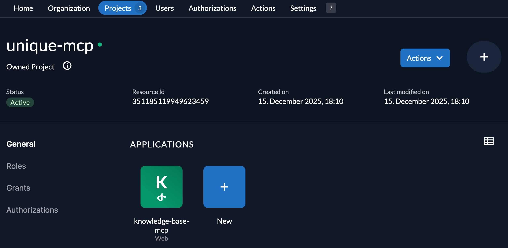
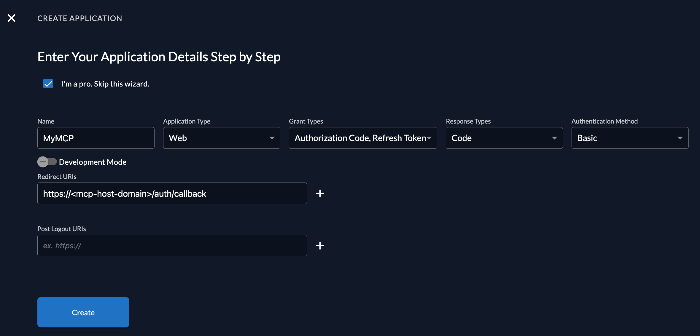
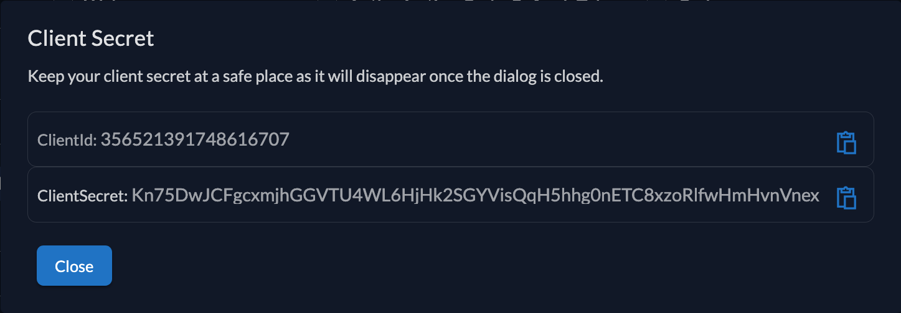
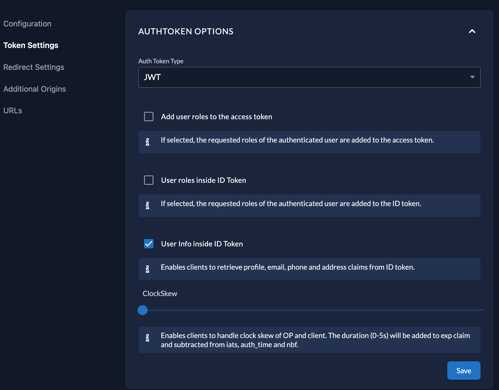

# Zitadel Auth Provider

This guide walks you through setting up Zitadel authentication for your MCP server.

## Prerequisites

Before you begin, ensure you have access to your Zitadel instance. The Zitadel application can be found under the `id` subdomain of your Unique platform domain.

**Example:**
- Platform domain: `https://unique.app`
- Zitadel URL: `https://id.unique.app`

Save this URL to your environment as `ZITADEL_BASE_URL` - it's required for the setup to work.

## Step 1: Create a New Application



1. Navigate to your Zitadel instance
2. Click the **+** button to add a new application

## Step 2: Configure Application Settings



In the **Pro Setup**, configure the following:

- Replace `<mcp-host-domain>` with the domain where your MCP server is reachable
- Add appropriate redirect URLs

**Development Setup:**

For local development, we recommend using [ngrok](https://ngrok.com/) to expose your MCP server:

1. Expose your local MCP server using ngrok
2. Add the ngrok URL as a redirect URL
3. Optionally, add `http://localhost:8003/auth/callback` for direct local access
   - **Note:** If using localhost redirects, you'll need to activate development mode

## Step 3: Save Client Credentials

> 💡 **Note:** Secrets for display only. Do not copy.



After creating the application, you'll see:

- **Client ID**
- **Client Secret**

Copy these values - you'll need them in the next step.

## Step 4: Configure Token Settings



In the **Auth Token** options:

1. Select **JWT** as the token type
2. Enable **Include user info in ID token**

This ensures the ID token contains the necessary user information for authentication.

## Step 5: Configure Environment Variables

Create a `zitadel.env` file (or add to your `.env` file) in your project root with the following variables:

```bash
ZITADEL_BASE_URL=https://id.unique.app
ZITADEL_CLIENT_ID=your_client_id_here
ZITADEL_CLIENT_SECRET=your_client_secret_here
```

**Note:** The code automatically looks for these variables in `zitadel.env` or `.env` files. All variables must be prefixed with `ZITADEL_`.

## Step 6: Integrate the Authentication Proxy

Add the Zitadel authentication proxy to your MCP server. You can use either the OIDC or OAuth proxy:

### Option A: OIDC Proxy (Recommended)

The OIDC proxy uses OpenID Connect discovery for automatic configuration:

```python
from fastmcp import FastMCP
from unique_mcp.auth.zitadel.oidc_proxy import create_zitadel_oidc_proxy

mcp = FastMCP()
mcp.auth = create_zitadel_oidc_proxy()
mcp.run()
```

### Option B: OAuth Proxy

Alternatively, use the OAuth proxy for more explicit endpoint configuration:

```python
from fastmcp import FastMCP
from unique_mcp.auth.zitadel.oauth_proxy import create_zitadel_oauth_proxy

mcp = FastMCP()
mcp.auth = create_zitadel_oauth_proxy()
mcp.run()
```

**Note:** By default, the MCP server runs on `http://localhost:8003`. You can customize this by passing `mcp_server_base_url` to the proxy creation function.

## Summary

After completing these steps, you should have:

- ✅ Zitadel application created and configured
- ✅ `ZITADEL_BASE_URL` set in your environment file
- ✅ `ZITADEL_CLIENT_ID` set in your environment file
- ✅ `ZITADEL_CLIENT_SECRET` set in your environment file
- ✅ Application configured with correct redirect URLs
- ✅ JWT token type selected with user info included in ID token
- ✅ Authentication proxy integrated into your MCP server

Your MCP server is now ready to authenticate requests using Zitadel!


