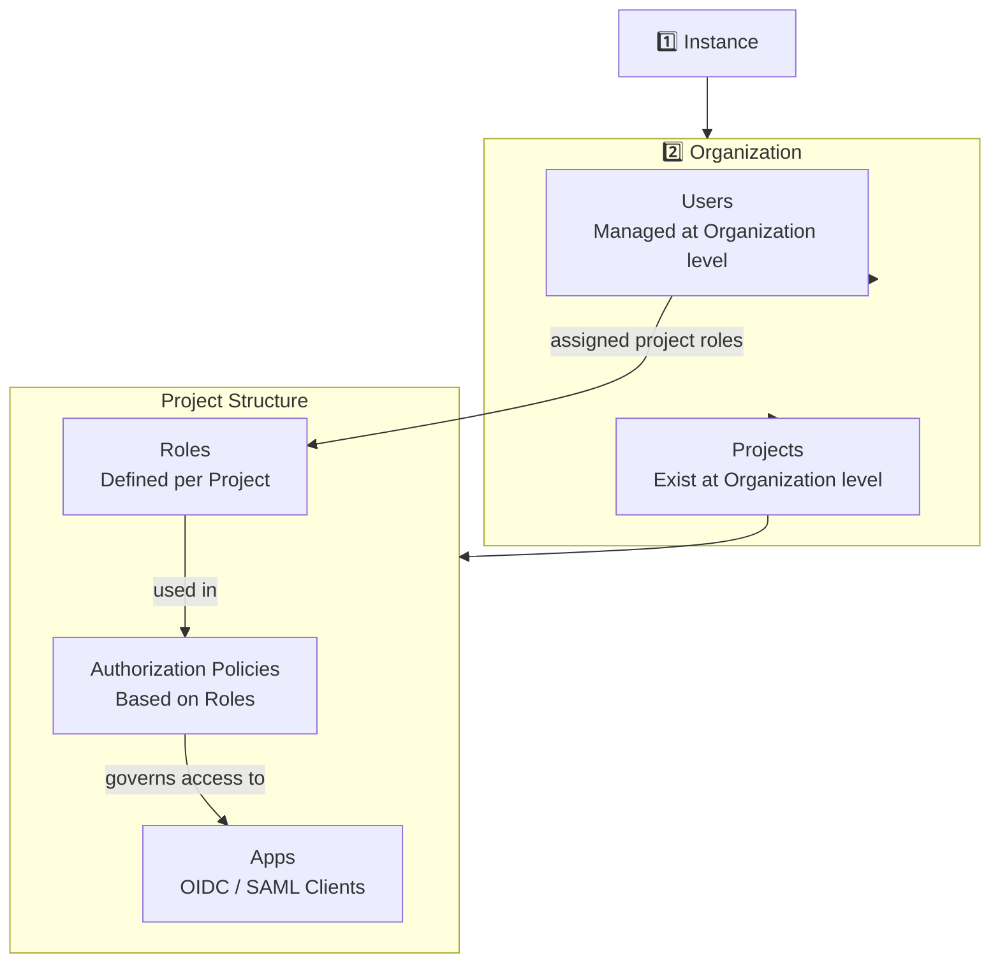

# Zitadel 


# Architecture of Zitadel



# Secrets per APP

The following secrets are required in a environement file calle `zitadel.env`

```
ZITADEL_URL=
UPSTREAM_CLIENT_ID=
UPSTREAM_CLIENT_SECRET=
```

after setting up an App they can be found


