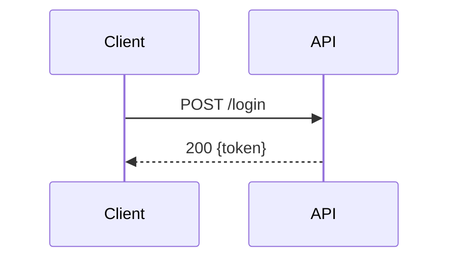

## What I do

I add new pages to an existing MkDocs + Entangled documentation site. I inspect the project's config and existing pages first, then produce a Markdown page with correct Entangled annotations, literate-programming prose, Mermaid diagrams where requested, and an updated `mkdocs.yaml`/`mkdocs.yml` nav entry.

## When to use me

- Document a module, algorithm, or feature
- Incorporate existing source code as annotated examples
- Add Mermaid diagrams to a page
- Register a new page in the site navigation

**Prerequisites**: `mkdocs.yaml`/`mkdocs.yml`, `docs/`, and `entangled.toml` must already exist.
Install: `pip install mkdocs-material mkdocs-entangled-plugin entangled-cli`

---

## Workflow

### 1 — Read (always first)

Read `mkdocs.yaml` or `mkdocs.yml` (check both; use whichever exists — keep the extension consistent):
- `docs_dir` (default: `docs`)
- Active `plugins:` and `markdown_extensions:` — don't add duplicates
- `nav:` structure — note existing sections and any `!include` / external URL entries
- Existing `file=` targets — avoid these paths in new blocks

Read 1–3 existing `docs/**/*.md` pages — note heading style, admonition usage, and established tangle output location (e.g. `docs/.python_files/`).

### 2 — Write

Produce a new `.md` in `docs/`. Structure every section as **prose that introduces intent, followed by a code block or diagram**. Never drop a bare block without context.

### 3 — Update nav

Insert the new page into `nav:` (see [Nav registration](#nav-registration)).

### 4 — Remind

**When `scripts/docs_build_versioned.sh` exists** (this repo), use it for clean, build, and serve:

```bash
# Clean, build, and serve local docs (from repo root)
./scripts/docs_build_versioned.sh --clean --serve

# Or step by step:
./scripts/docs_build_versioned.sh --clean    # clean _local_docs and build
./scripts/docs_build_versioned.sh --serve    # build (if needed) and serve at http://127.0.0.1:8000
```

Options: `--clean` (clean `_local_docs` before building), `--serve` (start server after build), `--port PORT` (default 8000). Run `./scripts/docs_build_versioned.sh --help` for full usage.

**When the script is not present** (single-project or other repos), end with:
```
entangled tangle   # extract source files
mkdocs serve       # preview at http://127.0.0.1:8000
```

---

## Entangled syntax

All fenced blocks **must** have `file=`, `#id`, or both.

| Form | Example |
|------|---------|
| File-targeting | ` ``` {.python file=docs/.python_files/mod.py} ` |
| Named block | ` ``` {.python #block-name} ` |
| Both | ` ``` {.python #main file=docs/.python_files/main.py} ` |
| Noweb reference | `<<block-name>>` inside any block |
| Append | Two blocks with the same `#id` are concatenated at tangle time |

**Default `file=` path**: `docs/.python_files/<name>.py` for Python, unless existing blocks show a different convention.

**Noweb example** (present concepts in narrative order, assemble in a final block):

````markdown
## Imports

The module needs `secrets` for token generation.

``` {.python #session-imports}
import secrets
```

## Session class

`Session` stores a user ID and a random token.

``` {.python #session-class}
class Session:
    def __init__(self, user_id: str):
        self.token = secrets.token_hex(32)
```

## Assembled module

``` {.python #session file=docs/.python_files/session.py}
<<session-imports>>
<<session-class>>
```
````

---

## Existing source files

1. **Read the file first** — never invent placeholder code.
2. Reproduce the real content in `file=`-targeting blocks.
3. For large files, split into named `#id` blocks (each with prose) and assemble via noweb.
4. If the target `file=` path is already claimed by another block, use named-block appending instead.

---

## Mermaid diagrams

Write diagrams as fenced `mermaid` blocks:

````markdown

````

**Plugin guard**: Check `mkdocs.yaml`/`mkdocs.yml` before adding a diagram:
- If `pymdownx.superfences` is absent → add the full config.
- If present but missing `custom_fences:` → add just the custom fence block.
- If already configured for Mermaid → do nothing.

Required YAML:
```yaml
markdown_extensions:
  - pymdownx.superfences:
      custom_fences:
        - name: mermaid
          class: mermaid
          format: !!python/name:pymdownx.superfences.fence_code_format
```

**Math**: If `pymdownx.arithmatex` is active, use `\(...\)` / `\[...\]`. Not `$...$`.

See `assets/mkdocs-baseline.yaml` for the full recommended extension set.

---

## Nav registration

1. Find the existing `nav:` section whose topic best matches the new page — insert there.
2. Create a new section only if none fits.
3. If no `nav:` block exists, create a minimal one listing existing pages plus the new one.

**Never modify**:
- `!include` monorepo entries: `'!include ./subproject/mkdocs.yaml'`
- External URL entries: `https://...`
- `mike`-versioning entries

---

## Behaviour rules

| Rule | Requirement |
|------|-------------|
| Read before write | Always read config + existing pages before generating output |
| Prose before code | Every code block must be preceded by explanatory prose |
| No bare blocks | Every block must have `file=` or `#id` |
| No conflicting `file=` | Don't target a path already claimed; use named-block appending instead |
| Default tangle location | Use `docs/.python_files/<name>.py` unless existing blocks show a different convention |
| Named blocks for complex assembly | Use `#id` + noweb when code is introduced out of narrative order or split across sections |
| Plugin guard | Only add plugins/extensions that are genuinely absent; never duplicate |
| Preserve nav | Never touch `!include`, external URL, or `mike` entries |
| Match existing style | Match heading capitalisation, admonition usage, and prose tone of existing pages |
| Math notation | If `arithmatex` is active, use `\(...\)` / `\[...\]`; not `$...$` |
| Real code only | Read actual source files; never invent placeholder code |
| Prefer docs script | When `scripts/docs_build_versioned.sh` exists, recommend it for clean / build / serve instead of raw `entangled tangle` + `mkdocs serve` |

---

## Error handling

| Condition | Action |
|-----------|--------|
| No `mkdocs.yaml` / `mkdocs.yml` found | Inform user, stop |
| No `docs/` directory | Ask for correct `docs_dir`, stop |
| Source file doesn't exist | Inform user, stop |
| `file=` path already targeted | Warn, use named-block appending |
| Project uses `mike` versioning | Don't add or modify version-related nav entries; insert only in the current config |
| No existing docs pages | Use Material defaults as style baseline |
