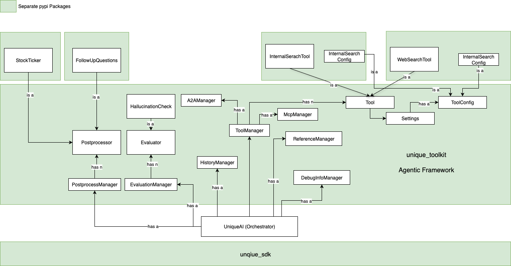

## 📘 Technical Documentation: UniqueAI Agentic Framework

This document provides a detailed overview of the **UniqueAI Agentic Framework**, its components, and their interactions. The framework is designed to enable developers to build dynamic, agentic workflows by leveraging modular components and tools. Below is a concise yet detailed explanation of the framework and its architecture.

Each of the components of the framework are documented and you can read in more detail how they are implemented and what their functions are. It contains code snippets so you can orientate yourself better in the code and understand what the different parts do.

**Overview diagram**

---

### **1. Overview of the Agentic Framework**
The **UniqueAI Agentic Framework** is built around an orchestrator that facilitates agentic workflows. It allows developers to dynamically manage user prompts, tools, and other functionalities to create reliable and efficient answering systems. The framework emphasizes modularity, enabling developers to integrate and replace components as needed.

The framework is built on the **Unique SDK** and includes the **Unique Toolkit**, a collection of modular packages available via PyPI. Developers are encouraged to create their own packages to extend the framework's capabilities.

---

### **2. Core Component: The Orchestrator**
The orchestrator is the central component of the framework. It manages the agentic loop, which processes user prompts and dynamically recruits tools and capabilities to generate accurate responses. Key functionalities include:

- **Agentic Loop**: Iteratively gathers information using tools until the orchestrator is confident in its response.
- **Tool Integration**: Supports tools like the `Internal Search Tool` and `Web Search Tool` to fetch relevant data.
- **Evaluation and Post-Processing**: Includes mechanisms to evaluate responses (e.g., hallucination checks) and apply post-processing (e.g., generating follow-up questions or appending stock ticker information).

---

### **3. Managers in the Framework**
The orchestrator relies on several managers to handle specific tasks. These managers ensure modularity and scalability:

#### **3.1 Tool Manager**
- Manages the integration and execution of tools.
- Supports multiple tools with configurations defined as **Pydantic classes**.
- Generates JSON schemas for tool configurations, enabling seamless front-end integration.
- Includes experimental support for:
  - **MCP Manager**: Handles MCP tools.
  - **Agent-to-Agent (A2A) Manager**: Facilitates communication between agents.

#### **3.2 History Manager**
- Collects and optimizes conversation history to fit within the token window of the LLM.
- Ensures the LLM has the necessary context for decision-making.

#### **3.3 Evaluation Manager**
- Evaluates generated responses for quality and accuracy.
- Example: **Hallucination Check** evaluates the likelihood of hallucinations in the response.

#### **3.4 Post-Processor Manager**
- Applies post-processing to responses.
- Examples:
  - **Follow-Up Questions**: Generates additional questions for clarification.
  - **Stock Ticker**: Appends stock-related information to responses.

#### **3.5 Reference Manager**
- Manages references produced by tools to ensure traceability and transparency.

#### **3.6 Debug Info Manager**
- Provides debug information to developers for troubleshooting and optimization.

---

### **4. Tools and Configurations**
The framework supports a variety of tools, each with its own configuration. These tools are modular and can be extended or replaced as needed.

#### **4.1 Internal Search Tool**
- Fetches information from internal knowledge bases.
- Configurations are defined as Pydantic classes and displayed in the front-end.

#### **4.2 Web Search Tool**
- Retrieves information from the web.
- Configurations follow the same schema as the Internal Search Tool.

#### **4.3 Tool Configuration**
- Each tool has a **ToolConfig** that defines its settings, such as:
  - Display name
  - Icon
  - Admin-defined parameters

---

### **5. Modular Design and Extensibility**
The framework is designed to be modular, with components packaged as separate PyPI modules. Developers can:
- Install pre-built packages like `Internal Search`, `Web Search`, `Stock Ticker`, and `Follow-Up Questions`.
- Create custom packages to extend the framework's functionality.
- Maintain logical separation between components for better maintainability.

---

### **6. Summary of Key Features**
- **Dynamic Orchestration**: Manages agentic workflows with a focus on modularity and flexibility.
- **Tool Integration**: Supports a wide range of tools with customizable configurations.
- **Evaluation and Post-Processing**: Ensures high-quality responses with evaluation and post-processing mechanisms.
- **Extensibility**: Encourages developers to build and integrate their own tools and packages.

---

This documentation provides a high-level understanding of the **UniqueAI Agentic Framework**. For further details, refer to the individual package documentation or the source code.