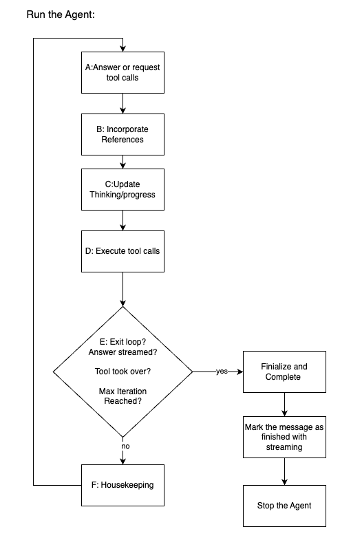
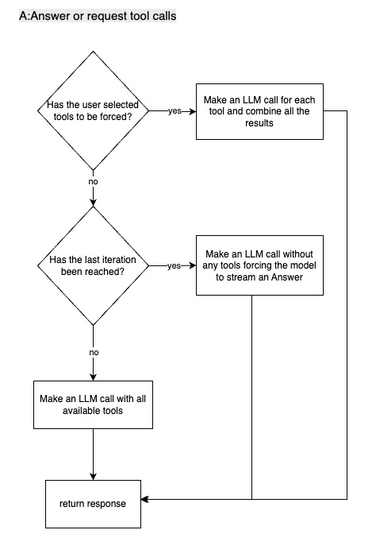
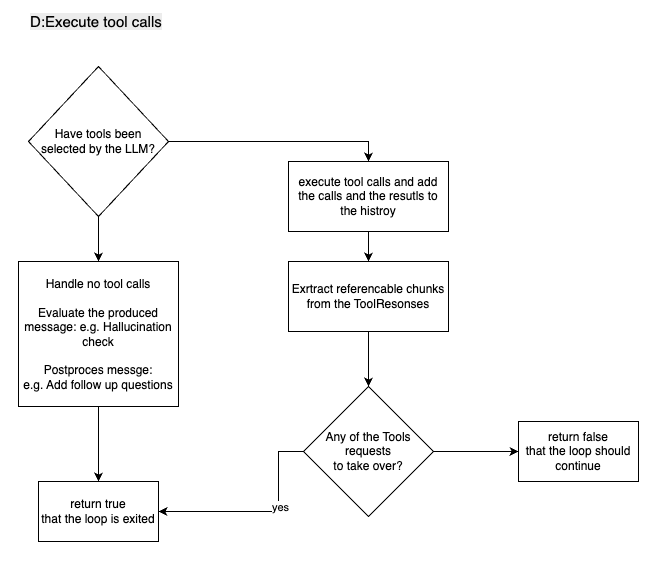

## 🧭 UniqueAI Orchestrator — Technical Documentation

This document explains the architecture and control flow of the UniqueAI agent orchestrator, including how it plans, executes, streams, and coordinates tools, references, thinking steps, evaluations, and post-processing. It includes full function code snippets for clarity and copy/paste.

---

## 📌 Summary

- UniqueAI is an iterative, tool-using AI agent orchestrator.
- It receives an incoming chat event and space-scoped configuration, and coordinates:
  - Planning (LLM call to decide to stream or call tools)
  - Tool execution (with history updates and reference extraction)
  - Streaming messages to the frontend
  - Evaluation and postprocessing on final messages
  - Thinking/Progress updates for user visibility
- The loop is bounded by `max_loop_iterations` and supports forced tool calls on the first iteration only.
- Prompts (system and user) are rendered via Jinja templates, enriched with tool metadata and MCP server instructions.

---

## 🧱 Construction & Dependencies

### Constructor

The orchestrator is initialized with:
- Event: contains the user message and streaming context
- Config: space-scoped config including model, prompts, and loop constraints
- Managers:
  - HistoryManager: builds LLM call history and appends tool calls/results
  - ToolManager: tool registry, forced tools, execution, and control handoff checks
  - ReferenceManager: collects referenceable chunks from LLM and tools
  - ThinkingManager: progress reporter for visible “thinking steps”
  - DebugInfoManager: aggregates debug metadata and tool traces
  - EvaluationManager: runs evaluations when a final message is produced (e.g. Hallucination check or other assessments)
  - PostprocessorManager: transforms LLM outputs (e.g., follow up questions, stock ticker information)
- Services:
  - ChatService: LLM interactions and streaming to frontend

Code:
```python

    def __init__(
          self,
        logger: Logger,
        event: ChatEvent,
        config: UniqueAIConfig,
        chat_service: ChatService,
        content_service: ContentService,
        debug_info_manager: DebugInfoManager,
        reference_manager: ReferenceManager,
        thinking_manager: ThinkingManager,
        tool_manager: ToolManager,
        history_manager: HistoryManager,
        evaluation_manager: EvaluationManager,
        postprocessor_manager: PostprocessorManager,
        mcp_servers: list[McpServer],
    ):
        self._logger = logger
        self._event = event
        self._config = config
        self._chat_service = chat_service
        self._content_service = content_service

        self._debug_info_manager = debug_info_manager
        self._reference_manager = reference_manager
        self._thinking_manager = thinking_manager
        self._tool_manager = tool_manager

        self._history_manager = history_manager

        self._evaluation_manager = evaluation_manager
        self._postprocessor_manager = postprocessor_manager
        self._latest_assistant_id: str = event.payload.assistant_message.id
        self._mcp_servers = mcp_servers
```

---


## 🔁 Main Control flow (run method) — Expanded, Readable Walkthrough 

The orchestrator runs a bounded, iterative loop that plans, executes, and streams results while coordinating tools, references, evaluations, and post-processing. Here’s a clearer, fuller picture of what happens in each phase.

### Initialization and kickoff
- Fresh session check: Before the loop begins, the agent asks the HistoryManager whether there are any “loop messages” already present. If this is a fresh interaction (no loop messages), it proactively updates the frontend with a short status message like “Starting agentic loop…”. This gives users immediate feedback that the system is alive and preparing to work.
- Context setup: Internally, the agent also sets bookkeeping values such as the current iteration index and any existing “start_text” used for progressive streaming (this may be used to guide how text appears or is removed from later outputs).

### Iterative planning and execution (repeat up to max_loop_iterations)
- Loop boundary: The agent enters a for-loop capped at config.agent.max_loop_iterations. This hard limit prevents runaway tool-use or infinite deliberation. Each iteration represents a plan-and-act cycle.

- Step A — Answer or request tool calls (_plan_or_execute):
  - Compose prompts and history: The agent uses `_compose_message_plan_execution()` to construct a clean message stack for the model call. This includes:
    - Original user query (verbatim)
    - A Jinja-rendered user prompt (enriched with tool metadata and MCP hints)
    - A Jinja-rendered system prompt (which includes tool descriptions, project settings, loop constraints, and any custom instructions)
    - Prior conversation and tool results assembled by the HistoryManager
  - Decide tool availability:
    - First iteration with forced tools: If ToolManager has “forced” tools (Tool the user explicitly said need to be executed) and we are at iteration 0, the agent calls the model once per forced toolChoice. It merges all tool calls and references across those calls into a single stream response. This ensures the model must use specific tools at least once.
    - Last iteration: If we’ve reached the final allowed iteration, the agent disables tools entirely and asks the model to produce a best-effort final answer. This guarantees termination with a user-facing result.
    - Default case: The model is allowed to decide whether to call tools or just stream an answer. Tools, references, debug info, and loop parameters are all provided so the model can choose wisely.

- Step B — Incorporate references
  - The agent pulls any references that the model produced (`loop_response.message.references`) and feeds them into the ReferenceManager. These references are the building blocks for citations or UI panels showing sources, tool outputs, or other supporting material.

- Step C — Update thinking/progress
  - The ThinkingManager receives the `loop_response` to update visible “thinking” or “progress” indicators. This can show users what the agent is doing (e.g., choosing tools, summarizing findings, or drafting an answer) and helps with transparency during longer operations.

- Step D — Process the plan (`_process_plan`):
  - Tool path:
    - If the model requested tool calls, `_handle_tool_calls()` is invoked:
      - Tool calls are appended to history so the full chain-of-thought (without revealing private reasoning) remains consistent for future model calls.
      - Tools can include MCP tools or A2A tools.
      - ToolManager executes the tools and returns structured results.
      - ReferenceManager extracts referenceable chunks from tool outputs. How to construct a `ToolResponse` that the references can be read is described in the documentation about the `ToolResponse`.
      - DebugInfoManager captures any useful traces or diagnostics. How to construct the `ToolResponse` to contain the debug information is described in the documentation about the `ToolResponse`.
      - HistoryManager records tool results so the next iteration can build on them.
      - Control handoff: If any tool signals that it “takes control” (e.g., a deep research agent that will stream independently), the method returns True to exit the base loop. The Orchestrator "hands off" the responsibility of the user interaction to the control taking tool. Otherwise, the loop continues to the next iteration.
  - No-tool path:
    - If no tools were requested, the model likely produced a user-facing response. The agent:
      - Runs evaluations selected by ToolManager to spot issues (e.g., Hallucination check).
      - Applies postprocessors (e.g., generation of follow up questions or displaying of stock information).
      - If any evaluation fails, a warning is logged. A future enhancement could inject corrective instructions and retry; for now, the loop cleanly exits after postprocessing a final answer.

- Step E — Exit the loop?
  - **If**: `_process_plan()` indicates we’re done. The following conditions lead to the exit of the loop:
      - A final answer has been streamed no more tool calls are requested.
      - A tool has been handed of the control of communicating with the user. Like the Deep research tool would or possibly another agent.
      - **Then**: The ThinkingManager is asked to close its visible steps
  - **Else**: Continue in the loop and go to Step F, there is still tools to be called.

- Step F - Housekeeping
  - Continue iteration: If we’re still in the loop (e.g., tools just ran)
  - Possibly create a new assistant message if appropriate: If thinking mode isn’t displayed and the model produced meaningful content (not just the start_text), the agent creates a new assistant message via ChatService. It captures the original text (not the progressively displayed version) in the HistoryManager and updates the latest assistant message ID if necessary. This ensures the UI shows coherent, incremental results without duplicating “thinking” scaffolding.


### On Loop exit: Finalization and completion
- Mark message as complete: Once the loop ends (for any reason), the agent signals completion to the frontend by calling modify_assistant_message_async with `set_completed_at=True`. This allows the UI to remove loading indicators and present the final state of the message. This is also the indication for other external processes like the Benchmarking to know when the Agent finished its work. This was designed to be non-blocking such that long running jobs of 10 or more minutes can be checked and polled by the external processes.
- Outcome: At this point, the conversation history contains user prompts, rendered system/user prompts, any tool calls and results, and the final assistant message. References and debug info are stored, and any evaluation/postprocessing steps have already been applied if we ended on a no-tools final message.

Why this design works well
- Predictable termination: `max_loop_iterations` plus last-iteration “no tools” ensures the user always gets an answer or a clear explanation.
- Transparent progress: ThinkingManager and streaming updates keep users informed during multi-step reasoning or tool use.
- High-quality outputs: Evaluations and postprocessors refine the final answer before completion.
- Extensible: Forced tools, tool control handoff, and template-driven prompts (with MCP integration) make it easy to add capabilities without changing the core loop.

**Flow diagram:**




Code:
```python
    # @track(name="loop_agent_run")  # Group traces together
    async def run(self):
        """
        Main loop of the agent. The agent will iterate through the loop, runs the plan and
        processes tool calls if any are returned.
        """
        self._logger.info("Start LoopAgent...")

        if self._history_manager.has_no_loop_messages():  # TODO: why do we even need to check its always no loop messages on this when its called.
            self._chat_service.modify_assistant_message(
                  content="Starting agentic loop..."  # TODO: this must be more informative
            )

        ## Loop iteration
        for i in range(self._config.agent.max_loop_iterations):
            self.current_iteration_index = i
            self._logger.info(f"Starting iteration {i + 1}...")

            # Plan execution
            loop_response = await self._plan_or_execute()
            self._logger.info("Done with _plan_or_execute")

            self._reference_manager.add_references(
                  loop_response.message.references
            )
            self._logger.info("Done with adding references")

            # Update tool progress reporter
            self._thinking_manager.update_tool_progress_reporter(loop_response)

            # Execute the plan
            exit_loop = await self._process_plan(loop_response)
            self._logger.info("Done with _process_plan")

            if exit_loop:
                self._thinking_manager.close_thinking_steps(loop_response)
                self._logger.info("Exiting loop.")
                break

            if i == self._config.agent.max_loop_iterations - 1:
                self._logger.error("Max iterations reached.")
                await self._chat_service.modify_assistant_message_async(
                      content="I have reached the maximum number of self-reflection iterations. Please clarify your request and try again...",
                )
                break

            self.start_text = self._thinking_manager.update_start_text(
                  self.start_text, loop_response
            )
            await self._create_new_assistant_message_if_loop_response_contains_content(
                  loop_response
            )

        await self._chat_service.modify_assistant_message_async(
              set_completed_at=True,
        )
```

Key behaviors:
- Forced tools is only be applied on the first iteration. Allowing the LLM to choose freely from the tools in the subsequent iterations.
- Last iteration forbids tool usage to force an answer.
- If a tool takes control (e.g., deep research), the base agent stops continuing the loop & sets the agent to complete for the frontend and other consumers to know that it is done.

---

## 🧠 Planning vs. Executing

### _plan_or_execute() Generate answer or request the tool calls:

Decides how to call the model:
- Builds messages via `_compose_message_plan_execution()` (which renders prompts and history). These are the instructions for the LLMs the context on which it will build it's next action. To either call tools to gather more information or to stream a message.
- Case 1: If forced tools exist and it’s the first iteration → call LLM once per `toolChoice`, merge tool calls and references across responses.
- Case 2: If it’s the last iteration → do not provide tools; force the model to answer.
- Case 3: Default → provide tools; let the model decide to call tools or stream content.

The method always returns a `LanguageModelStreamResponse` which can includes:
- `message.text` or/and
- `tool_calls`
 
This makes heavy use of the function `complete_with_references_async`, it is described in detail here LINK. 
In a nutshell it either streams a response from the llm or/and it returns the decision from the LLM that more tools need to be used, in oder for the LLM to answer
Should it stream it makes sure the references are automatically cited correctly and with proper linkage so it can be displayed to the user.

**Flow diagram:**
Detailed description of Step A from the Main Control flow:



Code:
```python
    # @track()
    async def _plan_or_execute(self) -> LanguageModelStreamResponse:
        self._logger.info("Planning or executing the loop.")
        messages = await self._compose_message_plan_execution()

        self._logger.info("Done composing message plan execution.")

        # Forces tool calls only in first iteration
        if (
              len(self._tool_manager.get_forced_tools()) > 0
            and self.current_iteration_index == 0
        ):
            self._logger.info("Its needs forced tool calls.")
            self._logger.info(
                  f"Forced tools: {self._tool_manager.get_forced_tools()}"
            )
            responses = [
                  await self._chat_service.complete_with_references_async(
                      messages=messages,
                    model_name=self._config.space.language_model.name,
                    tools=self._tool_manager.get_tool_definitions(),
                    content_chunks=self._reference_manager.get_chunks(),
                    start_text=self.start_text,
                    debug_info=self._debug_info_manager.get(),
                    temperature=self._config.agent.experimental.temperature,
                    other_options=self._config.agent.experimental.additional_llm_options
                    | {"toolChoice": opt},
                )
                for opt in self._tool_manager.get_forced_tools()
            ]

            # Merge responses and refs:
            tool_calls = []
            references = []
            for r in responses:
                if r.tool_calls:
                    tool_calls.extend(r.tool_calls)
                references.extend(r.message.references)

            stream_response = responses[0]
            stream_response.tool_calls = (
                  tool_calls if len(tool_calls) > 0 else None
            )
            stream_response.message.references = references
        elif (
              self.current_iteration_index
            == self._config.agent.max_loop_iterations - 1
        ):
            self._logger.info(
                  "we are in the last iteration we need to produce an answer now"
            )
            # No tool calls in last iteration
            stream_response = await self._chat_service.complete_with_references_async(
                  messages=messages,
                model_name=self._config.space.language_model.name,
                content_chunks=self._reference_manager.get_chunks(),
                start_text=self.start_text,
                debug_info=self._debug_info_manager.get(),
                temperature=self._config.agent.experimental.temperature,
                other_options=self._config.agent.experimental.additional_llm_options,
            )

        else:
            self._logger.info(
                  f"we are in the iteration {self.current_iteration_index} asking the model to tell if we should use tools or if it will just stream"
            )
            stream_response = await self._chat_service.complete_with_references_async(
                  messages=messages,
                model_name=self._config.space.language_model.name,
                tools=self._tool_manager.get_tool_definitions(),
                content_chunks=self._reference_manager.get_chunks(),
                start_text=self.start_text,
                debug_info=self._debug_info_manager.get(),
                temperature=self._config.agent.experimental.temperature,
                other_options=self._config.agent.experimental.additional_llm_options,
            )

        return stream_response
```

---

## 🧩 Plan Processing

### _process_plan()


- If tool calls are present → handle tools via `_handle_tool_calls()` and return whether a tool took control (if so, exit loop).
  - A tool can take control if its an agent itself and takes over the communication with the user e.g. the DeepResearch tool.
- If no tool calls → handle finalization via `_handle_no_tool_calls()` and exit the loop.

- If the model response is empty → warn the user and exit the loop. This case normally never happens in LLMs, it is more of a precaution.


**Flow diagram:**
Detailed description of Step D from the Main Control flow




Code:
```python
    async def _process_plan(
          self, loop_response: LanguageModelStreamResponse
    ) -> bool:
        self._logger.info(
              "Processing the plan, executing the tools and checking for loop exit conditions once all is done."
        )

        if loop_response.is_empty():
            self._logger.debug("Empty model response, exiting loop.")
            self._chat_service.modify_assistant_message(
                  content=EMPTY_MESSAGE_WARNING
            )
            return True

        call_tools = len(loop_response.tool_calls or []) > 0
        if call_tools:
            self._logger.debug(
                  "Tools were called we process them and do not exit the loop"
            )

            return await self._handle_tool_calls(loop_response)

        self._logger.debug("No tool calls. we might exit the loop")

        return await self._handle_no_tool_calls(loop_response)
```

## 🔧 Tool Handling

### _handle_tool_calls()

When the LLM returns tool calls:
1. Append tool calls to history
2. Execute tool calls via ToolManager
3. Extract referenceable chunks from tool results
4. Collect debug info from tools
5. Add tool results to history
6. Return whether a tool took control (to exit the loop if true)

When the model proposes tool calls, the orchestrator has to do more than merely “run them.”

Here’s the reasoning behind each step:

1. Append tool calls to history — before execution
The conversation history must reflect the model’s intent at the moment it decided to act. By writing the tool calls into the HistoryManager first, we preserve a verifiable chain of decision → action. This makes subsequent model calls reproducible: on the next iteration, the LLM sees exactly which tools it requested and in what order.
2. Execute tool calls via ToolManager
The ToolManager centralizes the parallel execution of the tools. Keeping execution behind a single interface reduces coupling in the orchestrator and ensures every tool adheres to a consistent contract.

3. Extract referenceable chunks from tool results
Tools can produce citable references as part of the `ToolCallResponse`. The ReferenceManager collects them to allow the citation by the model during the execution of `complete_with_references_async`. 
Multiple tools can produce citable references and all of them must be numbered correctly and brought into a standardized format for citation by the ReferenceManager.

4. Collect debug info from tools
Operational visibility matters. If a tool times out, returns a partial payload, or hits an API limit, the DebugInfoManager captures this without polluting the user-facing content. These traces are invaluable for developer diagnosis and for adaptive logic (e.g., future retries, fallbacks).
For easier debugging in production and richer telemetry without exposing noisy internals to end users.
5. Add tool results to history
Mich like in "Append tool calls to history" step the The model’s next reasoning step must be informed about the actual tool outputs (not just that a tool was called). 
6. Return whether a tool “takes control”
Some tools aren’t just data fetchers — they’re specialized agents (e.g., deep research, long-running pipelines) that assume full streaming and control. If ToolManager.does_a_tool_take_control() returns true, the orchestrator stops its loop to handoff control to the subagent.

This ordering preserves causal integrity (what was intended vs. what happened), equips the next iteration with usable evidence, and makes space for expert agents to take over when it’s appropriate.


Code:
```python
    async def _handle_tool_calls(
          self, loop_response: LanguageModelStreamResponse
    ) -> bool:
        """Handle the case where tool calls are returned."""
        self._logger.info("Processing tool calls")

        tool_calls = loop_response.tool_calls or []

        # Append function call to history
        self._history_manager._append_tool_calls_to_history(tool_calls)

        # Execute tool calls
        tool_call_responses = await self._tool_manager.execute_selected_tools(
              tool_calls
        )

        # Process results with error handling
        self._reference_manager.extract_referenceable_chunks(
              tool_call_responses
        )
        self._debug_info_manager.extract_tool_debug_info(tool_call_responses)
        self._history_manager.add_tool_call_results(tool_call_responses)

        return self._tool_manager.does_a_tool_take_control(tool_calls)
```

Notes:
- “Tool takes control” scenarios (e.g., deep research) stop the orchestrator’s loop and hand over streaming to the tool/agent.

---

## ✅ Finalization Path (No Tool Calls)

### _handle_no_tool_calls()

When the LLM produces a user-facing message (no more tools):
When the model finishes without requesting tools, we run a fast “quality gate + polish” step to finalize the answer.

1. Evaluations (quality gate)
To catch issues with the produced message and inform the user about these.
Typical checks is the hallucination detection.
The EvaluationManager runs the checklist from ToolManager against the loop_response and latest assistant message. If any fail, we log a warning (future: retry with corrective instructions).
2. Postprocessors
Add additional information on top of the Message generated by the orchestrator.
For example to add follow-up questions or attach stock ticker plots to the message


Code:
```python
    async def _handle_no_tool_calls(
          self, loop_response: LanguageModelStreamResponse
    ) -> bool:
        """Handle the case where no tool calls are returned."""
        selected_evaluation_names = (
              self._tool_manager.get_evaluation_check_list()
        )
        evaluation_results = await self._evaluation_manager.run_evaluations(
              selected_evaluation_names, loop_response, self._latest_assistant_id
        )

        await self._postprocessor_manager.run_postprocessors(loop_response)

        if not all(result.is_positive for result in evaluation_results):
            self._logger.warning(
                  "we should add here the retry counter add an instruction and retry the loop for now we just exit the loop"
            )  # TODO: add retry counter and instruction

        return True
```

---

## 🧱 History Construction

### _compose_message_plan_execution()

Builds the message list for the LLM call by:
- Rendering user and system prompts with Jinja
- Combining with original user message
- Delegating to HistoryManager to assemble a clean message stack for the LLM

Code:
```python
    async def _compose_message_plan_execution(self) -> LanguageModelMessages:
        original_user_message = self._event.payload.user_message.text
        rendered_user_message_string = await self._render_user_prompt()
        rendered_system_message_string = await self._render_system_prompt()

        messages = await self._history_manager.get_history_for_model_call(
              original_user_message,
            rendered_user_message_string,
            rendered_system_message_string,
            self._postprocessor_manager.remove_from_text,
        )
        return messages
```


### _render_system_prompt()

- Renders system prompt with:
  - Model info and date
  - Tools
    - Tool descriptions (full information of the tool so that the rendering in the system prompts can describe to the tools correctly)
    - used tools (information on what tools were executed this round to potentially add additional formatting information)
    - custom instructions (instructions comming from the Configuration in the Sapce Management to give the agent s certain spin)
  - Loop constraints (`max_tool_calls_per_iteration`, `max_loop_iterations`, `current_iteration`)
  - MCP server system prompts (some mcp server carry formatting information for now. this however will change and move into the tools.)

Code:
```python
    async def _render_system_prompt(
          self,
    ) -> str:
        # TODO: Collect tool information here and adapt to system prompt
        tool_descriptions = self._tool_manager.get_tool_prompts()

        used_tools = [m.name for m in self._tool_manager.get_tools()]

        system_prompt_template = jinja2.Template(
              self._config.agent.prompt_config.system_prompt_template
        )

        date_string = datetime.now().strftime("%A %B %d, %Y")

        mcp_server_system_prompts = [
              mcp_server.system_prompt for mcp_server in self._mcp_servers
        ]

        system_message = system_prompt_template.render(
              model_info=self._config.space.language_model.model_dump(
                  mode="json"
            ),
            date_string=date_string,
            tool_descriptions=tool_descriptions,
            used_tools=used_tools,
            project_name=self._config.space.project_name,
            custom_instructions=self._config.space.custom_instructions,
            max_tools_per_iteration=self._config.agent.experimental.loop_configuration.max_tool_calls_per_iteration,
            max_loop_iterations=self._config.agent.max_loop_iterations,
            current_iteration=self.current_iteration_index + 1,
            mcp_server_system_prompts=mcp_server_system_prompts,
        )
        return system_message
  ```

#### The *jinja* template for the System Prompt:


```markdown
{#- System Prompt Section -#}
# System 

You are Unique AI a system based on large language models created by UniqueAI

**Knowledge cutoff**: {{ model_info.info_cutoff_at | default('unknown') }}
**Current date**: {{ date_string }}

Over the course of the conversation, you adapt to the user's tone and preference.
Try to match the user's vibe, tone, and generally how they are speaking. You want the conversation to feel natural.
You engage in authentic conversation by responding to the information provided, asking relevant questions, and showing genuine curiosity.
If natural, continue the conversation with casual conversation.


# Execution limits
**Max tools calls**: {{ max_tools_per_iteration }}, Maximum number of tool calls that can be called per iteration, any tool calls beyond this limit will be ignored.

{# Tools Section -#}


# Tools
You can use the following tools to fullfill the tasks given by the user and to answer their questions. 
Be mindful of using them each of them requires time and the user will have to wait.


{#- The tool name and description should always be available -#}
## {{ tool_description.name }}
This tool is called {{ tool_description.display_name }} by the user.

{{ tool_description.tool_description}} 



### Tool-Specific Instructions
{{ tool_description.tool_system_prompt }}


{# Include formatting guidelines if result handling instructions are available and the tool is used -#}

### Formatting guidelines for output of {{ tool_description.name}}
{{ tool_description.tool_format_information_for_system_prompt }}




{# Answer Style Section #}
# Answer Style
### 1. Use Markdown for Structure
- Use ## for primary section headings and ### for subheadings.
- Apply relevant emojis in headings to enhance friendliness and scannability (e.g., ## 📌 Summary, ### 🚀 How It Works).
- Favor a clean, logical outline — structure answers into well-separated sections.

### 2. Text Styling
- Use **bold** for key concepts, actionable terms, and labels.
- Use *italics* for emphasis, definitions, side remarks, or nuance.
- Use `inline code` for technical terms, file paths (/mnt/data/file.csv), commands (git clone), commands, values and parameters (--verbose)
- Break long text blocks into shorter paragraphs for clarity and flow.

### 3. Lists & Step Sequences
- Use bullet lists - for unordered points.
- Use numbered lists 1., 2. when describing ordered procedures or sequences.
- Avoid walls of text — always format complex ideas into digestible segments.

### 4. Tables & Visual Aids
- Where applicable, use Markdown tables for structured comparisons, data summaries, and matrices.
- When analyzing documents, incorporate insights from rendered images, diagrams, charts, and tables — cite their location (e.g., "See chart on page 2").

### 5. Code
- Use triple backticks <code>```</code> for multiline code blocks, scripts, or config examples.
- Use single backticks ` for inline code or syntax references.

### 6. Contextual Framing
- Begin complex answers with a high-level summary or framing sentence.
- Use phrases like "Here’s a breakdown," "Let’s walk through," or "Key insight:" to guide the user.

### 7. Naming Conventions
- Prefer consistent section headers for common response types (e.g., Summary, Risks, Data, Steps).
- Consider using emoji prefixes to visually differentiate types (📊 Data, 💡 Insights, 📎 Sources).

### 8. Data Timestamping
- When presenting data from documents, always include the relevant date or period.
- Format examples: "As of Q1 2024", "Based on data from February 28, 2025"

### 9. Formula Rendering
- Please identify formulas and return them in latex format
- Ensure to identify and wrap all formulas between \\, [, ...formula... , \\, ]. Eg. `\\[E = mc^2\\]`

{#- MCP System Prompts Section #}


# MCP Server Instructions



{{ server_prompt }}



{#- Custom instructions #}

# SYSTEM INSTRUCTIONS CONTEXT
You are operating in the context of a wider project called {{ project_name | default('Unique AI') }}.
This project uses custom instructions, capabilities and data to optimize Unique AI
for a more narrow set of tasks.

Here are instructions from the user outlining how you should respond:

{{ custom_instructions }}

```


---

## 🧰 Prompt Rendering

### _render_user_prompt()

- Renders the user prompt template with:
  - `query` original user message
  - `tool_descriptions` tool with metadata
  - `used_tools` and tools that were used so that it can be derived what tools might need special formatting.
  - `mcp_server_user_prompts` some mcp server carry formatting information for now. this however will change and move into the tools.

Code:
```python
    async def _render_user_prompt(self) -> str:
        user_message_template = jinja2.Template(
              self._config.agent.prompt_config.user_message_prompt_template
        )

        tool_descriptions_with_user_prompts = [
              prompts.tool_user_prompt
            for prompts in self._tool_manager.get_tool_prompts()
        ]

        used_tools = [m.name for m in self._tool_manager.get_tools()]

        mcp_server_user_prompts = [
              mcp_server.user_prompt for mcp_server in self._mcp_servers
        ]

        tool_descriptions = self._tool_manager.get_tool_prompts()

        query = self._event.payload.user_message.text

        user_msg = user_message_template.render(
              query=query,
            tool_descriptions=tool_descriptions,
            used_tools=used_tools,
            mcp_server_user_prompts=list(mcp_server_user_prompts),
            tool_descriptions_with_user_prompts=tool_descriptions_with_user_prompts,
        )
        return user_msg
```

Here is the *jinja* template:
### The *jinja* template for the System Prompt:

```markdown

{# Comments for the user message template
    - This template is used to format the user message for the LLM
    - Variables available:
    - query: The original user query
    - model_info: Information about the language model being used
    - date_string: The current date in formatted string
    - mcp_server_user_prompts: List of unique server-wide user prompts from MCP servers
    - tool_descriptions_with_user_prompts: List of UniqueToolDescription objects with user prompts
#}{{ query }}



## MCP Server Context


{{ server_prompt }}



```


