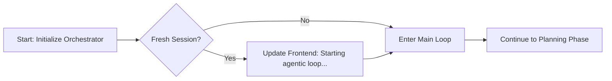
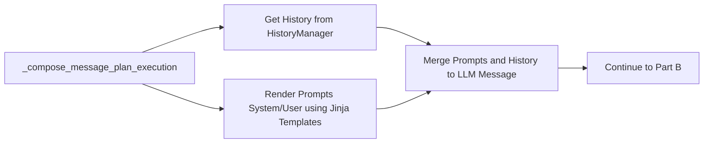
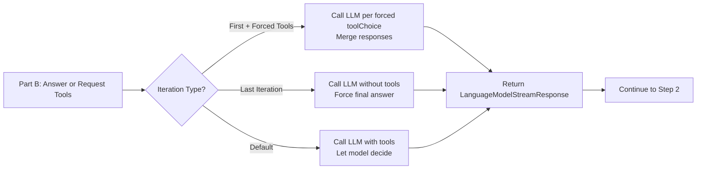
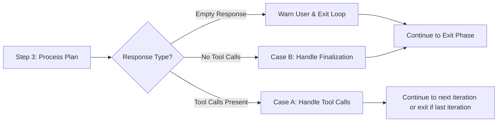
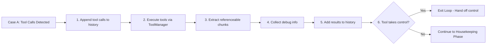
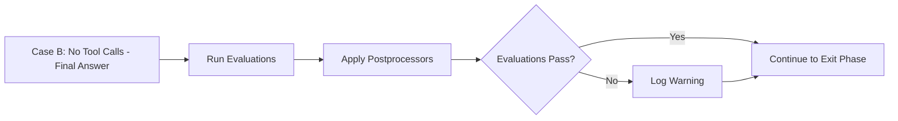
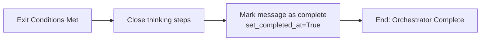

# 🧭 UniqueAI Orchestrator — Technical Documentation

This document explains the architecture and control flow of the UniqueAI agent orchestrator, including how it plans, executes, streams, and coordinates tools, references, thinking steps, evaluations, and post-processing. It includes full function code snippets for clarity and copy/paste.

---

# 📌 Summary

- UniqueAI is an iterative, tool-using AI agent orchestrator.
- It receives an incoming chat event and space-scoped configuration, and coordinates:
  - Planning (LLM call to decide to stream or call tools)
  - Tool execution (with history updates and reference extraction)
  - Streaming messages to the frontend
  - Evaluation and postprocessing on final messages
  - Thinking/Progress updates for user visibility
- The loop is bounded by `max_loop_iterations` and supports forced tool calls on the first iteration only.
- Prompts (system and user) are rendered via Jinja templates, enriched with tool metadata and MCP server instructions.

---

# 🧱 Construction & Dependencies

## Constructor

The orchestrator is initialized with:

- Event: contains the user message and streaming context
- Config: space-scoped config including model, prompts, and loop constraints
- Managers:
  - HistoryManager: builds LLM call history and appends tool calls/results
  - ToolManager: tool registry, forced tools, execution, and control handoff checks
  - ReferenceManager: collects referenceable chunks from LLM and tools
  - ThinkingManager: progress reporter for visible “thinking steps”
  - DebugInfoManager: aggregates debug metadata and tool traces
  - EvaluationManager: runs evaluations when a final message is produced (e.g. Hallucination check or other assessments)
  - PostprocessorManager: transforms LLM outputs (e.g., follow up questions, stock ticker information)
- Services:
  - ChatService: LLM interactions and streaming to frontend

Code:
```python

    def __init__(
          self,
        logger: Logger,
        event: ChatEvent,
        config: UniqueAIConfig,
        chat_service: ChatService,
        content_service: ContentService,
        debug_info_manager: DebugInfoManager,
        reference_manager: ReferenceManager,
        thinking_manager: ThinkingManager,
        tool_manager: ToolManager,
        history_manager: HistoryManager,
        evaluation_manager: EvaluationManager,
        postprocessor_manager: PostprocessorManager,
        mcp_servers: list[McpServer],
    ):
        self._logger = logger
        self._event = event
        self._config = config
        self._chat_service = chat_service
        self._content_service = content_service

        self._debug_info_manager = debug_info_manager
        self._reference_manager = reference_manager
        self._thinking_manager = thinking_manager
        self._tool_manager = tool_manager

        self._history_manager = history_manager

        self._evaluation_manager = evaluation_manager
        self._postprocessor_manager = postprocessor_manager
        self._latest_assistant_id: str = event.payload.assistant_message.id
        self._mcp_servers = mcp_servers
```

---


# 🔁 Main Control flow (run method) — Expanded, Readable Walkthrough 

The orchestrator runs a bounded, iterative loop that plans, executes, and streams results while coordinating tools, references, evaluations, and post-processing. Here’s a clearer, fuller picture of what happens in each phase.

## Initialization and kickoff
- Fresh session check: Before the loop begins, the agent asks the HistoryManager whether there are any “loop messages” already present. If this is a fresh interaction (no loop messages), it proactively updates the frontend with a short status message like “Starting agentic loop…”. This gives users immediate feedback that the system is alive and preparing to work.
- Context setup: Internally, the agent also sets bookkeeping values such as the current iteration index and any existing “start_text” used for progressive streaming (this may be used to guide how text appears or is removed from later outputs).


## Iterative planning and execution
Loop boundary: The agent escapes the for-loop capped at config.agent.max_loop_iterations. This hard limit prevents runaway tool-use or infinite deliberation. Each iteration represents a plan-and-act cycle.

### Step 1 — Compose Prompts Answer (_plan_or_execute):

#### Part A: Compose Prompts
Compose prompts and history: The agent uses `_compose_message_plan_execution()` to construct a clean message stack for the model call. This includes:

- Original user query (verbatim)
- A Jinja-rendered user prompt (enriched with tool metadata and MCP hints)
- A Jinja-rendered system prompt (which includes tool descriptions, project settings, loop constraints, and any custom instructions)
- Prior conversation and tool results assembled by the HistoryManager



#### Part B: Answer to User or request Tools
- First iteration with forced tools: If ToolManager has "forced" tools (Tool the user explicitly said need to be executed) and we are at iteration 0, the agent calls the model once per forced toolChoice. It merges all tool calls and references across those calls into a single stream response. This ensures the model must use specific tools at least once.
- Last iteration: If we've reached the final allowed iteration, the agent disables tools entirely and asks the model to produce a best-effort final answer. This guarantees termination with a user-facing result.
- Default case: The model is allowed to decide whether to call tools or just stream an answer. Tools, references, debug info, and loop parameters are all provided so the model can choose wisely.



### Step 2 — Incorporate References and Thinking Steps
- The agent pulls any references that the model produced (`loop_response.message.references`) and feeds them into the ReferenceManager. These references are the building blocks for citations or UI panels showing sources, tool outputs, or other supporting material.

- The ThinkingManager receives the `loop_response` to update visible "thinking" or "progress" indicators. This can show users what the agent is doing (e.g., choosing tools, summarizing findings, or drafting an answer) and helps with transparency during longer operations.

### Step 3 — Process the Plan (`_process_plan`):



#### Case A: Model requests Tool Calls:
If the model requested tool calls, `_handle_tool_calls()` is invoked:

- Tool calls are appended to history so the full chain-of-thought (without revealing private reasoning) remains consistent for future model calls.
- Tools can include MCP tools or A2A tools.
- ToolManager executes the tools and returns structured results.
- ReferenceManager extracts referenceable chunks from tool outputs. How to construct a `ToolResponse` that the references can be read is described in the documentation about the `ToolResponse`.
- DebugInfoManager captures any useful traces or diagnostics. How to construct the `ToolResponse` to contain the debug information is described in the documentation about the `ToolResponse`.
- HistoryManager records tool results so the next iteration can build on them.
- Control handoff: If any tool signals that it "takes control" (e.g., a deep research agent that will stream independently), the method returns True to exit the base loop. The Orchestrator "hands off" the responsibility of the user interaction to the control taking tool. Otherwise, the loop continues to the next iteration.



#### Case B: Model does not request Tool Calls
If no tools were requested, the model likely produced a user-facing response. 
The agent:

1. Runs evaluations selected by ToolManager to spot issues (e.g., Hallucination check).
2. Applies postprocessors (e.g., generation of follow up questions or displaying of stock information).

If any evaluation fails, a warning is logged. A future enhancement could inject corrective instructions and retry; for now, the loop cleanly exits after postprocessing a final answer.



### Step 4 — Exit the Loop or do we Continue?
The following conditions lead to an exit of the loop:

- A final answer has been streamed no more tool calls are requested.
- A tool has been handed of the control of communicating with the user. Like the Deep research tool would or possibly another agent.

#### Case A: `_process_plan()` indicates we’re done. 
1. The answer has already been streamed to the user
2. The ThinkingManager is asked to close its visible steps

#### Case B: Continue in the Loop
The requested tool calls have been executed and integrate into the history. The agent continues to step 6 and decides again to call tools or not.

**House Keeping**

1. Continue iteration: If we're still in the loop (e.g., tools just ran)
2. Given a model requests tool calls and a meaningful answer this can be displayed via the ThinkingManager. Alternatively, if the thinking manager is deactivate it could be appended to the last assistant message or added as another assistant message.

## On Loop Exit: Finalization and completion
- Mark message as complete: Once the loop ends (for any reason), the agent signals completion to the frontend by calling modify_assistant_message_async with `set_completed_at=True`. This allows the UI to remove loading indicators and present the final state of the message. This is also the indication for other external processes like the Benchmarking to know when the Agent finished its work. This was designed to be non-blocking such that long running jobs of 10 or more minutes can be checked and polled by the external processes.
- Outcome: At this point, the conversation history contains user prompts, rendered system/user prompts, any tool calls and results, and the final assistant message. References and debug info are stored, and any evaluation/postprocessing steps have already been applied if we ended on a no-tools final message.



Why this design works well:

- Predictable Termination: `max_loop_iterations` plus last-iteration “no tools” ensures the user always gets an answer or a clear explanation.
- Transparent Progress: ThinkingManager and streaming updates keep users informed during multi-step reasoning or tool use.
- High-:uality Outputs: Evaluations and postprocessors refine the final answer before completion.
- Extensible: Forced tools, tool control handoff, and template-driven prompts (with MCP integration) make it easy to add capabilities without changing the core loop.

Code:
```python
    # @track(name="loop_agent_run")  # Group traces together
    async def run(self):
        """
        Main loop of the agent. The agent will iterate through the loop, runs the plan and
        processes tool calls if any are returned.
        """
        self._logger.info("Start LoopAgent...")

        if self._history_manager.has_no_loop_messages():  # TODO: why do we even need to check its always no loop messages on this when its called.
            self._chat_service.modify_assistant_message(
                  content="Starting agentic loop..."  # TODO: this must be more informative
            )

        ## Loop iteration
        for i in range(self._config.agent.max_loop_iterations):
            self.current_iteration_index = i
            self._logger.info(f"Starting iteration {i + 1}...")

            # Plan execution
            loop_response = await self._plan_or_execute()
            self._logger.info("Done with _plan_or_execute")

            self._reference_manager.add_references(
                  loop_response.message.references
            )
            self._logger.info("Done with adding references")

            # Update tool progress reporter
            self._thinking_manager.update_tool_progress_reporter(loop_response)

            # Execute the plan
            exit_loop = await self._process_plan(loop_response)
            self._logger.info("Done with _process_plan")

            if exit_loop:
                self._thinking_manager.close_thinking_steps(loop_response)
                self._logger.info("Exiting loop.")
                break

            if i == self._config.agent.max_loop_iterations - 1:
                self._logger.error("Max iterations reached.")
                await self._chat_service.modify_assistant_message_async(
                      content="I have reached the maximum number of self-reflection iterations. Please clarify your request and try again...",
                )
                break

            self.start_text = self._thinking_manager.update_start_text(
                  self.start_text, loop_response
            )

        await self._chat_service.modify_assistant_message_async(
              set_completed_at=True,
        )
```

Key behaviors:

- Forced tools is only be applied on the first iteration. Allowing the LLM to choose freely from the tools in the subsequent iterations.
- Last iteration forbids tool usage to force an answer.
- If a tool takes control (e.g., deep research), the base agent stops continuing the loop & sets the agent to complete for the frontend and other consumers to know that it is done.


Further Details can be found here:

- [Planning vs Executing](./flow_details/planning_vs_executing.md)
- [History Construction and Prompt Creation](./flow_details/history_construction_and_prompts.md)
- [Plan Processing](./flow_details/plan_processing.md)
- [Tool Handling](./flow_details/tool_handling.md)
- [Finalization Path](./flow_details/finalization_path.md)
