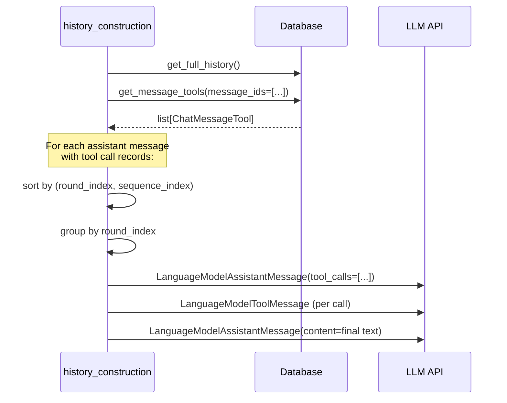

## 📘 Tool Call Persistence

The agentic framework can persist each tool call (and its response) to the database at the end of every turn. On the next turn the full tool-call history is reloaded and interleaved back into the LLM message sequence so the model keeps its context across turns.

---

### 🔑 Why persistence matters

Without persistence, the only thing stored in the database between turns is the final assistant text. When the user sends a follow-up message the orchestrator can reconstruct the user/assistant dialogue, but the intermediate tool calls that led to each answer are gone. Modern LLM APIs require that every `tool_calls` assistant message is immediately followed by matching `tool` messages. If those are missing, the API rejects the request.

Persistence solves this by saving all tool-call rounds after each turn, and by replaying them in the correct sequence when history is fetched on the next turn.

---

### 🗂️ Data model

Each individual tool call is stored as a `ChatMessageTool` record:

```python
from unique_toolkit.chat.schemas import ChatMessageTool, ChatMessageToolResponse

tool = ChatMessageTool(
    external_tool_call_id="call_abc123",  # ID as seen by the LLM
    function_name="internal_search",
    arguments={"query": "quarterly revenue"},
    round_index=0,         # which sequential round within the turn
    sequence_index=0,      # position within a parallel batch
    message_id="msg_xyz",  # parent assistant message in the DB
    response=ChatMessageToolResponse(content="[{...}]"),
)
```

Multiple parallel tool calls (same `round_index`, different `sequence_index`) are issued in a single LLM request. Sequential rounds have incrementing `round_index` values.

---

### 🛠️ Persisting tool calls after a turn

At the end of a turn the orchestrator:

1. Calls `HistoryManager.extract_message_tools()` to convert the in-memory loop history into a flat `list[ChatMessageTool]`.
2. Optionally calls `HistoryManager.compact_message_tools()` to drop uncited search results, keeping the persisted history lean.
3. Calls `ChatService.create_message_tools()` to write the records to the database.

```python
records = history_manager.extract_message_tools()
records = HistoryManager.compact_message_tools(records, assistant_text=final_answer)
chat_service.create_message_tools(
    message_id=assistant_message_id,
    tool_calls=records,
)
```

`compact_message_tools` scans the assistant text for `[sourceN]` citations and removes any source items in the tool responses that were not cited. Source numbers are **not** renumbered, so existing citations in the stored message stay valid.

---

### 🔄 Replaying history on subsequent turns

Use `get_full_history_with_contents_and_tool_calls` instead of `get_full_history_with_contents` when building the LLM message sequence:

```python
from unique_toolkit.agentic.history_manager.history_construction_with_contents import (
    get_full_history_with_contents_and_tool_calls,
)

messages = get_full_history_with_contents_and_tool_calls(
    user_message=event.payload.user_message,
    chat_id=event.payload.chat_id,
    chat_service=chat_service,
    content_service=content_service,
)
```

The function batch-loads all `ChatMessageTool` records for every assistant message in the chat history in a single call, then interleaves them in the correct order:



---

### ⚠️ Edge cases handled automatically

| Situation | Behaviour |
|---|---|
| A round has tool calls but none have a response | The entire round is skipped. Emitting an assistant tool-call message without matching tool messages causes LLM APIs to reject the request. |
| `external_tool_call_id` is an empty string | Pydantic's `randomize_id` validator replaces it with a UUID. The same UUID is used in both the assistant message and the matching tool message. |
| Backend call fails | A warning is logged and the history is returned without tool-call interleaving rather than raising. |
| `message_ids` is empty | `get_message_tools` returns `[]` immediately without a network call. |

---

### 🔗 Related components

- **`HistoryManager`** — see `history_manager.md` for `extract_message_tools` and `compact_message_tools`.
- **`ChatService`** — `create_message_tools` / `get_message_tools` write and read `ChatMessageTool` records.
- **`get_full_history_with_contents`** — the non-persistence variant, used when tool-call history replay is not needed.
