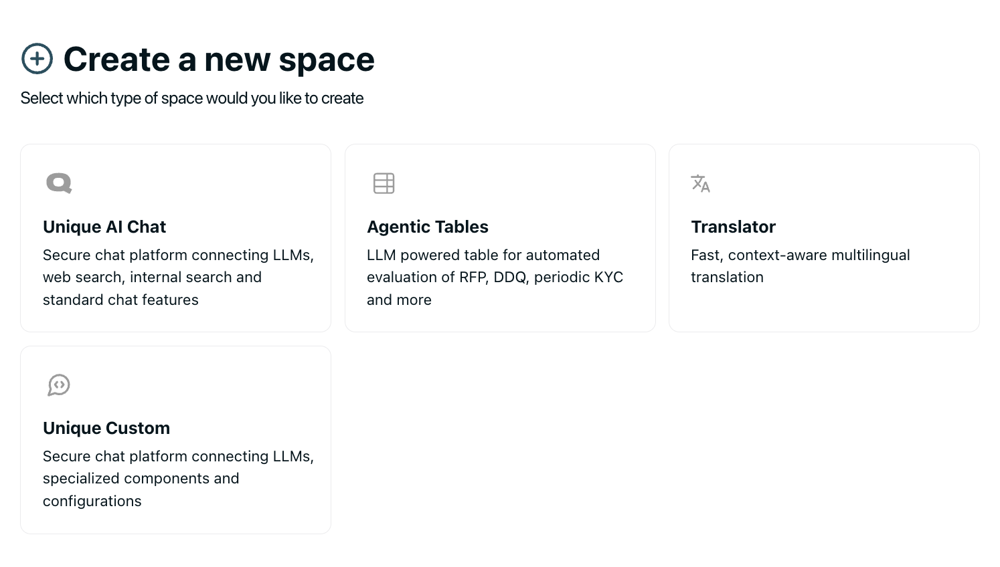

# Setting up a Development Application on the Platform

Whether SSE or Webhooks are used, an AI Module Template and a Space must be set up to send messages to the app.

### Module Templates

Modules Templates establish a base configuration and setup that can be further refined when setting up a space.
Most importantly they define the `reference in Code` that will be passed along with each event and can be used to filter events.

1. Click on  { height=20 } to create a new module using the { height=20 } this should open the following page.

2. Name the Module and give it a unique `Reference in Code`

3. Define a default configuration that can be refined in the space setup. This can be any JSON object that you want to pass to your application.

4. Define a default definition (this is a function/tool definition ) that must follow the [openai definitions](https://platform.openai.com/docs/guides/function-calling#defining-functions). This is only required for the case where a space hosts multiple modules at the same time.

### Space 

Spaces are shown as assistants and can host multiple modules

1. Click on  { height=50 } and click on the { height=50 }. This will lead you to the following page

2. Click on custom space and name your space

3. Select an AI module template in the following selection

4. Edit the configuration and definition

5. Publish the space in the top right corner and follow the `Go to Chat` link.

