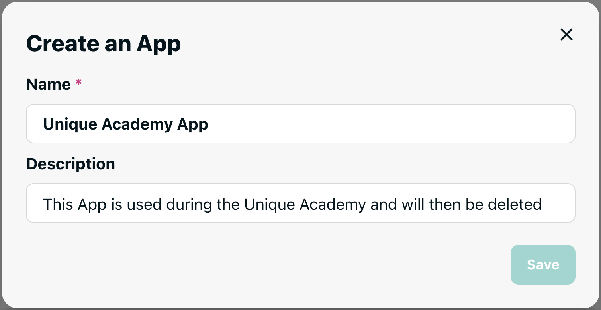

# Standalone App

A standalone application uses the capabilities of the Unique plattform but is not interacting with the users directly via any GUI.

## Examples

- Knowledgebase Management Pipeline
- Automatic Report Generation

# How to Register an Standalone App
Each application must be registered within the unique platform so it can authenticate using secrets. The required secrets are 

```env
UNIQUE_API_BASE_URL=            # The backend url of Unique's public API
UNIQUE_API_VERSION=             # The version Unique's public API

UNIQUE_APP_ID=                  # The app id as obtained in the App secion of Unique
UNIQUE_APP_KEY=                 # The app key as obtained in the App secion of Unique

UNIQUE_AUTH_COMPANY_ID=
UNIQUE_AUTH_USER_ID=
```

The values can be obtained via the `Personal API Key` during development and should be stored in a `unique.env` file at the root of your project. For production it is recommended to register the application as below.


### Go to the Apps Page 

1) On the sidebar click on the following symbol { width=50 } and click on the { width=150 } button to create a new app.

2) Enter a name and a description

{ height=100 } 

after saving you will see the following screen

 

3) Activate the App

In the header of the page you find the app id as well as an activation button


where the app can be activated and deactivated.


4) Create an API key for the App

After activation new section allows to create an api key for the app


once created the following pop up will show


with the generated key.


# Initializing Standalone Toolkit Services

Environment variables are loaded implicitely through the `UniqueSettings` that can be passed to the services as

<!--
```{.python #unique_setup_settings_sdk_from_env_standalone}
settings = UniqueSettings.from_env_auto_with_sdk_init()
```
-->

```{.python #unique_init_service_standalone}
kb_service = KnowledgeBaseService.from_settings(settings=settings)
```

if it is not passed it is automatically loaded such that the services can be initialized as

```{.python #unique_init_service_standalone_auto}
kb_service = KnowledgeBaseService.from_settings()
```

??? example "Full Examples (Click to expand)"
    
    <!--codeinclude-->
    [Standalone Init](../examples_from_docs/standalone_setup.py)
    [Auto Standalone Init](../examples_from_docs/standalone_setup_auto.py)
    <!--/codeinclude-->

<!--
```{.python file=docs/.python_files/standalone_setup.py}
<<common_imports>>
<<unique_setup_settings_sdk_from_env_standalone>>
<<unique_init_service_standalone>>
client = get_openai_client(unique_settings=settings)
```
-->


<!--
```{.python file=docs/.python_files/standalone_setup_auto.py}
<<common_imports>>
<<unique_init_service_standalone_auto>>
client = get_openai_client()
```
-->

