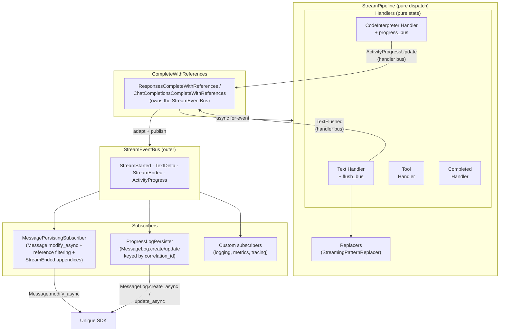

# Streaming Pipeline Architecture

> **Status:** Implemented (March 2026, event-bus refactor April 2026)
> **Package:** `unique_toolkit.framework_utilities.openai.streaming.pipeline`

The streaming pipeline transforms raw LLM token streams into two parallel outputs:

1. **Live platform updates** — UI shows incremental text via Unique SDK (delivered by event subscribers)
2. **Toolkit contract** — `LanguageModelStreamResponse` for downstream code

## Documents

| File | Focus |
|------|-------|
| [overview.md](./overview.md) | High-level design and data flow |
| [handler-protocols.md](./handler-protocols.md) | Protocol-based handler system |
| [pattern-replacer.md](./pattern-replacer.md) | Cross-chunk citation normalisation |
| [extensibility.md](./extensibility.md) | Adding new stream sources, handlers, and subscribers |
| [lifecycle.md](./lifecycle.md) | State management and concurrency |
| [review.md](./review.md) | Architecture review and recommendations |

## Quick Reference



**Key property:** handlers and pipelines contain *no* SDK calls and *no* knowledge of retrieved chunks. Handlers that need to surface per-event signals own a typed `TypedEventBus` (`flush_bus`, `progress_bus`), and the orchestrator subscribes once at construction to adapt each signal into an outer-bus `StreamEvent` with request context. All persistence side-effects live in subscribers on the outer bus.

## Module Layout

```
streaming/
├── pattern_replacer.py          # NORMALIZATION_PATTERNS, StreamingPatternReplacer
└── pipeline/
    ├── __init__.py              # Public API re-exports
    ├── events.py                # StreamStarted, TextDelta, StreamEnded, ActivityProgress, StreamEventBus
    ├── protocols/               # Handler protocols
    │   ├── common.py            # TextState, StreamHandlerProtocol, TextFlushed, ActivityProgressUpdate, AppendixProducer
    │   ├── responses.py         # Responses API protocols
    │   └── chat_completions.py  # Chat Completions protocols
    ├── subscribers/             # Default StreamEvent subscribers
    │   ├── message_persister.py      # MessagePersistingSubscriber (Message.modify_async)
    │   └── progress_log_persister.py # ProgressLogPersister (MessageLog create/update)
    ├── responses/               # OpenAI Responses API handlers (pure state machines)
    │   ├── stream_pipeline.py
    │   ├── complete_with_references.py
    │   ├── text_delta_handler.py
    │   ├── tool_call_handler.py
    │   ├── completed_handler.py
    │   └── code_interpreter_handler.py
    └── chat_completions/        # Chat Completions API handlers (pure state machines)
        ├── stream_pipeline.py
        ├── complete_with_references.py
        ├── text_handler.py
        └── tool_call_handler.py
```
