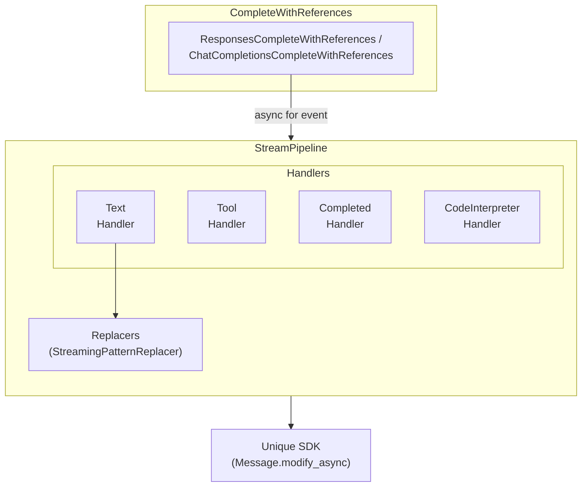

# Streaming Pipeline Architecture

> **Status:** Implemented (March 2026)  
> **Package:** `unique_toolkit.framework_utilities.openai.streaming.pipeline`

The streaming pipeline transforms raw LLM token streams into two parallel outputs:

1. **Live platform updates** — UI shows incremental text via Unique SDK
2. **Toolkit contract** — `LanguageModelStreamResponse` for downstream code

## Documents

| File | Focus |
|------|-------|
| [overview.md](./overview.md) | High-level design and data flow |
| [handler-protocols.md](./handler-protocols.md) | Protocol-based handler system |
| [pattern-replacer.md](./pattern-replacer.md) | Cross-chunk citation normalisation |
| [extensibility.md](./extensibility.md) | Adding new stream sources and handlers |
| [lifecycle.md](./lifecycle.md) | State management and concurrency |
| [review.md](./review.md) | Architecture review and recommendations |

## Quick Reference



## Module Layout

```
streaming/
├── pattern_replacer.py          # NORMALIZATION_PATTERNS, StreamingPatternReplacer
└── pipeline/
    ├── __init__.py              # Public API re-exports
    ├── protocols/               # Handler protocols
    │   ├── common.py            # TextState, StreamHandlerProtocol
    │   ├── responses.py         # Responses API protocols
    │   └── chat_completions.py  # Chat Completions protocols
    ├── responses/               # OpenAI Responses API handlers
    │   ├── stream_pipeline.py
    │   ├── complete_with_references.py
    │   ├── text_delta_handler.py
    │   ├── tool_call_handler.py
    │   ├── completed_handler.py
    │   └── code_interpreter_handler.py
    └── chat_completions/        # Chat Completions API handlers
        ├── stream_pipeline.py
        ├── complete_with_references.py
        ├── text_handler.py
        └── tool_call_handler.py
```
