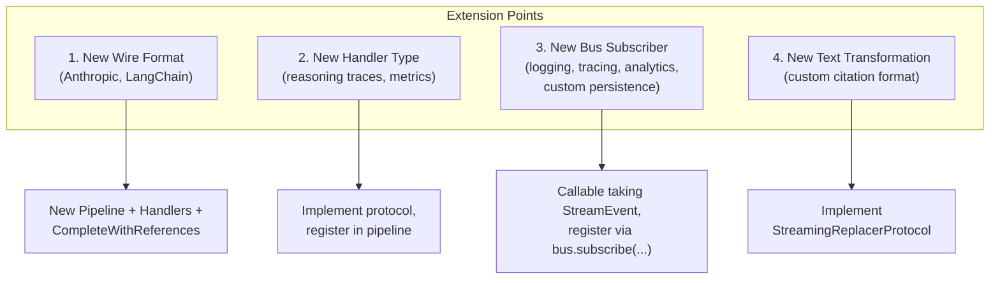

# Extensibility Guide

The pipeline architecture is designed for extension at multiple levels.

## Extension Points



## 1. Adding a New Wire Format

### Required Components

| Component | Purpose |
|-----------|---------|
| `FooPipeline` | Routes events to handlers; pure dispatch, no SDK |
| `FooCompleteWithReferences` | Entry point, owns async loop, owns a `StreamEventBus` |
| Handler implementations | Pure state machines processing specific event types |
| Protocol extensions (optional) | New handler contracts |

### Example: Adding Anthropic Streaming

```python
# protocols/anthropic.py
class AnthropicTextHandlerProtocol(Protocol):
    @property
    def flush_bus(self) -> TypedEventBus[TextFlushed]: ...

    async def on_content_block_delta(self, event: ContentBlockDeltaEvent) -> None: ...
    async def on_stream_end(self) -> None: ...
    def get_text(self) -> TextState: ...
    def reset(self) -> None: ...

# anthropic/stream_pipeline.py
class AnthropicStreamPipeline:
    def __init__(self, *, text_handler: AnthropicTextHandlerProtocol):
        self._text = text_handler

    @property
    def text_flush_bus(self) -> TypedEventBus[TextFlushed]:
        return self._text.flush_bus

    async def on_event(self, event: StreamEvent) -> None:
        if isinstance(event, ContentBlockDeltaEvent):
            await self._text.on_content_block_delta(event)

    async def on_stream_end(self) -> None:
        await self._text.on_stream_end()

    def get_text(self) -> TextState:
        return self._text.get_text()

    def reset(self) -> None:
        self._text.reset()

# anthropic/complete_with_references.py
class AnthropicCompleteWithReferences:
    def __init__(self, settings, *, pipeline, subscribers=None):
        self._bus = StreamEventBus()  # internal; subscribers are the injection point
        for handler in subscribers or [MessagePersistingSubscriber(settings).handle]:
            self._bus.subscribe(handler)
        self._pipeline = pipeline
        self._current_message_id: str | None = None
        self._current_chat_id: str | None = None
        self._pipeline.text_flush_bus.subscribe(self._on_text_flushed)

    async def _on_text_flushed(self, event: TextFlushed) -> None:
        if self._current_message_id is None:
            return
        await self._bus.publish_and_wait_async(
            TextDelta(
                message_id=self._current_message_id,
                chat_id=self._current_chat_id,
                full_text=event.full_text,
                original_text=event.original_text,
            )
        )

    async def complete_with_references_async(self, ...):
        self._pipeline.reset()
        self._current_message_id = message_id
        self._current_chat_id = chat_id
        await self._bus.publish_and_wait_async(StreamStarted(...))
        try:
            async for event in stream:
                await self._pipeline.on_event(event)
        finally:
            await self._pipeline.on_stream_end()
            await self._bus.publish_and_wait_async(StreamEnded(...))
            self._current_message_id = None
            self._current_chat_id = None
        return self._pipeline.build_result(...)
```

## 2. Adding a New Handler

### Steps

1. Define a protocol (if new event type)
2. Implement the handler class (keep it pure — no SDK calls)
3. If the handler produces per-event signals (text flushes, progress updates),
   own a `TypedEventBus[T]` and publish on it; expose the bus via a `@property`
   on the handler and re-expose it on the pipeline. The orchestrator subscribes
   once at construction and adapts the signal to an outer-bus event.
4. Add a slot to the pipeline constructor and route events in `on_event()`
5. Expose handler state via getters; collect in `build_result()`. For final
   single-shot contributions to the assistant message, implement
   `AppendixProducer` so the pipeline picks them up in `get_appendices()`.

### Example: Reasoning Trace Handler

```python
# In protocols/responses.py (extend existing)
class ResponsesReasoningHandlerProtocol(StreamHandlerProtocol, Protocol):
    async def on_reasoning_delta(self, event: ReasoningDeltaEvent) -> None: ...
    def get_reasoning(self) -> str: ...

# In responses/reasoning_handler.py
class ResponsesReasoningHandler:
    def __init__(self) -> None:
        self._reasoning = ""

    async def on_reasoning_delta(self, event: ReasoningDeltaEvent) -> None:
        self._reasoning += event.delta

    def get_reasoning(self) -> str:
        return self._reasoning

    async def on_stream_end(self) -> None:
        pass

    def reset(self) -> None:
        self._reasoning = ""

# In stream_pipeline.py - add to constructor and routing
class ResponsesStreamPipeline:
    def __init__(
        self,
        *,
        text_handler: ...,
        reasoning_handler: ResponsesReasoningHandlerProtocol | None = None,
    ):
        self._reasoning = reasoning_handler

    async def on_event(self, event):
        # ... existing routing ...
        if isinstance(event, ReasoningDeltaEvent) and self._reasoning:
            await self._reasoning.on_reasoning_delta(event)
            return False  # reasoning deltas don't move the assistant message text
```

## 3. Adding a New Bus Subscriber

Subscribers are any callable matching `Callable[[StreamEvent], Awaitable[None]]`. They react to
the domain events emitted by the orchestrator (`StreamStarted`, `TextDelta`, `StreamEnded`)
without touching handler or pipeline internals.

### Example: OpenTelemetry Tracing

```python
from opentelemetry import trace
from unique_toolkit.framework_utilities.openai.streaming.pipeline import (
    StreamEnded,
    StreamEvent,
    StreamStarted,
    TextDelta,
)

class TracingSubscriber:
    def __init__(self) -> None:
        self._tracer = trace.get_tracer(__name__)
        self._spans: dict[str, trace.Span] = {}

    async def handle(self, event: StreamEvent) -> None:
        if isinstance(event, StreamStarted):
            span = self._tracer.start_span(
                "llm.stream",
                attributes={"message_id": event.message_id, "chat_id": event.chat_id},
            )
            self._spans[event.message_id] = span
        elif isinstance(event, TextDelta):
            span = self._spans.get(event.message_id)
            if span:
                span.add_event("text_delta", attributes={"chars": len(event.full_text)})
        elif isinstance(event, StreamEnded):
            span = self._spans.pop(event.message_id, None)
            if span:
                span.set_attribute("final_length", len(event.full_text))
                span.end()

# Wire it up
orchestrator = ChatCompletionsCompleteWithReferences(settings, pipeline=pipeline)
orchestrator.bus.subscribe(TracingSubscriber().handle)
```

### Example: Replacing the Default Persister

If you need to customise persistence (e.g. write to a custom backend), inject your own
subscriber list — when `subscribers=` is provided the orchestrator does **not**
auto-register the default persister:

```python
orchestrator = ChatCompletionsCompleteWithReferences(
    settings,
    pipeline=pipeline,
    subscribers=[MyCustomPersister().handle],  # instead of MessagePersistingSubscriber
)
```

## 4. Adding a Custom Replacer

```python
class ProfanityFilter:
    """Replace profanity with asterisks during streaming."""

    def __init__(self, words: list[str]) -> None:
        self._pattern = re.compile("|".join(re.escape(w) for w in words), re.I)
        self._buffer = ""
        self._max_word = max(len(w) for w in words)

    def process(self, delta: str) -> str:
        self._buffer += delta
        self._buffer = self._pattern.sub(lambda m: "*" * len(m.group()), self._buffer)
        safe_end = max(0, len(self._buffer) - self._max_word)
        released = self._buffer[:safe_end]
        self._buffer = self._buffer[safe_end:]
        return released

    def flush(self) -> str:
        result = self._pattern.sub(lambda m: "*" * len(m.group()), self._buffer)
        self._buffer = ""
        return result
```

## 5. Dependency Injection Points

| Component | Injectable |
|-----------|------------|
| Text handlers | `replacers`, `send_every_n_events` (Chat Completions) |
| Other handlers | `settings` only where absolutely required (e.g. `CodeInterpreterHandler`) |
| Pipelines | handler slots |
| `CompleteWithReferences` | `pipeline`, `client`, `additional_headers`, `bus` |

### Example: Custom OpenAI Client

```python
from openai import AsyncOpenAI

custom_client = AsyncOpenAI(
    api_key="...",
    base_url="https://my-proxy.example.com",
)

handler = ResponsesCompleteWithReferences(
    settings=settings,
    pipeline=pipeline,
    client=custom_client,
)
```

## Design Principles

1. **Closed for modification, open for extension** — new features via new handlers *or* new subscribers, not changes to existing ones
2. **Handlers stay pure** — side-effects (SDK, telemetry, analytics) live in bus subscribers
3. **Protocol-based contracts** — no forced inheritance
4. **Constructor injection** — dependencies are explicit; `bus=` lets callers override default persistence
5. **Unknown events are ignored** — forward compatible with new SDK versions
