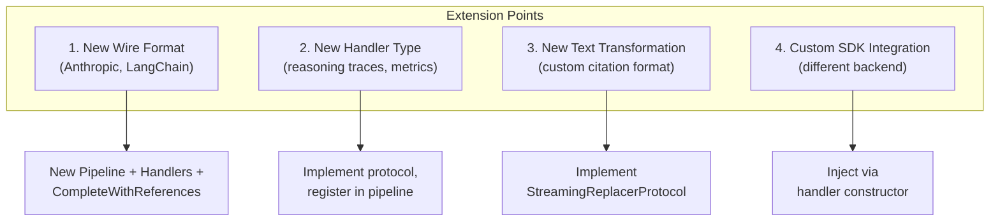

# Extensibility Guide

The pipeline architecture is designed for extension at multiple levels.

## Extension Points



## 1. Adding a New Wire Format

### Required Components

| Component | Purpose |
|-----------|---------|
| `FooPipeline` | Routes events to handlers |
| `FooCompleteWithReferences` | Entry point, owns async loop |
| Handler implementations | Process specific event types |
| Protocol extensions (optional) | New handler contracts |

### Example: Adding Anthropic Streaming

```python
# protocols/anthropic.py
class AnthropicTextHandlerProtocol(StreamHandlerProtocol, Protocol):
    async def on_content_block_delta(self, event: ContentBlockDeltaEvent) -> None: ...
    def get_text(self) -> TextState: ...

# anthropic/stream_pipeline.py
class AnthropicStreamPipeline:
    def __init__(self, *, text_handler: AnthropicTextHandlerProtocol):
        self._text = text_handler

    async def on_event(self, event: StreamEvent) -> None:
        if isinstance(event, ContentBlockDeltaEvent):
            await self._text.on_content_block_delta(event)
        # ... other event types

# anthropic/complete_with_references.py
class AnthropicCompleteWithReferences:
    async def complete_with_references_async(self, ...):
        self._pipeline.reset()
        try:
            async for event in stream:
                await self._pipeline.on_event(event)
        finally:
            await self._pipeline.on_stream_end()
        return self._pipeline.build_result(...)
```

## 2. Adding a New Handler

### Steps

1. Define protocol (if new event type)
2. Implement handler class
3. Add slot to pipeline constructor
4. Route events in `on_event()`
5. Collect results in `build_result()`

### Example: Reasoning Trace Handler

```python
# In protocols/responses.py (extend existing)
class ResponsesReasoningHandlerProtocol(StreamHandlerProtocol, Protocol):
    async def on_reasoning_delta(self, event: ReasoningDeltaEvent) -> None: ...
    def get_reasoning(self) -> str: ...

# In responses/reasoning_handler.py
class ResponsesReasoningHandler:
    def __init__(self) -> None:
        self._reasoning = ""

    async def on_reasoning_delta(self, event: ReasoningDeltaEvent) -> None:
        self._reasoning += event.delta

    def get_reasoning(self) -> str:
        return self._reasoning

    async def on_stream_end(self) -> None:
        pass

    def reset(self) -> None:
        self._reasoning = ""

# In stream_pipeline.py - add to constructor and routing
class ResponsesStreamPipeline:
    def __init__(
        self,
        *,
        text_handler: ...,
        reasoning_handler: ResponsesReasoningHandlerProtocol | None = None,
    ):
        self._reasoning = reasoning_handler

    async def on_event(self, event):
        # ... existing routing ...
        if isinstance(event, ReasoningDeltaEvent) and self._reasoning:
            await self._reasoning.on_reasoning_delta(event)
```

## 3. Adding a Custom Replacer

```python
class ProfanityFilter:
    """Replace profanity with asterisks during streaming."""

    def __init__(self, words: list[str]) -> None:
        self._pattern = re.compile("|".join(re.escape(w) for w in words), re.I)
        self._buffer = ""
        self._max_word = max(len(w) for w in words)

    def process(self, delta: str) -> str:
        self._buffer += delta
        self._buffer = self._pattern.sub(lambda m: "*" * len(m.group()), self._buffer)
        safe_end = max(0, len(self._buffer) - self._max_word)
        released = self._buffer[:safe_end]
        self._buffer = self._buffer[safe_end:]
        return released

    def flush(self) -> str:
        result = self._pattern.sub(lambda m: "*" * len(m.group()), self._buffer)
        self._buffer = ""
        return result
```

## 4. Dependency Injection Points

Handlers accept dependencies via constructor:

| Handler | Injectable |
|---------|------------|
| Text handlers | `settings`, `replacers` |
| CompleteWithReferences | `pipeline`, `client`, `additional_headers` |
| CodeInterpreter handler | `settings` |

### Example: Custom OpenAI Client

```python
from openai import AsyncOpenAI

custom_client = AsyncOpenAI(
    api_key="...",
    base_url="https://my-proxy.example.com",
)

handler = ResponsesCompleteWithReferences(
    settings=settings,
    pipeline=pipeline,
    client=custom_client,  # Injected
)
```

## Design Principles

1. **Closed for modification, open for extension** — new features via new handlers, not changes to existing ones
2. **Protocol-based contracts** — no forced inheritance
3. **Constructor injection** — dependencies are explicit
4. **Unknown events are ignored** — forward compatible with new SDK versions
