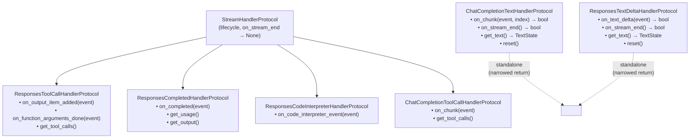

# Handler Protocols

Handlers are pluggable components that process specific event types. The system uses **structural typing** (Python Protocols) rather than inheritance.

Handlers are **pure state machines**: they accumulate state only. They do not call the Unique SDK, they do not see retrieved chunks, and they do not publish events themselves. Side-effects live in [subscribers](./overview.md#subscribers) on the `StreamEventBus`.

## Base Protocol

Most handlers implement the shared lifecycle protocol:

```python
class StreamHandlerProtocol(Protocol):
    async def on_stream_end(self) -> None:
        """Finalize after the stream ends (flush buffers, release resources)."""
        ...

    def reset(self) -> None:
        """Clear all per-run state for reuse."""
        ...
```

Text handlers **narrow `on_stream_end`** to return `bool` (see below) so the orchestrator can observe a residual flush from replacer buffers before publishing `StreamEnded`.

## Protocol Hierarchy



Text handler protocols do not inherit from `StreamHandlerProtocol` so their `on_stream_end` return type can be narrowed from `None` to `bool` without a variance conflict.

## TextState

Shared data structure for text handlers:

```python
@dataclass
class TextState:
    full_text: str      # Normalised (replacers applied)
    original_text: str  # Raw model output
```

## Flush Signalling (text handlers)

Text handlers return `bool` from their event methods:

| Method | Return | Meaning |
|--------|--------|---------|
| `on_chunk` / `on_text_delta` | `True` | Observable text was produced *and* a flush boundary was crossed — the orchestrator should publish `TextDelta`. |
| `on_chunk` / `on_text_delta` | `False` | No observable text yet (empty delta, throttled, buffered in a replacer). |
| `on_stream_end` | `True` | Replacer buffers produced residual text — orchestrator should publish one more `TextDelta` before `StreamEnded`. |
| `on_stream_end` | `False` | No residual text. |

Throttling strategy is handler-local:

- `ChatCompletionTextHandler` flushes every `send_every_n_events` content-carrying chunks.
- `ResponsesTextDeltaHandler` flushes on every non-empty delta (Responses streams are already pre-chunked by the provider).

## Why Protocols?

1. **No forced inheritance** — any class with the right methods works
2. **Easy testing** — create minimal fakes without complex base classes
3. **Clear contracts** — IDE shows exactly what methods are required
4. **Composition over inheritance** — handlers can have any internal structure

## Adding a Custom Handler

Side-effect-free handlers (the preferred shape — anything SDK-related belongs in a subscriber) look like this:

```python
from unique_toolkit.framework_utilities.openai.streaming.pipeline.protocols import (
    StreamHandlerProtocol,
)

class MyCustomHandler:
    def __init__(self) -> None:
        self._data: list[str] = []

    async def on_my_event(self, event: MyEventType) -> None:
        self._data.append(event.content)

    async def on_stream_end(self) -> None:
        pass  # or finalize in-memory state

    def reset(self) -> None:
        self._data = []

    def get_data(self) -> list[str]:
        return list(self._data)
```

If your handler needs to trigger side-effects, have it surface state via a getter and
[add a subscriber](./extensibility.md#3-adding-a-new-bus-subscriber) on the orchestrator's bus
instead of calling the SDK from inside the handler.
