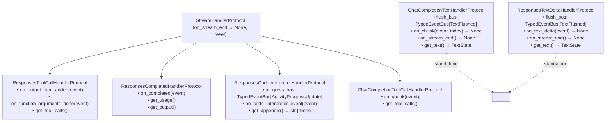

# Handler Protocols

Handlers are pluggable components that process specific event types. The system uses **structural typing** (Python Protocols) rather than inheritance.

Handlers are **pure state machines**: they accumulate state only. They do not call the Unique SDK and they do not see retrieved chunks. Handlers that produce per-event signals (text flushes, tool-activity progress) own a `TypedEventBus[T]` and publish typed payloads on it; the orchestrator subscribes at construction and adapts those payloads to outer-bus events (e.g. `TextFlushed` → `TextDelta`). Side-effects live in [subscribers](./overview.md#subscribers) on the `StreamEventBus`.

## Base Protocol

All handlers implement the shared lifecycle protocol:

```python
class StreamHandlerProtocol(Protocol):
    async def on_stream_end(self) -> None:
        """Finalize after the stream ends (flush buffers, release resources)."""
        ...

    def reset(self) -> None:
        """Clear all per-run state for reuse."""
        ...
```

All `on_event` / `on_chunk` / `on_text_delta` / `on_stream_end` methods return `None`. Text handlers publish a `TextFlushed` on their `flush_bus` at every flush boundary (including any residual flush in `on_stream_end`); the code interpreter handler publishes `ActivityProgressUpdate` on its `progress_bus` per state transition.

## Protocol Hierarchy



Text handler protocols stand alone (no `StreamHandlerProtocol` inheritance) because their event methods carry `index` or an SDK-specific delta type that doesn't fit the base shape; all still expose `reset()` and `on_stream_end()` via duck-typing.

## TextState

Shared data structure for text handlers:

```python
@dataclass
class TextState:
    full_text: str      # Normalised (replacers applied)
    original_text: str  # Raw model output
```

## Flush Signalling (text handlers)

Text handlers publish `TextFlushed` on their `flush_bus` at every flush boundary — no bool return values. The orchestrator subscribes once at construction and lifts each flush to a `TextDelta` outer-bus event.

```python
@dataclass(frozen=True, slots=True)
class TextFlushed:
    full_text: str
    original_text: str
    chunk_index: int | None = None
```

| Source | Published when | Carries |
|--------|---------------|---------|
| `on_chunk` / `on_text_delta` (mid-stream) | Delta carried content *and* a flush boundary was crossed (throttling / replacer release) | Current `TextState` snapshot + `chunk_index` |
| `on_stream_end` (residual) | Replacer buffers released trailing characters at end-of-stream | Final `TextState` snapshot |

Throttling strategy is handler-local:

- `ChatCompletionTextHandler` flushes every `send_every_n_events` content-carrying chunks.
- `ResponsesTextDeltaHandler` flushes on every non-empty delta (Responses streams are already pre-chunked by the provider).

## Progress Signalling (code interpreter handler)

`ResponsesCodeInterpreterHandler` publishes `ActivityProgressUpdate` on its `progress_bus` for every genuine state transition (deduplicated by a per-`item_id` `(status, text)` fingerprint). The orchestrator subscribes once at construction and lifts each update to an `ActivityProgress` outer-bus event by attaching `message_id` / `chat_id`. Future progress-producing handlers need only expose the same shape.

```python
@dataclass(frozen=True, slots=True)
class ActivityProgressUpdate:
    correlation_id: str
    status: ActivityStatus  # "RUNNING" | "COMPLETED" | "FAILED"
    text: str
    order: int = 0
```

## Why Protocols?

1. **No forced inheritance** — any class with the right methods works
2. **Easy testing** — create minimal fakes without complex base classes
3. **Clear contracts** — IDE shows exactly what methods are required
4. **Composition over inheritance** — handlers can have any internal structure

## Adding a Custom Handler

Side-effect-free handlers (the preferred shape — anything SDK-related belongs in a subscriber) look like this:

```python
from unique_toolkit.framework_utilities.openai.streaming.pipeline.protocols import (
    StreamHandlerProtocol,
)

class MyCustomHandler:
    def __init__(self) -> None:
        self._data: list[str] = []

    async def on_my_event(self, event: MyEventType) -> None:
        self._data.append(event.content)

    async def on_stream_end(self) -> None:
        pass  # or finalize in-memory state

    def reset(self) -> None:
        self._data = []

    def get_data(self) -> list[str]:
        return list(self._data)
```

If your handler needs to trigger side-effects, have it surface state via a getter and
[add a subscriber](./extensibility.md#3-adding-a-new-bus-subscriber) on the orchestrator's bus
instead of calling the SDK from inside the handler.
