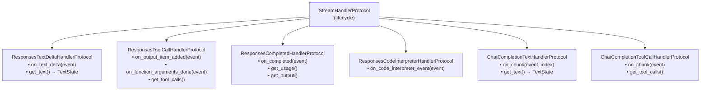

# Handler Protocols

Handlers are pluggable components that process specific event types. The system uses **structural typing** (Python Protocols) rather than inheritance.

## Base Protocol

Every handler implements the lifecycle protocol:

```python
class StreamHandlerProtocol(Protocol):
    async def on_stream_end(self) -> None:
        """Finalize after stream ends (flush buffers, final SDK calls)."""
        ...

    def reset(self) -> None:
        """Clear all per-run state for reuse."""
        ...
```

## Protocol Hierarchy



## TextState

Shared data structure for text handlers:

```python
@dataclass
class TextState:
    full_text: str      # Normalised (replacers applied)
    original_text: str  # Raw model output
```

## Why Protocols?

1. **No forced inheritance** — any class with the right methods works
2. **Easy testing** — create minimal fakes without complex base classes
3. **Clear contracts** — IDE shows exactly what methods are required
4. **Composition over inheritance** — handlers can have any internal structure

## Adding a Custom Handler

```python
from unique_toolkit.framework_utilities.openai.streaming.pipeline.protocols import (
    StreamHandlerProtocol,
)

class MyCustomHandler:
    def __init__(self) -> None:
        self._data: list[str] = []

    async def on_my_event(self, event: MyEventType) -> None:
        self._data.append(event.content)

    async def on_stream_end(self) -> None:
        pass  # or finalize

    def reset(self) -> None:
        self._data = []

    def get_data(self) -> list[str]:
        return list(self._data)
```

The pipeline just needs to know when to call `on_my_event()` and where to collect `get_data()`.
