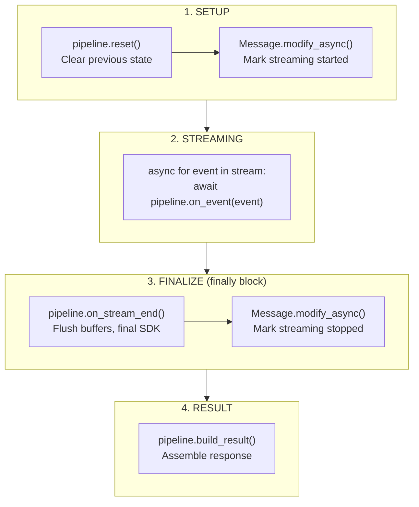

# Lifecycle and Concurrency

## Stream Lifecycle



## State Management

### Handler State

Each handler maintains private state:

| Handler | State |
|---------|-------|
| TextDeltaHandler | `_state: TextState`, replacer buffers |
| ToolCallHandler | `_function_name_by_item_id`, `_tool_calls` |
| CompletedHandler | `_usage`, `_output` |
| CodeInterpreterHandler | `_message_logs`, `_code` |

### Reset Protocol

`reset()` clears all per-run state:

```python
def reset(self) -> None:
    self._state = TextState(full_text="", original_text="")
    for replacer in self._replacers:
        replacer.flush()  # Discard buffered data
```

### Flush Protocol

`on_stream_end()` finalizes:

```python
async def on_stream_end(self) -> None:
    # Cascade flush replacers
    remaining = ""
    for replacer in self._replacers:
        if remaining:
            remaining = replacer.process(remaining)
        remaining += replacer.flush()

    if remaining:
        self._state.full_text += remaining
        await self._emit_message_event()

    await self._persist_final_message()
```

## Concurrency Rules

| Rule | Enforcement |
|------|-------------|
| Sequential reuse is safe | `reset()` before each run |
| No concurrent sharing | One pipeline instance per stream |
| Connection errors are handled | `httpx.RemoteProtocolError` caught, finalize with partial content |

### Why No Concurrent Sharing?

Handlers are stateful:
- Text handler accumulates text in `_state`
- Replacers buffer partial matches
- Tool handler tracks item IDs

Concurrent access would corrupt these buffers.

### Pattern: One Pipeline Per Stream

```python
# CORRECT: Pipeline per request
async def handle_request(event):
    pipeline = build_pipeline(settings)  # Fresh instance
    handler = ResponsesCompleteWithReferences(settings, pipeline=pipeline)
    return await handler.complete_with_references_async(...)

# INCORRECT: Shared pipeline
shared_pipeline = build_pipeline(settings)  # BAD

async def handle_request(event):
    handler = ResponsesCompleteWithReferences(settings, pipeline=shared_pipeline)
    return await handler.complete_with_references_async(...)  # Concurrent corruption!
```

## Error Handling

### Mid-Stream Connection Drop

```python
try:
    async for event in stream:
        await self._pipeline.on_event(event)
except httpx.RemoteProtocolError as exc:
    _LOGGER.warning(
        "Stream connection closed prematurely. "
        "Finalizing with content received so far. Error: %s",
        exc,
    )
finally:
    await self._pipeline.on_stream_end()  # Always finalize
```

The pipeline finalizes with whatever content was received, rather than failing completely.

### Validation Errors

Chat context must be set:

```python
chat = settings.context.chat
if chat is None:
    raise ValueError("Chat context is not set")
```

## SDK Integration Timing

| Phase | SDK Call |
|-------|----------|
| Before stream | `Message.modify_async(startedStreamingAt=...)` |
| During stream | `Message.modify_async(text=..., originalText=...)` |
| After stream | `Message.modify_async(stoppedStreamingAt=..., completedAt=...)` |

The text handler throttles SDK calls via `send_every_n_events` to avoid overwhelming the backend.
