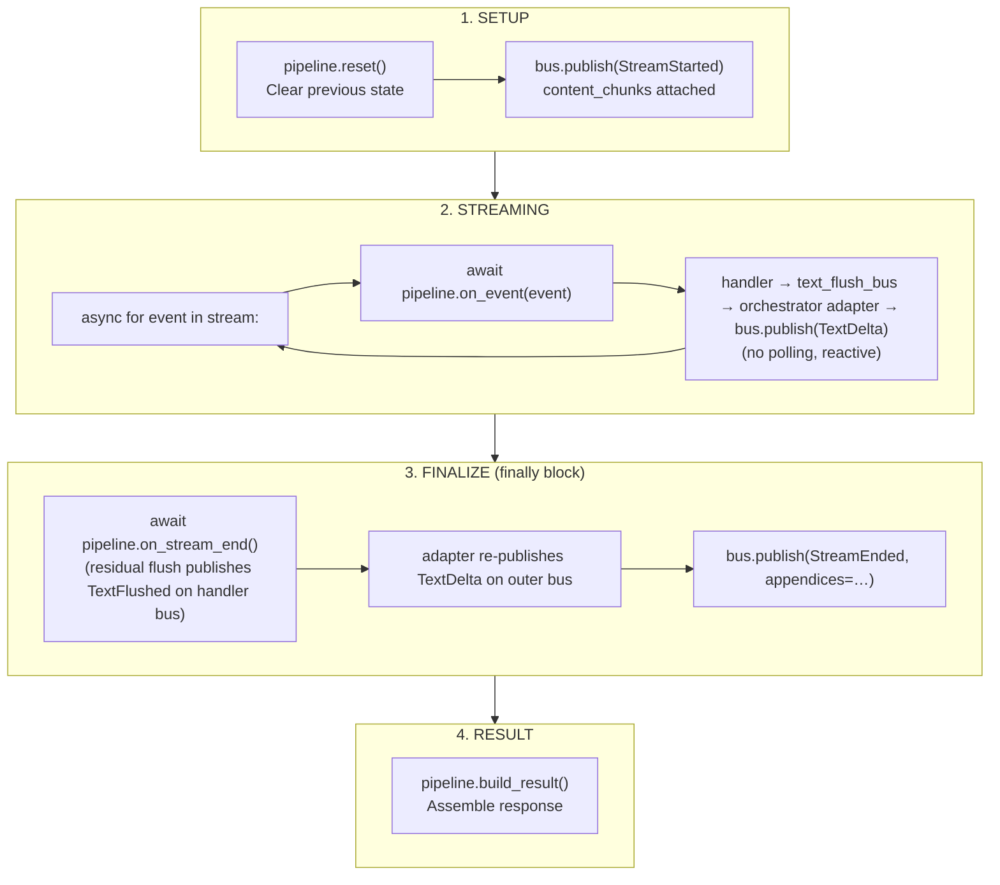

# Lifecycle and Concurrency

## Stream Lifecycle



The default `MessagePersistingSubscriber` translates each published event into a single
`unique_sdk.Message.modify_async` call (see [SDK Integration Timing](#sdk-integration-timing)).

## State Management

### Handler State

Each handler maintains private state:

| Handler | State |
|---------|-------|
| TextDeltaHandler / ChatCompletionTextHandler | `_state: TextState`, replacer buffers |
| ToolCallHandler | `_function_name_by_item_id`, `_tool_calls` |
| CompletedHandler | `_usage`, `_output` |
| CodeInterpreterHandler | `_message_logs`, `_code` |

### Subscriber State

| Subscriber | State |
|------------|-------|
| `MessagePersistingSubscriber` | `_chunks_by_message: dict[str, list[ContentChunk]]` — per-stream retrieved chunks, seeded on `StreamStarted` and cleared on `StreamEnded` so overlapping streams stay isolated |

### Reset Protocol

`reset()` clears all per-run handler state:

```python
def reset(self) -> None:
    self._state = TextState(full_text="", original_text="")
    for replacer in self._replacers:
        replacer.flush()  # Discard buffered data
```

### Flush Protocol

Text handlers own a `TypedEventBus[TextFlushed]` (`flush_bus`) and publish on every
flush boundary — both mid-stream (subject to `send_every_n_events` throttling on the
Chat Completions handler) and once at `on_stream_end()` for residual replacer output:

```python
async def on_stream_end(self) -> None:
    remaining = ""
    for replacer in self._replacers:
        if remaining:
            remaining = replacer.process(remaining)
        remaining += replacer.flush()

    if remaining:
        self._state.full_text += remaining
        await self._flush_bus.publish_and_wait_async(
            TextFlushed(
                full_text=self._state.full_text,
                original_text=self._state.original_text,
            )
        )
```

The orchestrator subscribes once at construction; no polling/drain dance is needed:

```python
# At construction:
self._pipeline.text_flush_bus.subscribe(self._on_text_flushed)

# Per request:
self._current_message_id = message_id
self._current_chat_id = chat_id
try:
    async for chunk in stream:
        await self._pipeline.on_event(chunk, index=index)
finally:
    await self._pipeline.on_stream_end()
    await self._bus.publish_and_wait_async(StreamEnded(...))
    self._current_message_id = None
    self._current_chat_id = None

# Adapter:
async def _on_text_flushed(self, event: TextFlushed) -> None:
    await self._bus.publish_and_wait_async(
        TextDelta(
            message_id=self._current_message_id,
            chat_id=self._current_chat_id,
            full_text=event.full_text,
            original_text=event.original_text,
        )
    )
```

The same pattern applies to `ResponsesCodeInterpreterHandler.progress_bus` for
`ActivityProgressUpdate` → `ActivityProgress`.

## Concurrency Rules

| Rule | Enforcement |
|------|-------------|
| Sequential reuse is safe | `reset()` before each run |
| No concurrent sharing of a pipeline | One pipeline instance per in-flight stream |
| Subscriber may be shared across streams | `MessagePersistingSubscriber` keys chunks by `message_id`; concurrent streams with distinct message IDs do not interfere |
| Connection errors are handled | `httpx.RemoteProtocolError` caught; `StreamEnded` still fires from the `finally` block |

### Why No Concurrent Pipeline Sharing?

Handlers are stateful:

- Text handler accumulates text in `_state`
- Replacers buffer partial matches
- Tool handler tracks item IDs

Concurrent access would corrupt these buffers.

### Pattern: One Pipeline Per Stream

```python
# CORRECT: Pipeline per request
async def handle_request(event):
    pipeline = build_pipeline()  # Fresh instance (no settings needed)
    handler = ResponsesCompleteWithReferences(settings, pipeline=pipeline)
    return await handler.complete_with_references_async(...)

# INCORRECT: Shared pipeline across concurrent requests
shared_pipeline = build_pipeline()  # BAD for concurrency

async def handle_request(event):
    handler = ResponsesCompleteWithReferences(settings, pipeline=shared_pipeline)
    return await handler.complete_with_references_async(...)  # Concurrent corruption!
```

## Error Handling

### Mid-Stream Connection Drop

```python
try:
    async for event in stream:
        await self._pipeline.on_event(event)
except httpx.RemoteProtocolError as exc:
    _LOGGER.warning(
        "Stream connection closed prematurely. "
        "Finalizing with content received so far. Error: %s",
        exc,
    )
finally:
    await self._pipeline.on_stream_end()
    await self._bus.publish_and_wait_async(
        StreamEnded(
            ...,
            full_text=...,
            original_text=...,
            appendices=self._pipeline.get_appendices(),
        )
    )
```

`StreamEnded` always fires from the `finally` block, so the persister always records
`stoppedStreamingAt` / `completedAt` — even on partial streams.

### Validation Errors

Chat context must be set:

```python
chat = settings.context.chat
if chat is None:
    raise ValueError("Chat context is not set")
```

## SDK Integration Timing

Subscribers (not handlers) talk to the SDK. With the default subscribers:

| Phase | Event published | Subscriber | SDK call |
|-------|----------------|-----------|----------|
| Before stream | `StreamStarted` | `MessagePersistingSubscriber` | `Message.modify_async` (`references=[]`, `startedStreamingAt=…`) |
| During stream (per text flush) | `TextDelta` | `MessagePersistingSubscriber` | `Message.modify_async` (`text`, `originalText`, filtered `references`) |
| During stream (per tool-activity state change) | `ActivityProgress` | `ProgressLogPersister` | `MessageLog.create_async` on first sighting, `MessageLog.update_async` on transitions (keyed by `correlation_id`) |
| After stream | `StreamEnded` | `MessagePersistingSubscriber` | `Message.modify_async` (`text + "".join(appendices)`, `references`, `stoppedStreamingAt`, `completedAt`) |

`StreamEnded.appendices` carries blocks contributed by auxiliary handlers (e.g. the code
interpreter's executed-code block) so the final persist stays a single `Message.modify_async`
call — no `retrieve` + `modify` round-trip needed.

Throttling is controlled by the **text handler** (`send_every_n_events` on the Chat Completions handler);
the bus itself does not throttle. To add rate-limiting, wrap the subscriber or add a throttling
subscriber that forwards a reduced-rate event stream to the persister.

## Custom Wiring

The bus itself is owned by the orchestrator and cannot be injected; instead, callers
supply the desired subscribers at construction time (or attach more later via the `bus`
property):

```python
orchestrator = ChatCompletionsCompleteWithReferences(
    settings,
    pipeline=pipeline,
    subscribers=[
        my_tracing_subscriber,
        MessagePersistingSubscriber(settings).handle,
    ],
)
```

When `subscribers=` is omitted, the orchestrator registers the defaults automatically —
for `ChatCompletionsCompleteWithReferences` that is `MessagePersistingSubscriber(settings)`;
for `ResponsesCompleteWithReferences` it is both `MessagePersistingSubscriber(settings)` **and**
`ProgressLogPersister(settings)` (since the Responses API publishes `ActivityProgress` for
code interpreter calls). Passing an explicit iterable (including `[]`) is treated as the caller
having fully specified the subscriber set — the defaults are **not** added.
