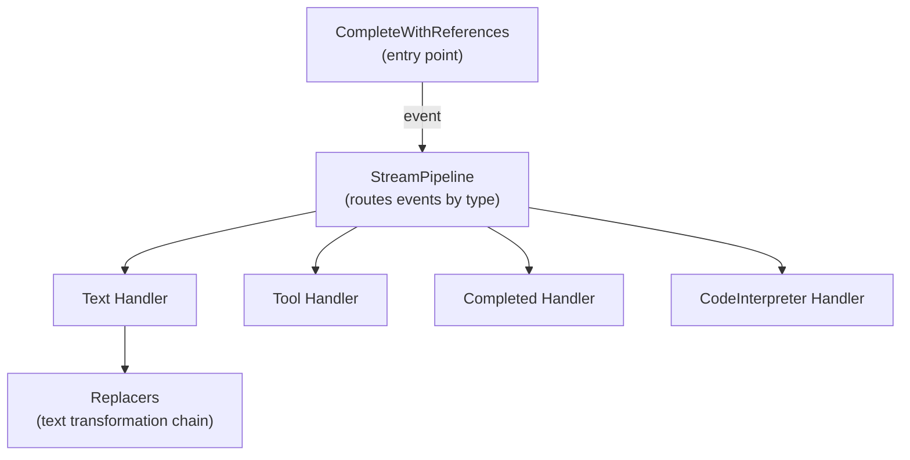
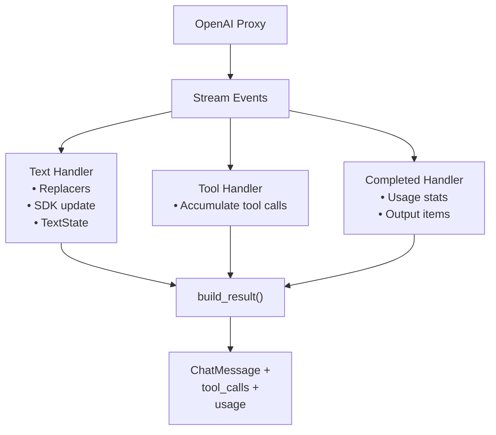

# Overview: Streaming Pipeline Design

## Problem

LLM providers emit tokens incrementally. The toolkit must:

1. Display text to users in real-time (via Unique SDK)
2. Normalise citation patterns across chunk boundaries
3. Assemble a typed response for downstream code
4. Support multiple wire formats (Responses API, Chat Completions, future sources)

## Solution: Handler Pipeline

The architecture separates **stream consumption** from **event processing**:

### Entry Point (`CompleteWithReferences`)

- Opens the stream from OpenAI proxy
- Runs its own `async for` loop (not a shared generic runner)
- Catches `httpx.RemoteProtocolError` for graceful partial-stream handling
- Calls `pipeline.reset()` before each run
- Calls `pipeline.on_stream_end()` in finally block

### Pipeline (`StreamPipeline`)

- Routes events to typed handlers via `isinstance` checks
- Unknown events are ignored (forward compatibility)
- Collects handler outputs via `build_result()`

### Handlers

Small, focused classes that:
- Process one event type
- Maintain private state (reset between runs)
- Implement `StreamHandlerProtocol` for lifecycle

## Data Flow

## Key Design Decisions

| Decision | Rationale |
|----------|-----------|
| Protocols over ABCs | Structural typing; easy fakes in tests |
| Explicit `reset()` | Sequential reuse without state leakage |
| Typed dispatch via `isinstance` | Forward compatible; unknown events ignored |
| Own `async for` loop per entry point | Can catch and handle mid-stream errors |
| Replacer chain in text handler | Extensible text transformation |
